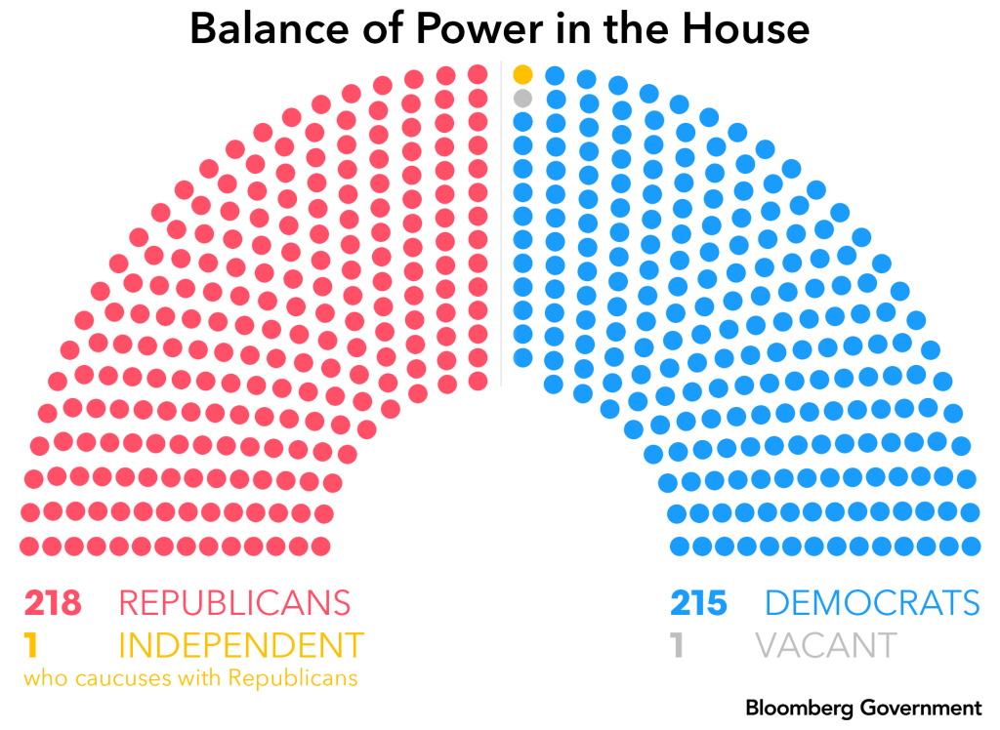
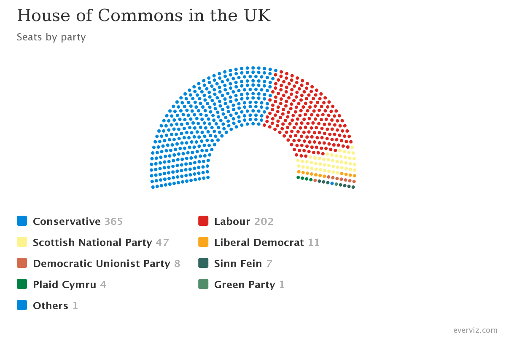
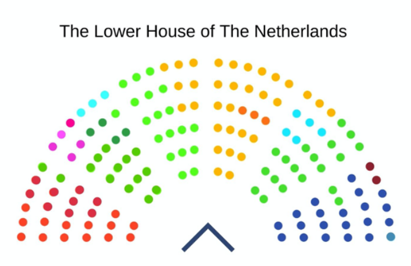
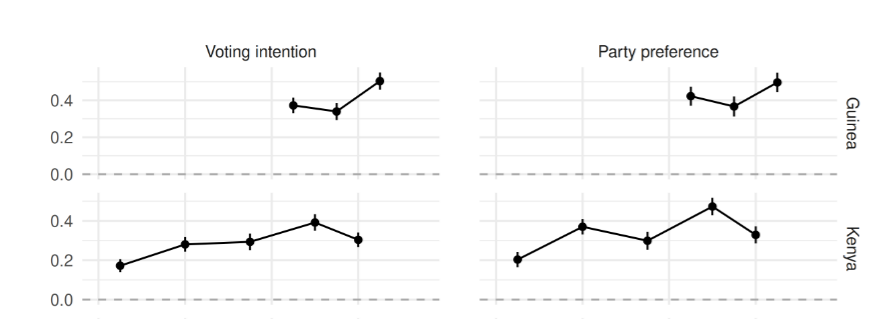
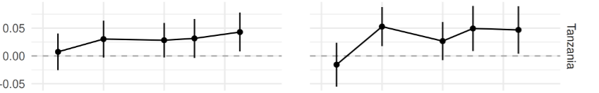

# Introduction(s) {.section}

## Course Information and Logistics

- Instructor: **Giacomo Lemoli** — [giacomolemoli.github.io](https://giacomolemoli.github.io)
- Instructor’s Email: [glemoli@fus.edu](mailto:glemoli@fus.edu)
- Office location: LAC 8 (3rd floor)
- Office Hours: Monday-Thursday 12:30-14:15
- Class location: Kaletsch Campus Bldg., Room 5
- Class meeting times: Monday-Thursday 14:30-15:45

---

## Course Platforms

We have a course website: [giacomolemoli.github.io/fus-pol-300/](https://giacomolemoli.github.io/fus-pol-300/)

- Syllabus, schedule, slides $\rightarrow$ <u>course website</u>

- Papers, PDFs, assignments, grades, communications $\rightarrow$ <u>Moodle</u>

---

## About me

- I am a postdoctoral researcher in Prof. Strijbis' team [DIVIDE](https://data.snf.ch/grants/grant/10003605)

- I am a political scientist and specialize in Comparative politics

- I was born and raised in Italy; before moving to Switzerland I studied and worked in the US and France

---

## About you

For each of you, I would like to know:

- Your name
- The place you call home
- What is the first political memory you have?
- Why are you taking this course and what do you expect to get from it?

# What to Expect during the Course {.section}

## Required Text and Materials

> William R. Clark, Matt Golder, Sona N. Golder, **Foundations of Comparative Politics (2nd Edition)**. 2024, CQ Press

- Two hard copies available in the Library
- If you want to purchase it, I recommend the [ebook version](https://collegepublishing.sagepub.com/products/foundations-of-comparative-politics-2-274955)

. . . 

Scientific articles for the review and discussion sessions

- Articles and discussion session materials will be uploaded on Moodle

---

## Assessment Overview

| **Assignment** | **Midterm Weight** | **Final Weight** |
|-----------------|--------------------|-------------------|
| Midterm exam (covering part I) | 60% | 30% |
| Final Exam (covering part II) | 0% | 30% |
| Paper presentation | 0% | 20% |
| Class participation | 40% | 20% |

---

## Course Structure and Attendance

- Each week covers one topic/module in two sessions
- **Lecture**: theories and concepts (following the textbook)
    - Lecture with active participation expected
- **Review and Discussion session**
    - <u>Review</u> of concepts of the week
    - In-class <u>discussions</u> (two-sided)
    - Examples, exercises $\approx$ exam questions
    - Students' paper <u>presentations</u> + <u>discussion</u>

---

## What You Need to Do Well

- [Attendance]{.alert} in all sessions is <u>necessary</u> (but not sufficient) to do well in exams and participation grades
- [Reading]{.alert} each session's material <u>before</u> class
    - The participation grade is based on lecture and discussion sessions
    - You should be ready to answer questions and do exercises
- Coming to class [prepared]{.alert} and [curious]{.alert} with an open mind

---

## Presentations

- We will have presentations of academic articles during the discussion sessions
- <u>You have to choose a paper on Moodle by the end of the week</u>
- First presentation on <u>September 10</u>
- The articles will be about the topic of the week
    - Empirical application or new perspective
    - They are part of the required readings and possible exam questions
    - Everyone (presenters and non-presenters) is expected to read the articles to participate in the discussion
- Duration: 15 minutes with slides + class discussion
- Presentation guide in Discussion session 1

---

## Questions?

# What is Comparative Politics?

## Comparative Politics

The study of political phenomena happening **within country** 

- In contrast with international politics ($\rightarrow$ **between countries**)
- In practice the two dimensions are deeply connected
- Arguably the largest and foundational area of [political science]{.alert}
    - Topics: State-building, elections, parties, ethnicity...

. . . 

$\implies$ what is political science?

---

## What is Politics?

The domain of human behavior that involves the use of **power**

. . . 

Consider these familiar situations. What do they have in common?

1. Organize house cleaning between roommates
2. Allocate faculty offices in a new campus
3. Vote someone for students representative

. . . 

$\implies$ reaching our goals may require influencing others or escaping their influence

---

## What is Politics?

These social interactions and many "real politics" settings have the **same nature**

1. Organize house cleaning between roommates
$\Rightarrow$ Participate in a protest

2. Allocate faculty offices in a new campus
$\Rightarrow$ Allocate a budget to different ministries

3. Vote someone for students representative
$\Rightarrow$ Vote someone for the Parliament

. . .

Studying politics $\rightarrow$ identify [commonalities]{.alert} and derive [explanations]{.alert} 

---

## Why Science? 

We interpret politics using the [scientific method]{.alert}

- **Question**: why do we observe X?
- **Theory/model**: a <u>simplifying</u> map of the world with logical connections
- **Implications**: if the model is true, then A $\implies$ B
- **Observations**: test the hypotheses 
- **Evaluation**: rejection or provisional corroboration of the theory

---

## Why Comparative?

:::: {.columns}

::: {.column width="60%"}
- Questions arise from comparisons
    - E.g., why do two bordering towns look so different?
- Theories are causal (*ceteris paribus*). To understand the effect of X we compare two cases equal in everything except X
    - E.g., Nogales $\rightarrow$ same geography, different political institutions
- Theories are falsifiable $\rightarrow$ likely case that contradicts the theory
    - E.g., Abu Dhabi or Singapore $\rightarrow$ also different institutions than the US. Do they look better or worse?
:::

::: {.column width="40%"}

:::

::::
---

## Comparative Questions

**Q**: Why do Parliaments have different numbers of parties?

:::: {.columns}

::: {.column width="30%"}

:::

::: {.column width="30%"}

:::

::: {.column width="30%"}

:::

::::

- [Effective Number of Parties]{.alert} (a measure of Parliament fragmentation): US, UK $\approx$ 2; Netherlands $\approx$ 8
- Are voters or parties different? Or do the vote rules matter?

---

## Comparative Questions

**Q**: Why do "similar" countries have different economic outcomes?

:::: {.columns}

::: {.column width="40%"}

:::

::: {.column width="60%"}

:::

::::

- Similar population, ethnic diversity, geographic/religious differences
- GDP rank: Indonesia = 17, Nigeria = 46; ACLED conflict index rank: Indonesia = 45, Nigeria = 5

---

## Comparative Questions

**Q**: Does ethnicity matter in politics?

:::: {.columns}

::: {.column width="50%"}

:::

::: {.column width="50%"}

:::

::::

- Kenya and Tanzania $\rightarrow$ geographic neighbors, same national language
- Kenya: prob. that two people vote the same party $\uparrow$ 40pp if they are coethnics
- Tanzania: almost same prob. between coethnics and non-coethnics
- Why do we see ethnic *cleavages* in some countries and not others?

---

## Our Plan for the Course

::: {.nonincremental}
- Methods: Causal Inference
- The State
- Democracy and Dictatorship: Economic Causes
- Democratic Transitions
- Varieties of Dictatorship
- Parliamentary and Presidential Systems
- Electoral Systems
- Cleavages and Party Systems
- Veto Players
- Effects of Institutions
:::

---

## Questions?

---

## 

::: {style="display: flex; justify-content: center; align-items: center; height: 70vh; font-size: 2.5em; font-weight: bold; color: Black;"}
Thank you!
:::
