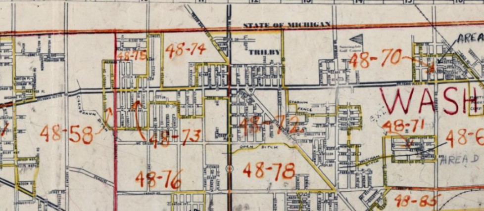

## A World of States

- [Politics]{.alert} $\rightarrow$ domain of human behavior that concerns the use of power
- The [state]{.alert} $\rightarrow$ master political institution through which power is exercised

---

## Varieties of States

::::{.columns}

::: {.column width="50%"}

{width="60%"}

:::

::: {.column width="50%"}

{width="50%"}

:::

::::

- Some states provide public services, guarantee safety and protection (e.g., Switzerland)
- Others do not have full authority over their territory (e.g., Somalia)
- Others have authority but exercise unchecked violence on their populations (e.g., European fascism, Rwanda 1994)

---

## Questions

- What is a state and what does it do? 
- Why do states exist and how did they evolve to the current configuration?
- Why these differences in states' governance and outcomes?

---

## Our Plan for Today

Two views of the state:

- The [Social Contract View]{.alert} $\rightarrow$ external protection to permit social cooperation
    - Solve the problem of "horizontal" violence 
- The [Predatory View]{.alert} $\rightarrow$ entrenches power of few over many
    - Create a problem of "vertical" violence

# What is the State? {.section}

## Weber's Classic Definition

> "a human community that (successfully) claims the **monopoly** of the **legitimate** use of **physical force** within a given **territory**"
>
> Max Weber (1918)

- **Territory**:  a state is delimited by space (unlike nations)
- **Physical force**: the state exerts (implicit) violence
- **Legitimate**: state's authority is willingly accepted by people
- **Monopoly**: the state is the sole provider of force

---

## Problems with Weber's Definition

:::: {.columns}

::: {.column width="60%"}

- **Territory** and **Physical force** $\rightarrow$ universally accepted

- The other concepts are more contested

- **Legitimacy** $\rightarrow$ is it objective or immutable?

- **Monopoly** $\rightarrow$ what if armed groups claim legitimacy?

:::

::: {.column width="40%"}

{fig-align="center" width="5cm"}

{fig-align="center" width="5cm"}

:::

::::

---

## Other Definitions

> [States are] relatively centralized, differentiated organizations, the officials of which, more or less, successfully **claim control** over the chief concentrated means of violence within a population inhabiting a large contiguous territory.
>
> Charles Tilly (1985)

> A state is an organization with a **comparative advantage** in violence, extending over a geographic area whose boundaries are determined by its power to tax constituents.
>
> Douglass North (1981)

. . .

$\implies$ what is new here?

---

## Other Definitions

- **Territory** and **force** are maintained
- **Legitimacy** and **monopoly** are abandoned $\rightarrow$ weaker conditions
- Violence is easier for the state and difficult to challenge
- But the state does not have a perfect monopoly

---

## A Continuum of Stateness

---

## Next Steps

{fig-align="center"}

- We have defined what the state is
- Now: Why do states exist? 
- What explains patterns of state formation in the world?

# The Social Contract View {.section}

## An Illustration



---

## The Foundations

[hobbes, locke, rousseau tba]

[add illustration of the theory]

---

## The State of Nature

Imagine an (idealized) "state of nature" with equal men

- Men can [steal]{.alert} from their neighbor or [refrain]{.alert}
- Imagine the problem two men would face in this world

. . . 

|                    | **Refrain** | **Steal** |
|:-------------------|:-------------:|:----------:|
| **Refrain**      |   -1, -1      |  -10, 0    |
| **Steal**          |    0, -10     |  -5, -5    |

. . . 

What would the men do?

---

## The State of Nature

<table style="margin: auto; font-size: 1.2em;">
  <tr>
    <td></td>
    <td style="text-align: center; font-weight: bold; padding: 10px;">Refrain</td>
    <td style="text-align: center; font-weight: bold; padding: 10px;">Steal</td>
  </tr>
  <tr>
    <td style="text-align: center; font-weight: bold; padding: 10px;">Refrain</td>
    <td style="text-align: center; padding: 15px; background-color: #90EE90; border: 3px solid #228B22;">-1, -1</td>
    <td style="text-align: center; padding: 15px;">-10, 0</td>
  </tr>
  <tr>
    <td style="text-align: center; font-weight: bold; padding: 10px;">Steal</td>
    <td style="text-align: center; padding: 15px;">0, -10</td>
    <td style="text-align: center; padding: 15px; background-color: #FFB6C1; border: 3px solid #DC143C;">-5, -5</td>
  </tr>
</table>

 

::: {.nonincremental}
- [**Pareto Optimal:**]{style="color: #228B22; font-weight: bold;"} (Refrain, Refrain) - Best [collective]{.alert} outcome
- [**Nash Equilibrium:**]{style="color: #DC143C; font-weight: bold;"} (Steal, Steal) - Most rational [individual]{.alert} strategy
:::

. . . 

$\implies$ in the anarchic state of nature men turn against each other

---

## The Social Contract

What is the role of the state here?

. . .

$\implies$ the state of nature is undesirable

::: {.nonincremental}

- Violence wins over cooperation 
- The threat of predation makes long-run investment unprofitable
- "Protection" groups emerge and are in conflict

:::

. . . 

$\implies$ an authority punishing "steal" benefits everyone 

---

## The Social Contract

[modified game tba]

. . . 

- Lower the benefit of stealing until no longer appealing
- The collectively optimal outcome is reached

---

## The Social Contract

Why "social contract"?

- People give up their "natural" rights $\rightarrow$ [freedom]{.alert}
- In exchange, they receive "civil" rights $\rightarrow$ [laws]{.alert}
- People "fund" the sovereign $\rightarrow$ [tax]{.alert}

---

## Problems with the Social Contract View

- It is [normative]{.alert} rather than [positive]{.alert}
- Single mechanism $\rightarrow$ hard to explain variation in state outcomes

. . . 

:::: {.columns}

::: {.column width="50%"}

::: {.nonincremental}

- The social contract grants the sovereign capacity to use violence
- The sovereign could use it to breach the contract

:::

:::

::: {.column width="50%"}

{fig-align="center"}

:::

::::

# The Predatory View {.section}

## The State as Organized Crime

In the predatory view, the state is analogous to the **Mafias**

:::: {.columns}

::: {.column width="50%"}

- Powerful men use violence to increase their power over others
- Protection is **extorted** rather than **sought** 
- Protectors want to expand their area of operations 

::: 

::: {.column width = "50%"}

[add illustration of the theory]

:::

::::

. . . 

$\implies$ the state emerges a consequence of power consolidation

---

## Predation and the Emergence of Early States

Key moment $\implies$ [Neolithic Revolution]{.alert}

8000-6000 BCE $\rightarrow$ emergence of agriculture in highly fertile lands 

. . .

:::: {.columns}

::: {.column width="60%"}
 

- From small, mobile groups to large, sedentary communities
- Plant cereals and legumes to complement traditional activities
- Domesticate animals

:::

::: {.colum width="40%"}
{width="45%" fig-align="center"}
:::

::::

---

## Grain States

The earliest states were all "grain states" (Scott 2017)

$\implies$ suggests causal link between agriculture and states

. . . 

:::: {.columns}

::: {.column width="60%"}

- From subsistence to agricultural surplus
  - $\implies$ social hierarchy of non-producing professions

- Cereals are measurable and storable
  - $\implies$ opportunity for [appropriation]{.alert} (taxes)

:::

::: {.column width="40%"}
{fig-align="center"}
:::

::::

---

## The Importance of Information

- The rise of agriculture $\implies$ institutionalized predation
- States developed technologies to implement it systematically

. . . 

:::: {.columns}

::: {.column width="50%"}

- **Population control**: control/block mobility to preserve food production
  - Forced resettlement, slavery, etc.

- **Information**: know who lives where and what is produced
  - Writing, maps, censuses, registries

:::

::: {.column width="50%"}
{fig-align="center"}
:::

::::

. . . 

$\implies$ States make their territory [legible]{.alert}

---

## State Formation in Early Modern Europe

Dissolution of the Roman Empire $\rightarrow$ fragmented political authority

{fig-align="center"}

. . . 

$\implies$ does the predation view explain state centralization?

---

## War and States

> War made the state, and the state made war (Tilly 1990)

. . . 

Two key forces:

- **Population growth** $\implies$ increase land to keep up productivity
  - $\implies$ incentive to try and conquer neighbors

- **Military technology** $\implies$ protection/aggression is costly
  - $\implies$ need stable sources of financing 

. . . 

$\implies$ External **wars** and internal **state building**

---

## War and States

> War made the state, and the state made war (Tilly 1990)

[diagram tba]

3 key elements: war-making, extraction, capital accumulation

- war (and defense from war) requires capital to fund armies
- taxation systems created and infrastructure created to manage them
- regular access to capital needed $\rightarrow$ regular extraction needed 

---

## War and States

The consolidation of European states:

- Was not the result of bargaining or ideological projects
- It was the result of the interaction of the forces of war making and accumulation

---

## The African Experience

Does the model account for non-European experiences?

In Africa: different structural conditions $\implies$ different outcomes (Herbst 2000)

:::: {.columns}

::: {.column  width="60%"}

- Land abundance + population scarcity (opposite of Europe)
- Colonialism + international system enforces state boundaries
- $\implies$ less incentives for external expansion and internal state building
- "Absence" of the state in remote territories

:::

::: {.column  width="40%"}

[diagram of capital + buffer]

:::

::::

# Summing Up {.section}

## What We Learned 

- The state is an institution that exercise power through violence
- To perform its functions the state extracts resources $\rightarrow$ taxation
- To work well the state needs [legibility]{.alert} $\rightarrow$ know its people

---

## Is There a Correct View?

- Both views of the state highlight powerful forces
- The [predatory view]{.alert} emphasizes violence and coercion
  - The pursuit of power is what drives state expansion
  - Better at explaining the range of observed outcomes
- But the [social contract view]{.alert} also emphasizes an important force
  - External authority may be important for cooperation
  - A consent component is always present $\rightarrow$ e.g., migration

---

## 

::: {style="display: flex; justify-content: center; align-items: center; height: 70vh; font-size: 2.5em; font-weight: bold; color: Black;"}
Thank you for your attention!
:::