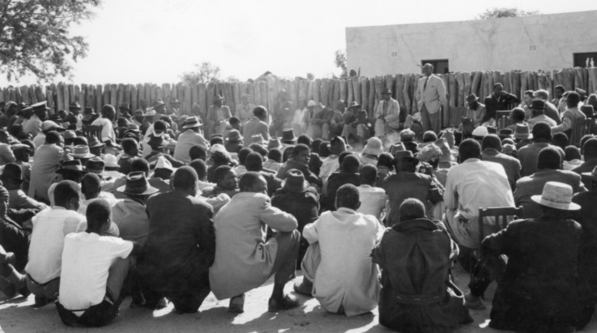
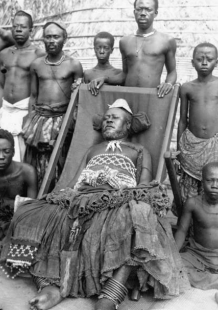
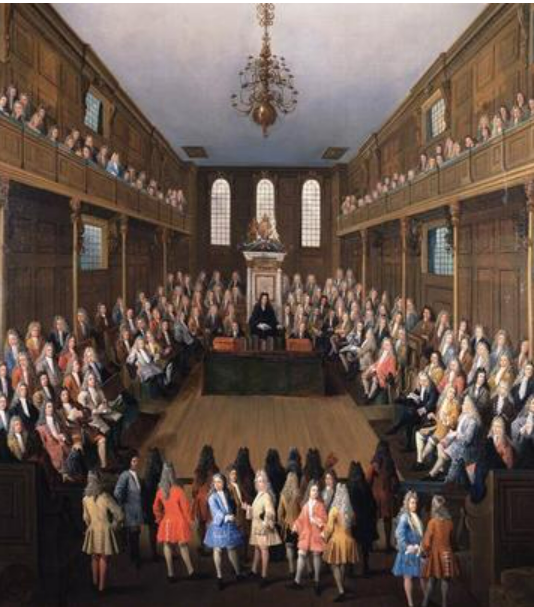
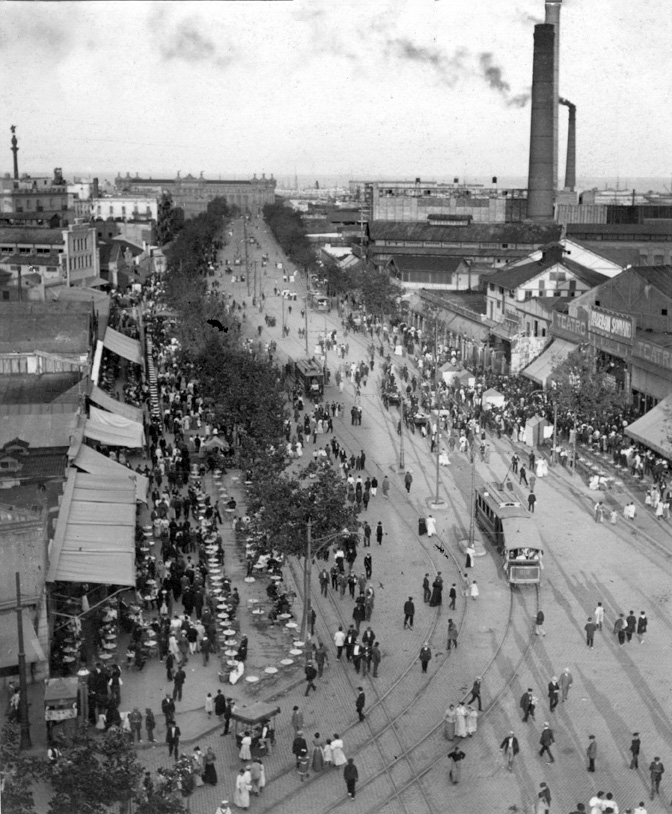
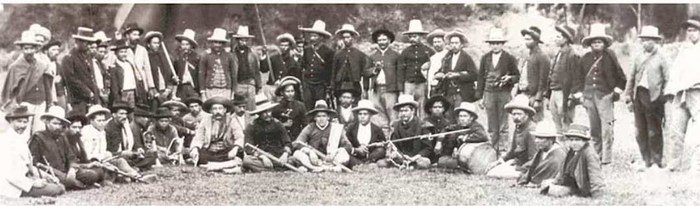
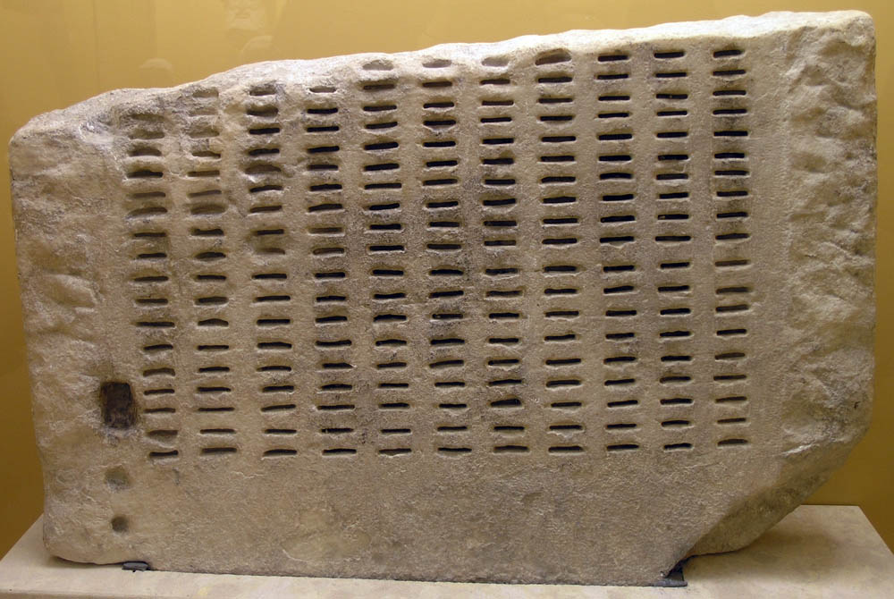
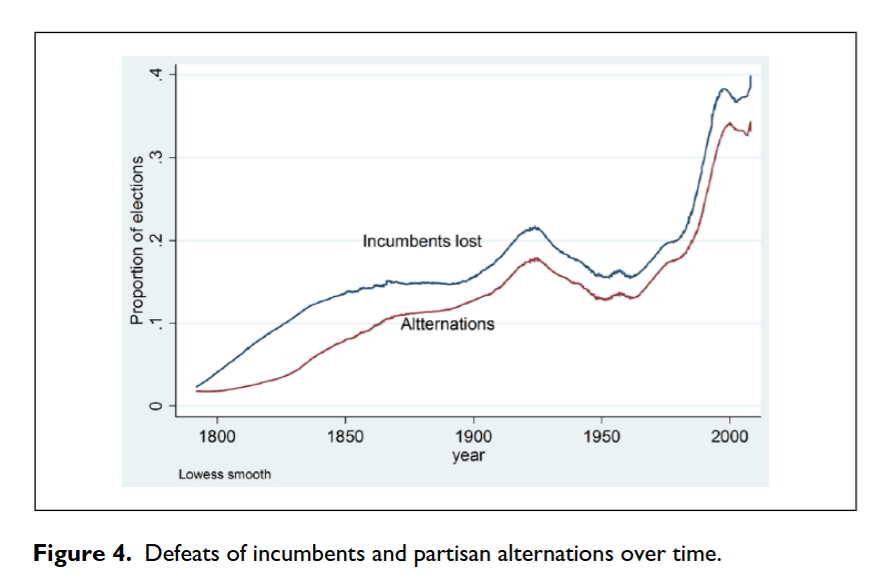
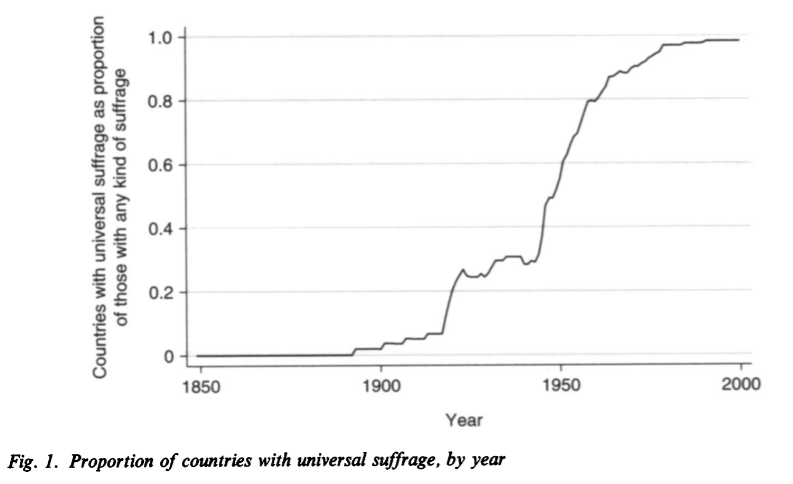
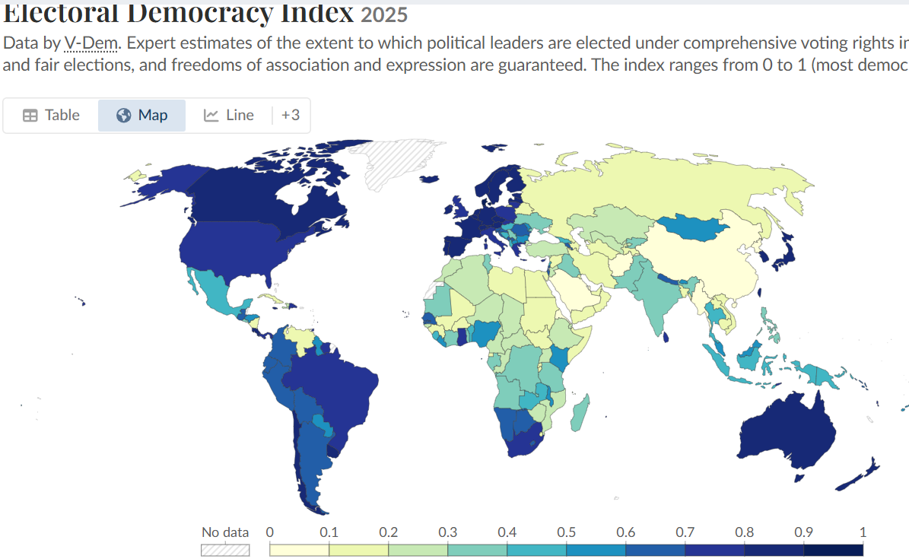
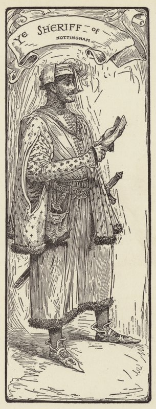

## Three Pictures


:::: {.columns}

::: {.column width="33%"}

{width="110%"}

:::

::: {.column width="33%"}



:::

::: {.column width="33%"}



:::

::::

. . . 

Which of these pictures represents a [democracy]{.alert}?

. . . 

$\implies$ Depending on the definition, all three or none

---

## A Different Picture



. . . 

Does [modernization]{.alert} lead to democracy?

. . . 

$\implies$ It depends

---


## Q1: What is Democracy?

 What is democracy? What makes a country a democracy? 

- Many intuitive concepts are invoked
    - The government is constrained, the people decide, power is shared...
- Principles adopted by many human societies since antiquity
- Our understanding and definition of democracy has evolved over time

---

## Q2: Does Development cause Democracy?

- Intuitively we think of prosperity and democracy as connected
- As a **static** relationship it seems reasonable
    - 9 of top 10 countries by GDP p.c. are democracies
- But is there a **dynamic**: development $\implies$ democracy?
    - Even intuitively, much less obvious
- A scientific approach to the question: isolate core mechanisms
    - Do development alter state-society relationships?
    - If yes, how can this lead to democracy?

---

## Our Plan for Today

Democracy: definitions and change

::: {.nonincremental}

- Early vs Modern democracy: from [consent]{.alert} to [representation]{.alert}
- The value of elections
- Constraining the government vs participation

:::

. . . 

Development and Democracy $\rightarrow$ Modernization theory

::: {.nonincremental}

- Economic change and the rise of the bourgeoisie
- The [commitment problem]{.alert} of the government
- Institutional solutions to the commitment problem
- Conditionality of the theory

:::

# What is Democracy? {.section}

## Early Democracy

[Early democracy]{.alert} $\rightarrow$ local rulers + council of independent community members

. . . 

:::: {.columns}

::: {.column width="50%"}

{width="50%"}

:::

::: {.column width="50%"}

{width="35%"}

:::

::::

- Rulers need [consent]{.alert} of community members
- **Direct** (all those entitled decide) or **representative** (selected few decide)
- Council members $\rightarrow$ custom or social structure (e.g., elderly, HH heads)

---

## Modern Democracy

[Modern democracy]{.alert} $\rightarrow$ **representatives** of the people **regularly** chosen in **competitive elections** under **universal** suffrage

- **Representative** $\rightarrow$ a minority of selected few rules 
- **Election** $\rightarrow$ people choose them
- **Regular** $\rightarrow$ chosen rulers can be renewed often
- **Competitive** $\rightarrow$ chosen rulers **can indeed** be renewed often
- **Universal suffrage** $\rightarrow$ $\sim$ all adults choose

---

## From Early to Modern Democracy

Modern democracy retains early democratic principles/procedures but changes others

. . . 

**Core principles**

::: {.nonincremental}

- Rule is based on people's [consent]{.alert} 
- The people's will [constrains]{.alert} what the ruler can do

:::
. . . 

**Innovations**

::: {.nonincremental}

- The rulers [compete]{.alert} to be [chosen]{.alert}
- Citizens' [participation]{.alert} $\rightarrow$ elections
- Between elections, rulers rule [autonomously]{.alert}
- [Mass]{.alert} participation

:::

---

## Why Elections? 

Why are [elections]{.alert} so central to modern democracy?

. . . 

Societies become increasingly large and complex 

- Direct democracy is infeasible $\rightarrow$ impossible to vote on everything
    - Few leaders should decide but respecting people's will
- Possible conflicts increase $\rightarrow$ more at stake in pursuing power
    - Selection of leaders should manage conflicts peacefully


## Why Elections?

**Regular + competitive elections** provide potential solutions

. . . 

:::: {.columns}

::: {.column width="70%"}

- [Power alternation]{.alert} $\rightarrow$ today's losers can still win tomorrow
- Losing power is no longer an existential threat
- Pushes winners to moderation and losers to democratic commitment

:::

::: {.column width="30%"}

:::

::::

. . . 

:::: {.columns}

::: {.column width="70%"}

- [Accountability]{.alert} of rulers $\rightarrow$ future power depends on performance
- Rulers anticipate the future evaluation of voters
- Pushes policies to (perceived) will of the people

:::

::: {.column width="30%"}

:::

::::

---

## Historical Trajectories

Modern democracy was not created overnight but evolved 

. . . 

:::: {.columns}

::: {.column width="50%"}

:::

::: {.column width="50%"}

:::

::::


- Alternation initially low $\rightarrow$ rulers reluctant to cede power
- Accountability initially an elite game $\rightarrow$ universal suffrage comes later

---

## Elections in the World

{width="50%" fig-align="center"}

- Why did many countries democratize while many others didn't?
- Is there a link between development and democracy?


# Development and Democracy {.section}

## The Modernization Theory


::: {.callout-note title="Modernization Theory"}
Economic development $\implies$ Democratization
:::

. . . 

By development we typically mean

::: {style="display:flex; align-items:center; justify-content:center; height:60vh; text-align:center; font-size:1.2em; line-height:2;"}

<div style="display:grid; grid-template-columns:1fr auto 1fr; column-gap:1em; text-align:left;">
<div>
Large agricultural sector  
Small industrial sector  
Small service sector  
Population mostly rural  
Low education levels
</div>
<div>
$\Longrightarrow$  
$\Longrightarrow$  
$\Longrightarrow$  
$\Longrightarrow$  
$\Longrightarrow$
</div>
<div style="text-align:right;">
Small agricultural sector  
Large industrial sector  
Large service sector  
Urbanization  
High education levels
</div>
</div>

:::

---

## Step Zero: Selecting Core Mechanisms 

Why should development lead to democracy?

<div style="height: 1em;"></div>

. . . 

Recall the **predatory view** of the state:

Agriculture $\implies$ Low **mobility** + **Legibility** $\implies$ Power concentration

. . . 

<div style="height: 1em;"></div>

$\implies$ how does transitioning away from agriculture alter power balance?

---

## First Step: Outside Options

Agriculture $\Longrightarrow$ Industry + Services

. . . 

:::: {.columns}

::: {.column width="60%"}

- A [bourgeoisie]{.alert} $\rightarrow$ wealth more **mobile** and less **legible**
- Financial system $\rightarrow$ wealth can be moved abroad
- Balance of power altered
    - People have [outside option]{.alert} $\rightarrow$ can escape taxation
    - Ruler now needs [consent]{.alert} to tax $\rightarrow$ forced to bargain

:::

::: {.column width="40%"}

:::

::::

---

## Second Step: Bargaining with the Rulers

What is the problem?

. . . 

- The government can promise concessions 
- But future economic conditions may change or legibility can improve

. . . 

:::: {.columns}

::: {.column width="60%"}

::: {.nonincremental}
- Then the government can renege on past promises and expropriate
    - After all, it control the means of violence
:::

$\implies$ the threat to the ruler must be **constant** for the bargain to work

:::

::: {.column width="40%"}
{width="30%"}
:::

::::


---

## Interlude: Commitment Problems

[Commitment problem]{.alert}/[Time inconsistency]{.alert} $\rightarrow$ **key** concept of social science

. . . 

```{r}
#| echo: false
#| fig-width: 11
#| fig-height: 4.2
#| fig-align: center
library(ggplot2)

# t=5 is B's final action: white-filled box, dark border
events <- data.frame(
  time      = c(1,    2,      3,    4,      5),
  y         = c(-1,   1,     -1,    1,     -1),
  label     = c("Makes a credible\nthreat",
                "Promises low taxes\n& concessions",
                "Concedes &\nwithdraws threat",
                "Reneges &\nreaps benefits",
                "Can't do\nanything"),
  fill      = c("#4A90D9", "#5BAD6F", "#4A90D9", "#C0392B", "white"),
  textcol   = c("white",   "white",   "white",   "white",   "grey25"),
  stringsAsFactors = FALSE
)

# Arrow connector endpoints: from box edge toward timeline (y=0)
# box centre y = y*1.7; arrow starts just below/above box, ends near y=0
connectors <- data.frame(
  x    = events$time,
  xend = events$time,
  y    = ifelse(events$y > 0, events$y * 1.7 - 0.38, events$y * 1.7 + 0.38),
  yend = ifelse(events$y > 0, 0.12, -0.35)
)

ggplot() +
  # Main timeline
  geom_segment(aes(x = 0.6, xend = 5.5, y = 0, yend = 0),
    arrow = arrow(length = unit(0.25, "cm"), type = "closed"),
    linewidth = 0.8, color = "grey50") +
  # Actor labels
  annotate("text", x = 0.55, y =  1, label = "A",
    hjust = 1, size = 4.5, fontface = "bold", color = "grey25") +
  annotate("text", x = 0.55, y = -1, label = "B",
    hjust = 1, size = 4.5, fontface = "bold", color = "grey25") +
  # Arrows from boxes to timeline
  geom_segment(data = connectors,
    aes(x = x, xend = xend, y = y, yend = yend),
    arrow = arrow(length = unit(0.15, "cm"), type = "closed"),
    color = "grey55", linewidth = 0.4) +
  # Dots on timeline
  geom_point(data = events,
    aes(x = time, y = 0, color = fill), size = 3.5, shape = 16) +
  # Action boxes (filled)
  geom_label(data = events[events$fill != "white", ],
    aes(x = time, y = y * 1.7, label = label, fill = fill),
    color = "white", size = 3.5, fontface = "bold",
    label.padding = unit(0.45, "lines"), label.r = unit(0.25, "lines"),
    lineheight = 1.2) +
  # t=5 box: white fill with blue border and blue text
  geom_label(data = events[events$fill == "white", ],
    aes(x = time, y = y * 1.7, label = label),
    fill = "white", color = "#4A90D9", size = 3.5, fontface = "bold",
    label.padding = unit(0.45, "lines"), label.r = unit(0.25, "lines"),
    label.size = 0.5, lineheight = 1.2) +
  # Time labels
  annotate("text", x = 1:5, y = -0.18, label = paste0("t = ", 1:5),
    size = 3.2, color = "grey55") +
  # Commitment problem callout
  annotate("text", x = 4.1, y = 2.6,
    label = "Commitment problem: promise only\ncredible when threat is active",
    hjust = 0.5, size = 3.5, color = "#C0392B", fontface = "italic",
    lineheight = 1.2) +
  geom_curve(aes(x = 4.35, y = 2.25, xend = 4.05, yend = 1.65),
    arrow = arrow(length = unit(0.18, "cm"), type = "closed"),
    color = "#C0392B", curvature = -0.25, linewidth = 0.5) +
  scale_color_identity() +
  scale_fill_identity() +
  theme_void() +
  theme(plot.background = element_rect(fill = "white", color = NA),
        plot.margin = margin(10, 30, 10, 70)) +
  xlim(0.55, 5.7) +
  ylim(-2.6, 2.9)
```

. . . 

$\implies$ knowing the commitment problem, the burgeoisie escapes taxation 

---

## Solving the Commitment Problem

[Institutions]{.alert} could mitigate the commitment problem between government and bourgeoisie

<div style="height: 1em;"></div>


- **Contracts** $\rightarrow$ write down who does what in advance
    - But the government is also the enforcer (recall the **social contract**)
- **Repeated interactions** $\rightarrow$ develop reputation for reliability
    - But the government needs resources now, doesn't think about the future
- **Move power to the people** $\rightarrow$ removes temptation to renege by force
    - The ruler will **always** need consent in the future


---

## Third Step: Institutions


::: {.columns}

::: {.column width="40%"}


:::

::: {.column width="60%"}

An [assembly]{.alert} forces the ruler to rule by consent, solving the commitment problem

The early English Parliament is a famous example (North & Weingast 1989)

- Parliament $\rightarrow$ control over [taxation]{.alert} and royal spending
- Parliament $\rightarrow$ a [veto player]{.alert} against expropriation
- Commitment to repay debts becomes credible
- Investors and merchants now willing to lend and invest


:::

:::

# When Modernization Theory Fails {.section}

## Our Argument So Far

```{r diagram-fn, echo=FALSE}
library(ggplot2)

# Reusable diagram; cross_box = x coord of box to mark with a red cross
plot_diagram <- function(cross_box = NULL) {
  nodes <- data.frame(
    x     = c(1, 3, 5, 7, 9),
    label = c("Development", "Outside\noptions", "Threat\nto ruler",
              "Rulers need\nto bargain", "Institutions\n(assemblies,\naccountability)"),
    fill  = c("#E8F4FD", "#E8F4FD", "#E8F4FD", "#E8F4FD", "#D5E8D4"),
    color = c("#4A90D9", "#4A90D9", "#4A90D9", "#4A90D9", "#5BAD6F"),
    stringsAsFactors = FALSE
  )
  arrows_df <- data.frame(
    x    = c(1.78, 3.78, 5.78, 7.78),
    xend = c(2.22, 4.22, 6.22, 8.22)
  )
  p <- ggplot() +
    geom_tile(data = nodes,
      aes(x = x, y = 0, fill = fill, color = color),
      width = 1.5, height = 1.1, linewidth = 1.2) +
    geom_text(data = nodes,
      aes(x = x, y = 0, label = label, color = color),
      size = 3.2, fontface = "bold", lineheight = 1.1) +
    geom_segment(data = arrows_df,
      aes(x = x, xend = xend, y = 0, yend = 0),
      arrow = arrow(length = unit(0.22, "cm"), type = "closed"),
      color = "grey45", linewidth = 0.8) +
    annotate("text", x = 3, y = -1.15,
      label = "The more people with outside\noptions, the bigger the threat",
      size = 3.2, color = "#4A90D9", fontface = "italic",
      hjust = 0.5, lineheight = 1.1) +
    annotate("text", x = 8, y = -1.15,
      label = "commitment problem",
      size = 3.2, color = "#C0392B", fontface = "italic", hjust = 0.5) +
    geom_segment(aes(x = 8, xend = 8, y = -0.9, yend = -0.1),
      arrow = arrow(length = unit(0.15, "cm"), type = "closed"),
      color = "#C0392B", linewidth = 0.45) +
    scale_fill_identity() +
    scale_color_identity() +
    theme_void() +
    theme(plot.background = element_rect(fill = "white", color = NA),
          plot.margin = margin(10, 20, 10, 20)) +
    xlim(0.1, 9.9) +
    ylim(-1.8, 0.9)

  if (!is.null(cross_box)) {
    bw <- 0.68; bh <- 0.48
    p <- p +
      geom_segment(aes(x = cross_box - bw, xend = cross_box + bw,
                       y = -bh, yend =  bh),
        color = "#C0392B", linewidth = 2.2) +
      geom_segment(aes(x = cross_box + bw, xend = cross_box - bw,
                       y = -bh, yend =  bh),
        color = "#C0392B", linewidth = 2.2)
  }
  p
}
```

```{r}
#| echo: false
#| fig-width: 11
#| fig-height: 3.2
#| fig-align: center
plot_diagram()
```

<div style="height: 1em;"></div>

::: {.fragment .fade-in}
**What the theory does not say**: <u>if</u> development <u>then</u> (modern) democracy
:::

<div style="height: 1em;"></div>

::: {.fragment .fade-in}
**What the theory says**: development $\implies$ $\uparrow$ conditions for democracy
:::


---

## When Conditions Fail (1)

```{r}
#| echo: false
#| fig-width: 11
#| fig-height: 3.2
#| fig-align: center
# Cross on "Outside options" (x=3): development does not create outside options
plot_diagram(cross_box = 3)
```

. . . 

<div style="height: 1em;"></div>

**Outside options are not very valuable**

- The state controls the economy and leads modernization
    - E.g., China and Russia today, 19th century Prussia
- Few alternatives to state employment or control
- The state also has greater capacity to extract

---

## When Conditions Fail (2)

```{r}
#| echo: false
#| fig-width: 11
#| fig-height: 3.2
#| fig-align: center
# Cross on "Threat to ruler" (x=5): outside options do not translate into a threat
plot_diagram(cross_box = 5)
```

. . . 

<div style="height: 1em;"></div>


**Rulers are not dependent on the people**

- The state relies on natural resources or foreign aid
    - E.g., Gulf emirates, Afghanistan
- No need to seek consent for taxes
- Can use revenues to co-opt opposition


# Summing up {.section}

## What We Learned

We have defined what democracy is and how it works

- Modern democracy: competitive representation + mass participation
- Competitive elections $\rightarrow$ peaceful alternation + accountability

. . . 

<div style="height: 0.5em;"></div>

We have examined when we can expect development $\rightarrow$ democracy

- Development **can** increase the people's outside options
- Rulers dependent on people **may** be forced to cede some power
- We can expect more democratic outcomes
    - the more people have better outside options
    - the better the outside options
    - the more dependent the government is

---

## What is Missing?

An assembly of representatives is only part of modern democracy

. . . 

:::: {.columns}

::: {.column width="40%"}


:::

::: {.column width="60%"}

<div style="height: 1em;"></div>

This is a congregation of barons, not a popular empowerment tool

::: {.fragment .fade-in}
$\implies$ a precondition, not a guarantee
:::

::: {.fragment .fade-in}
What is missing: **Mass participation** (next week)
:::

:::

::::

---

## 

::: {style="display: flex; justify-content: center; align-items: center; height: 70vh; font-size: 2.5em; font-weight: bold; color: Black;"}
Thank you for your attention!
:::