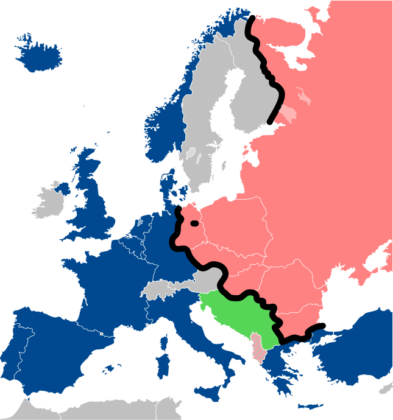
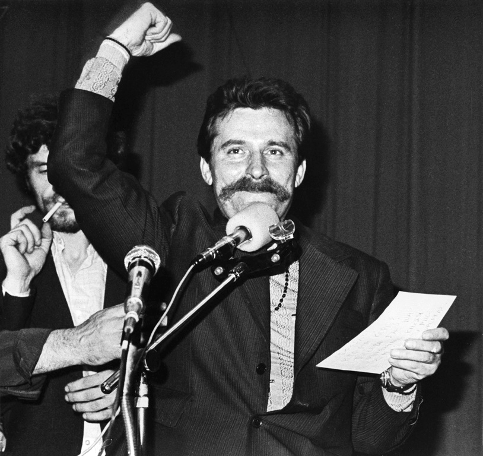

## From the Last Class

:::{.nonincremental}
- We have seen what a [democracy]{.alert} (early and modern) is

- We have seen how [development]{.alert} may lead to democratic reforms
:::

. . . 

A few issues still remain

- Modern democracy is about [mass]{.alert} participation

- So far, we have assumed that
    - People automatically respond to changing conditions
    - People automatically "act as one" (or coordinate)


- When the "masses" are large, this is not so easy to achieve

- We need to understand the forces that bring people together for democracy


## Our Plan for Today

We will study democratic transitions as [decision-making]{.alert} problems

Analyze the forces that lead people to obtain democratic transitions

. . . 

<div style="height: 0.3em;"></div>


**Bottom-up** transitions $\rightarrow$ people mobilize for democracy

- Key problem: citizens' coordination under risk of repression

- Two models: [collective action]{.alert} theory and [tipping]{.alert} models

- Explain why revolts are rare and why they surprisingly occur

. . . 

**Top-down** transitions $\rightarrow$ regime concedes reforms

- Key problem: the regime wants to reform but not democratize

- Regime divisions and [information]{.alert} are crucial

- Explain why transitions may start from the regime itself


# Our Case {.section}

## Post-War Europe and the Warsaw Pact




## The Unexpected Fall of Communism in 1989

:::: {.columns}

::: {.column width="50%"}
.jpg){fig-align="center"}
:::

::: {.column width="50%"}
:::{.nonincremental}
- Economic and political crises in the USSR in the 1980s
- Liberalization reforms by Gorbachev $\rightarrow$ *perestroika*, *glasnost*
- Fuels opposition groups in Eastern Europe
- Sudden fall of Communist regimes and wave of transitions
:::
:::

::::

::: {.fragment}
Communist regimes looked solid but crumbled very fast $\rightarrow$ a [surprise]{.alert}

We want to explain why such epochal events can be surprising
:::


# Bottom-Up Transitions {.section}

## East Germany 1989

:::: {.columns}

::: {.column width="50%"}

:::

::: {.column width="50%"}
- August 1989: Hungary opens border with Austria $\rightarrow$ 13,000 East Germans flee to West

- Mass demonstrations of citizens seeking escape or reform

- Regime crackdown fails, no military help from USSR

- November 1989: Travel restrictions lifted, people breach the Berlin wall

- October 1990: German reunification
:::
::::


## The Puzzle of Revolutions

- East Germany had a "bottom-up" democratic transition

- The "Puzzle" for us is why stable regimes end in sudden revolutions

- Why didn't people revolt earlier if they disapproved of the regime?

- Why did the regime look so stable despite worsening economic conditions?

- Why are mass revolutions of this type so rare?


::: {.fragment}

$\implies$ This has to do with the nature of [collective action]{.alert}

:::

 
## Collective Action Theory: Foundations and Logic

Remember the example in our first class: organizing housecleaning

- Roommates need to do their part, but would let the other work

. . . 

The core of this problem is the same as that of protesting

- Democracy can be reached only if many people protest

- Protesting is risky (repression)

- Once democracy is reached, everyone can enjoy it $\rightarrow$ [public good]{.alert}

- The best thing is to stay home $\rightarrow$ [free-ride]{.alert}
  - If the protest fails, you don't risk anything
  - If the protest succeeds you enjoy the benefits


## Collective Action Theory

**N** East Germans, **K** of them need to protest to obtain democracy

Personal cost for participation, public good in case of success

. . . 


<table style="margin: 25px auto; font-size: 0.85em; border-collapse: collapse; text-align: center; width: 95%;">
  <thead>
    <tr style="border-bottom: 2px solid #ccc;">
      <th style="padding: 12px 10px; width: 22%;"></th>
      <th style="padding: 12px 10px; width: 26%;">Scenario 1<br><span style="font-size: 0.85em; font-weight: normal;">Fewer than $K-1$ participate</span></th>
      <th style="padding: 12px 10px; width: 26%;">Scenario 2<br><span style="font-size: 0.85em; font-weight: normal;">Exactly $K-1$ participate</span></th>
      <th style="padding: 12px 10px; width: 26%;">Scenario 3<br><span style="font-size: 0.85em; font-weight: normal;">$K$ or more participate</span></th>
    </tr>
  </thead>
  <tbody>
    <tr style="border-bottom: 1px solid #eee;">
      <td style="padding: 16px 10px; font-weight: bold; text-align: right;">Participate</td>
      <td style="padding: 16px 10px;">Pay cost; don't receive benefit</td>
      <td style="padding: 16px 10px;">Pay cost; receive benefit</td>
      <td style="padding: 16px 10px;">Pay cost; receive benefit</td>
    </tr>
    <tr>
      <td style="padding: 16px 10px; font-weight: bold; text-align: right;">Don't participate</td>
      <td style="padding: 16px 10px;">Don't pay cost; don't receive benefit</td>
      <td style="padding: 16px 10px;">Don't pay cost; don't receive benefit</td>
      <td style="padding: 16px 10px;">Don't pay cost; receive benefit</td>
    </tr>
  </tbody>
</table>

---

## Collective Action Theory

**N** East Germans, **K** of them need to protest to obtain democracy

Personal cost for participation, public good in case of success


<table style="margin: 25px auto; font-size: 0.85em; border-collapse: collapse; text-align: center; width: 95%;">
  <thead>
    <tr style="border-bottom: 2px solid #ccc;">
      <th style="padding: 12px 10px; width: 22%;"></th>
      <th style="padding: 12px 10px; width: 26%; border-top: 3.5px solid #DC143C; border-left: 3.5px solid #DC143C; border-right: 3.5px solid #DC143C; background-color: #FFF5F5;">Scenario 1<br><span style="font-size: 0.85em; font-weight: normal;">Fewer than $K-1$ participate</span></th>
      <th style="padding: 12px 10px; width: 26%;">Scenario 2<br><span style="font-size: 0.85em; font-weight: normal;">Exactly $K-1$ participate</span></th>
      <th style="padding: 12px 10px; width: 26%;">Scenario 3<br><span style="font-size: 0.85em; font-weight: normal;">$K$ or more participate</span></th>
    </tr>
  </thead>
  <tbody>
    <tr style="border-bottom: 1px solid #eee;">
      <td style="padding: 16px 10px; font-weight: bold; text-align: right;">Participate</td>
      <td style="padding: 16px 10px; border-left: 3.5px solid #DC143C; border-right: 3.5px solid #DC143C; background-color: #FFF5F5;">Pay cost; don't receive benefit</td>
      <td style="padding: 16px 10px;">Pay cost; receive benefit</td>
      <td style="padding: 16px 10px;">Pay cost; receive benefit</td>
    </tr>
    <tr>
      <td style="padding: 16px 10px; font-weight: bold; text-align: right;">Don't participate</td>
      <td style="padding: 16px 10px; border-bottom: 3.5px solid #DC143C; border-left: 3.5px solid #DC143C; border-right: 3.5px solid #DC143C; background-color: #FFF5F5;">Don't pay cost; don't receive benefit</td>
      <td style="padding: 16px 10px;">Don't pay cost; don't receive benefit</td>
      <td style="padding: 16px 10px;">Don't pay cost; receive benefit</td>
    </tr>
  </tbody>
</table>

---

## Collective Action Theory

**N** East Germans, **K** of them need to protest to obtain democracy

Personal cost for participation, public good in case of success


<table style="margin: 25px auto; font-size: 0.85em; border-collapse: collapse; text-align: center; width: 95%;">
  <thead>
    <tr style="border-bottom: 2px solid #ccc;">
      <th style="padding: 12px 10px; width: 22%;"></th>
      <th style="padding: 12px 10px; width: 26%; border-top: 3.5px solid #DC143C; border-left: 3.5px solid #DC143C; border-right: 3.5px solid #DC143C; background-color: #FFF5F5;">Scenario 1<br><span style="font-size: 0.85em; font-weight: normal;">Fewer than $K-1$ participate</span></th>
      <th style="padding: 12px 10px; width: 26%;">Scenario 2<br><span style="font-size: 0.85em; font-weight: normal;">Exactly $K-1$ participate</span></th>
      <th style="padding: 12px 10px; width: 26%;">Scenario 3<br><span style="font-size: 0.85em; font-weight: normal;">$K$ or more participate</span></th>
    </tr>
  </thead>
  <tbody>
    <tr style="border-bottom: 1px solid #eee;">
      <td style="padding: 16px 10px; font-weight: bold; text-align: right;">Participate</td>
      <td style="padding: 16px 10px; border-left: 3.5px solid #DC143C; border-right: 3.5px solid #DC143C; background-color: #FFF5F5;">Pay cost; don't receive benefit</td>
      <td style="padding: 16px 10px;">Pay cost; receive benefit</td>
      <td style="padding: 16px 10px;">Pay cost; receive benefit</td>
    </tr>
    <tr>
      <td style="padding: 16px 10px; font-weight: bold; text-align: right;">Don't participate</td>
      <td style="padding: 16px 10px; border-bottom: 3.5px solid #DC143C; border-left: 3.5px solid #DC143C; border-right: 3.5px solid #DC143C; background-color: #90EE90; font-weight: bold;">Don't pay cost; don't receive benefit</td>
      <td style="padding: 16px 10px;">Don't pay cost; don't receive benefit</td>
      <td style="padding: 16px 10px;">Don't pay cost; receive benefit</td>
    </tr>
  </tbody>
</table>

---

## Collective Action Theory

**N** East Germans, **K** of them need to protest to obtain democracy

Personal cost for participation, public good in case of success


<table style="margin: 25px auto; font-size: 0.85em; border-collapse: collapse; text-align: center; width: 95%;">
  <thead>
    <tr style="border-bottom: 2px solid #ccc;">
      <th style="padding: 12px 10px; width: 22%;"></th>
      <th style="padding: 12px 10px; width: 26%;">Scenario 1<br><span style="font-size: 0.85em; font-weight: normal;">Fewer than $K-1$ participate</span></th>
      <th style="padding: 12px 10px; width: 26%; border-top: 3.5px solid #DC143C; border-left: 3.5px solid #DC143C; border-right: 3.5px solid #DC143C; background-color: #FFF5F5;">Scenario 2<br><span style="font-size: 0.85em; font-weight: normal;">Exactly $K-1$ participate</span></th>
      <th style="padding: 12px 10px; width: 26%;">Scenario 3<br><span style="font-size: 0.85em; font-weight: normal;">$K$ or more participate</span></th>
    </tr>
  </thead>
  <tbody>
    <tr style="border-bottom: 1px solid #eee;">
      <td style="padding: 16px 10px; font-weight: bold; text-align: right;">Participate</td>
      <td style="padding: 16px 10px;">Pay cost; don't receive benefit</td>
      <td style="padding: 16px 10px; border-left: 3.5px solid #DC143C; border-right: 3.5px solid #DC143C; background-color: #FFF5F5;">Pay cost; receive benefit</td>
      <td style="padding: 16px 10px;">Pay cost; receive benefit</td>
    </tr>
    <tr>
      <td style="padding: 16px 10px; font-weight: bold; text-align: right;">Don't participate</td>
      <td style="padding: 16px 10px; background-color: #90EE90; font-weight: bold;">Don't pay cost; don't receive benefit</td>
      <td style="padding: 16px 10px; border-bottom: 3.5px solid #DC143C; border-left: 3.5px solid #DC143C; border-right: 3.5px solid #DC143C; background-color: #FFF5F5;">Don't pay cost; don't receive benefit</td>
      <td style="padding: 16px 10px;">Don't pay cost; receive benefit</td>
    </tr>
  </tbody>
</table>

---

## Collective Action Theory

**N** East Germans, **K** of them need to protest to obtain democracy

Personal cost for participation, public good in case of success


<table style="margin: 25px auto; font-size: 0.85em; border-collapse: collapse; text-align: center; width: 95%;">
  <thead>
    <tr style="border-bottom: 2px solid #ccc;">
      <th style="padding: 12px 10px; width: 22%;"></th>
      <th style="padding: 12px 10px; width: 26%;">Scenario 1<br><span style="font-size: 0.85em; font-weight: normal;">Fewer than $K-1$ participate</span></th>
      <th style="padding: 12px 10px; width: 26%; border-top: 3.5px solid #DC143C; border-left: 3.5px solid #DC143C; border-right: 3.5px solid #DC143C; background-color: #FFF5F5;">Scenario 2<br><span style="font-size: 0.85em; font-weight: normal;">Exactly $K-1$ participate</span></th>
      <th style="padding: 12px 10px; width: 26%;">Scenario 3<br><span style="font-size: 0.85em; font-weight: normal;">$K$ or more participate</span></th>
    </tr>
  </thead>
  <tbody>
    <tr style="border-bottom: 1px solid #eee;">
      <td style="padding: 16px 10px; font-weight: bold; text-align: right;">Participate</td>
      <td style="padding: 16px 10px;">Pay cost; don't receive benefit</td>
      <td style="padding: 16px 10px; border-left: 3.5px solid #DC143C; border-right: 3.5px solid #DC143C; background-color: #90EE90; font-weight: bold;">Pay cost; receive benefit</td>
      <td style="padding: 16px 10px;">Pay cost; receive benefit</td>
    </tr>
    <tr>
      <td style="padding: 16px 10px; font-weight: bold; text-align: right;">Don't participate</td>
      <td style="padding: 16px 10px; background-color: #90EE90; font-weight: bold;">Don't pay cost; don't receive benefit</td>
      <td style="padding: 16px 10px; border-bottom: 3.5px solid #DC143C; border-left: 3.5px solid #DC143C; border-right: 3.5px solid #DC143C; background-color: #FFF5F5;">Don't pay cost; don't receive benefit</td>
      <td style="padding: 16px 10px;">Don't pay cost; receive benefit</td>
    </tr>
  </tbody>
</table>

---

## Collective Action Theory

**N** East Germans, **K** of them need to protest to obtain democracy

Personal cost for participation, public good in case of success


<table style="margin: 25px auto; font-size: 0.85em; border-collapse: collapse; text-align: center; width: 95%;">
  <thead>
    <tr style="border-bottom: 2px solid #ccc;">
      <th style="padding: 12px 10px; width: 22%;"></th>
      <th style="padding: 12px 10px; width: 26%;">Scenario 1<br><span style="font-size: 0.85em; font-weight: normal;">Fewer than $K-1$ participate</span></th>
      <th style="padding: 12px 10px; width: 26%;">Scenario 2<br><span style="font-size: 0.85em; font-weight: normal;">Exactly $K-1$ participate</span></th>
      <th style="padding: 12px 10px; width: 26%; border-top: 3.5px solid #DC143C; border-left: 3.5px solid #DC143C; border-right: 3.5px solid #DC143C; background-color: #FFF5F5;">Scenario 3<br><span style="font-size: 0.85em; font-weight: normal;">$K$ or more participate</span></th>
    </tr>
  </thead>
  <tbody>
    <tr style="border-bottom: 1px solid #eee;">
      <td style="padding: 16px 10px; font-weight: bold; text-align: right;">Participate</td>
      <td style="padding: 16px 10px;">Pay cost; don't receive benefit</td>
      <td style="padding: 16px 10px; background-color: #90EE90; font-weight: bold;">Pay cost; receive benefit</td>
      <td style="padding: 16px 10px; border-left: 3.5px solid #DC143C; border-right: 3.5px solid #DC143C; background-color: #FFF5F5;">Pay cost; receive benefit</td>
    </tr>
    <tr>
      <td style="padding: 16px 10px; font-weight: bold; text-align: right;">Don't participate</td>
      <td style="padding: 16px 10px; background-color: #90EE90; font-weight: bold;">Don't pay cost; don't receive benefit</td>
      <td style="padding: 16px 10px;">Don't pay cost; don't receive benefit</td>
      <td style="padding: 16px 10px; border-bottom: 3.5px solid #DC143C; border-left: 3.5px solid #DC143C; border-right: 3.5px solid #DC143C; background-color: #FFF5F5;">Don't pay cost; receive benefit</td>
    </tr>
  </tbody>
</table>

---

## Collective Action Theory

**N** East Germans, **K** of them need to protest to obtain democracy

Personal cost for participation, public good in case of success


<table style="margin: 25px auto; font-size: 0.85em; border-collapse: collapse; text-align: center; width: 95%;">
  <thead>
    <tr style="border-bottom: 2px solid #ccc;">
      <th style="padding: 12px 10px; width: 22%;"></th>
      <th style="padding: 12px 10px; width: 26%;">Scenario 1<br><span style="font-size: 0.85em; font-weight: normal;">Fewer than $K-1$ participate</span></th>
      <th style="padding: 12px 10px; width: 26%;">Scenario 2<br><span style="font-size: 0.85em; font-weight: normal;">Exactly $K-1$ participate</span></th>
      <th style="padding: 12px 10px; width: 26%; border-top: 3.5px solid #DC143C; border-left: 3.5px solid #DC143C; border-right: 3.5px solid #DC143C; background-color: #FFF5F5;">Scenario 3<br><span style="font-size: 0.85em; font-weight: normal;">$K$ or more participate</span></th>
    </tr>
  </thead>
  <tbody>
    <tr style="border-bottom: 1px solid #eee;">
      <td style="padding: 16px 10px; font-weight: bold; text-align: right;">Participate</td>
      <td style="padding: 16px 10px;">Pay cost; don't receive benefit</td>
      <td style="padding: 16px 10px; background-color: #90EE90; font-weight: bold;">Pay cost; receive benefit</td>
      <td style="padding: 16px 10px; border-left: 3.5px solid #DC143C; border-right: 3.5px solid #DC143C; background-color: #FFF5F5;">Pay cost; receive benefit</td>
    </tr>
    <tr>
      <td style="padding: 16px 10px; font-weight: bold; text-align: right;">Don't participate</td>
      <td style="padding: 16px 10px; background-color: #90EE90; font-weight: bold;">Don't pay cost; don't receive benefit</td>
      <td style="padding: 16px 10px;">Don't pay cost; don't receive benefit</td>
      <td style="padding: 16px 10px; border-bottom: 3.5px solid #DC143C; border-left: 3.5px solid #DC143C; border-right: 3.5px solid #DC143C; background-color: #90EE90; font-weight: bold;">Don't pay cost; receive benefit</td>
    </tr>
  </tbody>
</table>

---

## Collective Action Theory

**N** East Germans, **K** of them need to protest to obtain democracy

Personal cost for participation, public good in case of success


<table style="margin: 25px auto; font-size: 0.85em; border-collapse: collapse; text-align: center; width: 95%;">
  <thead>
    <tr style="border-bottom: 2px solid #ccc;">
      <th style="padding: 12px 10px; width: 22%;"></th>
      <th style="padding: 12px 10px; width: 26%;">Scenario 1<br><span style="font-size: 0.85em; font-weight: normal;">Fewer than $K-1$ participate</span></th>
      <th style="padding: 12px 10px; width: 26%;">Scenario 2<br><span style="font-size: 0.85em; font-weight: normal;">Exactly $K-1$ participate</span></th>
      <th style="padding: 12px 10px; width: 26%;">Scenario 3<br><span style="font-size: 0.85em; font-weight: normal;">$K$ or more participate</span></th>
    </tr>
  </thead>
  <tbody>
    <tr style="border-bottom: 1px solid #eee;">
      <td style="padding: 16px 10px; font-weight: bold; text-align: right;">Participate</td>
      <td style="padding: 16px 10px;">Pay cost; don't receive benefit</td>
      <td style="padding: 16px 10px; background-color: #90EE90; font-weight: bold;">Pay cost; receive benefit</td>
      <td style="padding: 16px 10px;">Pay cost; receive benefit</td>
    </tr>
    <tr>
      <td style="padding: 16px 10px; font-weight: bold; text-align: right;">Don't participate</td>
      <td style="padding: 16px 10px; background-color: #90EE90; font-weight: bold;">Don't pay cost; don't receive benefit</td>
      <td style="padding: 16px 10px;">Don't pay cost; don't receive benefit</td>
      <td style="padding: 16px 10px; background-color: #90EE90; font-weight: bold;">Don't pay cost; receive benefit</td>
    </tr>
  </tbody>
</table>


## Implications of the Theory

Direct implications:

- Larger **N** (relative to **K**) $\implies$ greater free-rider problem
  - Less likely that you are decisive
  - More difficult to monitor participants

- Small groups are often more successful at collective action
  - Think of lobbies vs large groups of voters

. . . 

Subtler implications:

- The absence of protest does not mean that most people support the regime

- The conditions for expressing discontent may not be there

. . . 

$\implies$ But what are these conditions?


## Tipping Models: Foundations and Logic

Tipping models $\rightarrow$ how people can suddenly overcome collective action problems

Relative to Collective Action Theory, we introduce some elements

- People have different personal motivations to protest
  - Some (e.g., "rebels") would always protest, others (e.g., "loyalists") would never protest

. . . 

Key idea: in a dictatorship people [conceal]{.alert} their real support for the government

- So people don't know how many others want to protest
- A few people protesting can motivate others $\implies$ [revolutionary cascade]{.alert}

## Tipping Models

:::: {.columns}

::: {.column width="65%"}

How can we formalize this intuition?

- People have their own propensity to protest **T** ("revolutionary threshold")
- Different people may have different **T** 
  - **Q**: **T**=how many people need to protest for me to join them
  - **Q**: Lower **T** $\implies$ more or less support?
  - How can we interpret **T**?


:::

::: {.column width="35%"}

```{r}
#| echo: false
#| fig-align: center
#| fig-width: 3.5
#| fig-height: 5.0
#| out-width: "280px"

library(grid)
grid.newpage()
pushViewport(viewport(width = 1, height = 1))

x <- 0.5
y_card <- 0.42

# 1. Threshold circle above individual
grid.circle(x = x, y = 0.78, r = 0.10, 
            gp = gpar(fill = "white", col = "#4A5568", lwd = 2.2))
grid.text(expression(bold(T[i])), x = x, y = 0.78, 
          gp = gpar(fontsize = 22, col = "black"))

# 2. Person Card
grid.roundrect(x = x, y = y_card, width = 0.44, height = 0.40, r = unit(0.035, "npc"),
               gp = gpar(fill = "white", col = "#718096", lwd = 2.2))

# 3. Person Icon
# Head
grid.circle(x = x, y = y_card + 0.095, r = 0.058, 
            gp = gpar(fill = "navajowhite", col = "black", lwd = 1.6))
# Torso / Body
grid.polygon(x = c(x - 0.07, x + 0.07, x + 0.052, x - 0.052),
             y = c(y_card - 0.09, y_card - 0.09, y_card + 0.055, y_card + 0.055),
             gp = gpar(fill = "#A0AEC0", col = "black", lwd = 1.6))

# 4. Person Label (Index)
grid.text(expression(bold(P[i])), x = x, y = y_card - 0.14, 
          gp = gpar(fontsize = 16, fontface = "bold", col = "black"))

popViewport()
```

:::

::::

---

## Tipping Models: An Example

Consider a society with 10 people

```{r}
#| echo: false
#| fig-align: center
#| fig-width: 11
#| fig-height: 4.4
#| out-width: "950px"
#| out-height: "360px"

library(grid)

draw_tipping_society <- function(thresholds, revolting_indices = c()) {
  grid.newpage()
  pushViewport(viewport(width = 1, height = 1))
  
  n <- length(thresholds)
  xs <- seq(0.07, 0.93, length.out = n)
  
  for (i in 1:n) {
    x <- xs[i]
    y_card <- 0.44
    t_val <- thresholds[i]
    is_revolting <- i %in% revolting_indices
    
    # Colors (Color-blind friendly: unfilled white vs vibrant green fill)
    if (is_revolting) {
      card_fill  <- "#C8E6C9"    # light green fill
      card_col   <- "#1B5E20"    # dark green stroke
      badge_fill <- "#2E7D32"    # green filled circle
      badge_text <- "white"
      badge_col  <- "#1B5E20"
      torso_col  <- "#1B5E20"
      card_lwd   <- 2.5
    } else {
      card_fill  <- "white"      # unfilled white
      card_col   <- "#718096"    # neutral outline
      badge_fill <- "white"      # unfilled circle
      badge_text <- "black"
      badge_col  <- "#4A5568"
      torso_col  <- "#A0AEC0"
      card_lwd   <- 1.5
    }
    
    # 1. Threshold circle above individual
    grid.circle(x = x, y = 0.77, r = 0.034, 
                gp = gpar(fill = badge_fill, col = badge_col, lwd = 1.6))
    grid.text(as.character(t_val), x = x, y = 0.77, 
              gp = gpar(fontsize = 13, fontface = "bold", col = badge_text))
    
    # 2. Person Card
    grid.roundrect(x = x, y = y_card, width = 0.075, height = 0.32, r = unit(0.015, "npc"),
                   gp = gpar(fill = card_fill, col = card_col, lwd = card_lwd))
    
    # 3. Person Icon
    # Head
    grid.circle(x = x, y = y_card + 0.075, r = 0.022, 
                gp = gpar(fill = "navajowhite", col = "black", lwd = 1.2))
    # Torso / Body
    grid.polygon(x = c(x - 0.026, x + 0.026, x + 0.020, x - 0.020),
                 y = c(y_card - 0.065, y_card - 0.065, y_card + 0.045, y_card + 0.045),
                 gp = gpar(fill = torso_col, col = "black", lwd = 1.2))
    
    # 4. Person Label (Index)
    grid.text(paste0("P", i), x = x, y = y_card - 0.11, 
              gp = gpar(fontsize = 10, fontface = "bold", col = "black"))
    
    # 5. Status indicator below card
    if (is_revolting) {
      grid.text("Revolts!", x = x, y = 0.16, 
                gp = gpar(fontsize = 10.5, fontface = "bold", col = "#1B5E20"))
    }
  }
  
  popViewport()
}

draw_tipping_society(c(0, 2, 2, 3, 4, 5, 6, 7, 8, 10), revolting_indices = c())
```


---

## Tipping Models: An Example

Consider a society with 10 people


```{r}
#| echo: false
#| fig-align: center
#| fig-width: 11
#| fig-height: 4.4
#| out-width: "950px"
#| out-height: "360px"

draw_tipping_society(c(0, 2, 2, 3, 4, 5, 6, 7, 8, 10), revolting_indices = c(1))
```

:::{.fragment}
:::{.nonincremental}
- Person 1 ($T = 0$) protests, the others require at least 2
- Protest size is 1
:::
:::

---

## Tipping Models: Changing Thresholds

Now suppose P2's threshold goes down from 2 to 1

```{r}
#| echo: false
#| fig-align: center
#| fig-width: 11
#| fig-height: 4.4
#| out-width: "950px"
#| out-height: "360px"

draw_tipping_society(c(0, 1, 2, 3, 4, 5, 6, 7, 8, 10), revolting_indices = c())
```

---

## Tipping Models: Changing Thresholds

Now suppose P2's threshold goes down from 2 to 1


```{r}
#| echo: false
#| fig-align: center
#| fig-width: 11
#| fig-height: 4.4
#| out-width: "950px"
#| out-height: "360px"

draw_tipping_society(c(0, 1, 2, 3, 4, 5, 6, 7, 8, 10), revolting_indices = 1:9)
```

:::{.fragment}
:::{.nonincremental}
- Person 1 ($T = 0$) protests $\rightarrow$ Person 2 ($T = 1$) joins $\rightarrow$ Person 3 $\dots$
- 9/10 people protest $\rightarrow$ revolutionary cascade 
:::
:::

---

## Tipping Models: Another Example

Consider a different society

```{r}
#| echo: false
#| fig-align: center
#| fig-width: 11
#| fig-height: 4.4
#| out-width: "950px"
#| out-height: "360px"

draw_tipping_society(c(0, 2, 3, 3, 4, 5, 6, 7, 8, 10), revolting_indices = c())
```

---

## Tipping Models: Another Example

Consider a different society

```{r}
#| echo: false
#| fig-align: center
#| fig-width: 11
#| fig-height: 4.4
#| out-width: "950px"
#| out-height: "360px"

draw_tipping_society(c(0, 2, 3, 3, 4, 5, 6, 7, 8, 10), revolting_indices = c(1))
```

:::{.fragment}
:::{.nonincremental}
- Person 1 ($T = 0$) revolts alone, others require at least 2 people
- Protest size is 1
:::
:::

---

## Tipping Models: Another Example

Now let's change P2 from 2 to 1 as before

```{r}
#| echo: false
#| fig-align: center
#| fig-width: 11
#| fig-height: 4.4
#| out-width: "950px"
#| out-height: "360px"

draw_tipping_society(c(0, 1, 3, 3, 4, 5, 6, 7, 8, 10), revolting_indices = c())
```

---

## Tipping Models: Another Example

Now let's change P2 from 2 to 1 as before


```{r}
#| echo: false
#| fig-align: center
#| fig-width: 11
#| fig-height: 4.4
#| out-width: "950px"
#| out-height: "360px"

draw_tipping_society(c(0, 1, 3, 3, 4, 5, 6, 7, 8, 10), revolting_indices = c(1, 2))
```

:::{.fragment}
:::{.nonincremental}
- Person 1 ($T = 0$) and Person 2 ($T = 1$) protest, others need at least 3
- The protest size is 2
:::
:::

---

## Tipping Models: "Boiling Point"

A final example

```{r}
#| echo: false
#| fig-align: center
#| fig-width: 11
#| fig-height: 4.4
#| out-width: "950px"
#| out-height: "360px"

draw_tipping_society(c(0, 2, 2, 2, 2, 2, 2, 2, 2, 10), revolting_indices = c())
```

---

## Tipping Models: "Boiling Point"

A final example

```{r}
#| echo: false
#| fig-align: center
#| fig-width: 11
#| fig-height: 4.4
#| out-width: "950px"
#| out-height: "360px"

draw_tipping_society(c(0, 2, 2, 2, 2, 2, 2, 2, 2, 10), revolting_indices = c(1))
```

:::{.fragment}
:::{.nonincremental}
- Almost everyone is very willing to revolt, but Person 1 ($T = 0$) protests alone 
- Highly discontented society, yet only 1 person protests
:::
:::

---

## Tipping Models: "Boiling Point"

Now let's make one person willing to protest

```{r}
#| echo: false
#| fig-align: center
#| fig-width: 11
#| fig-height: 4.4
#| out-width: "950px"
#| out-height: "360px"

draw_tipping_society(c(0, 0, 2, 2, 2, 2, 2, 2, 2, 10), revolting_indices = c())
```

---

## Tipping Models: "Boiling Point"

Now let's make one person willing to protest


```{r}
#| echo: false
#| fig-align: center
#| fig-width: 11
#| fig-height: 4.4
#| out-width: "950px"
#| out-height: "360px"

draw_tipping_society(c(0, 0, 2, 2, 2, 2, 2, 2, 2, 10), revolting_indices = 1:9)
```

:::{.fragment}
:::{.nonincremental}
- Person 1 ($T = 0$) and Person 2 ($T = 0$) both protest, other 7 join
- 9/10 people revolt $\rightarrow$ Revolutionary cascade
:::
:::


## Implications of the Theory

::::{.columns}
::: {.column width="60%"}
:::{.nonincremental}
- Discontent can be widespread, yet revolutions do not happen

- Catalyzing events can make people more willing to protest triggering a cascade

- East Germany: USSR position likely signalled violent repression was less likely

- Arab Spring: A street vendor's self-immolation started the revolts
:::
:::

:::{.column width="40%"}

:::
::::


# Top-Down Transitions {.section}

## Poland 1989

:::: {.columns}
::: {.column width="60%"}

- Economic crisis leads to demand for "liberal" reforms

- 1980: Polish Communist Party allows the formation of independent trade union Solidarity

- Solidarity gains 10 million members in a few months

- Initial wave of repression but protests continue

- 1989: Government seeks compromise with Solidarity, grants first elections

- Solidarity wins all "contestable" seats, first non-Communist Prime Minister appointed

:::

::: {.column width="40%"}

::::
::::

## A Strategic Theory of Transition: Foundations and Logic

Top-down transition $\rightarrow$ democratic reforms lead to democratization

. . . 

Key idea: the government does **not** want to democratize

- Moderate factions ("[soft-liners]{.alert}") $\rightarrow$ support liberal reforms (e.g., freedom of expression) to "co-opt" the opposition
- [Opposition]{.alert} $\rightarrow$ wants to use the reforms to further challenge the government's power
- Knowing this, soft-liners are reluctant to do any reform
- Democratization is the result of [miscalculation]{.alert} of the government

## Transition Game

```{r}
#| echo: false
#| fig-align: center
#| fig-width: 11
#| fig-height: 4.2
#| out-width: "900px"
#| out-height: "320px"

library(grid)

draw_transition_game_tree <- function(hl_branches = c(), hl_outcome = NULL, 
                                       branch_hl_col = "#DC143C", outcome_hl_col = "#DC143C") {
  grid.newpage()
  pushViewport(viewport(width = 1, height = 1))

  # Helper: Draw a decision node
  draw_node <- function(x, y, player) {
    grid.circle(x = x, y = y, r = 0.018, gp = gpar(fill = "black", col = "black"))
    grid.text(player, x = x, y = y + 0.065, gp = gpar(fontsize = 13, fontface = "bold", col = "black"))
  }

  # Helper: Draw an outcome box
  draw_outcome <- function(x, y, title, subtitle = NULL, is_hl = FALSE) {
    w <- 0.22
    h <- ifelse(is.null(subtitle), 0.085, 0.105)
    border_col <- ifelse(is_hl, outcome_hl_col, "black")
    fill_col   <- ifelse(is_hl, if (outcome_hl_col == "#DC143C") "#FFF5F5" else "#F1F8E9", "white")
    text_col   <- ifelse(is_hl, outcome_hl_col, "black")
    lwd_val    <- ifelse(is_hl, 3, 1.8)
    
    grid.roundrect(x = x + w/2 + 0.01, y = y, width = w, height = h, r = unit(0.015, "npc"),
                   gp = gpar(fill = fill_col, col = border_col, lwd = lwd_val))
    if (is.null(subtitle)) {
      grid.text(title, x = x + w/2 + 0.01, y = y, 
                gp = gpar(fontsize = 10.5, fontface = "bold", col = text_col))
    } else {
      grid.text(title, x = x + w/2 + 0.01, y = y + 0.020, 
                gp = gpar(fontsize = 10.5, fontface = "bold", col = text_col))
      grid.text(subtitle, x = x + w/2 + 0.01, y = y - 0.020, 
                gp = gpar(fontsize = 9, fontface = "italic", col = text_col))
    }
  }

  # Helper: Draw branch line + text
  draw_branch <- function(x1, y1, x2, y2, label, lx, ly, branch_id) {
    is_hl <- branch_id %in% hl_branches
    col_val <- ifelse(is_hl, branch_hl_col, "black")
    lwd_val <- ifelse(is_hl, 3.5, 2)
    grid.lines(x = c(x1, x2), y = c(y1, y2), gp = gpar(col = col_val, lwd = lwd_val))
    grid.text(label, x = lx, y = ly, gp = gpar(fontsize = 11.5, fontface = "bold", col = col_val))
  }

  # 1. ROOT (Stage 1: Soft-Liners)
  draw_branch(0.10, 0.55, 0.32, 0.80, "Do nothing", 0.17, 0.72, "do_nothing")
  draw_outcome(0.32, 0.80, "Status Quo", is_hl = (identical(hl_outcome, "status_quo")))

  draw_branch(0.10, 0.55, 0.35, 0.35, "Open", 0.20, 0.42, "open")
  draw_node(0.10, 0.55, "Soft-Liners")

  # 2. STAGE 2 (Opposition)
  draw_branch(0.35, 0.35, 0.58, 0.58, "Enter", 0.43, 0.51, "enter")
  draw_outcome(0.58, 0.58, "Broadened Dictatorship", is_hl = (identical(hl_outcome, "broadened_dictatorship")))

  draw_branch(0.35, 0.35, 0.60, 0.18, "Organize", 0.43, 0.23, "organize")
  draw_node(0.35, 0.35, "Opposition")

  # 3. STAGE 3 (Soft-Liners)
  draw_branch(0.60, 0.18, 0.76, 0.34, "Repress", 0.66, 0.30, "repress")
  draw_outcome(0.76, 0.34, "Narrow Dictatorship", "or Insurgency", is_hl = (identical(hl_outcome, "narrow_dictatorship")))

  draw_branch(0.60, 0.18, 0.76, 0.05, "Democratize", 0.66, 0.08, "democratize")
  draw_outcome(0.76, 0.05, "Democratic Transition", is_hl = (identical(hl_outcome, "democratic_transition")))
  draw_node(0.60, 0.18, "Soft-Liners")

  popViewport()
}

draw_transition_game_tree()
```


Strategic interaction: [anticipate]{.alert} the future actions of the opponent

We analyze what happens in two cases: 

1. Weak opposition (does not have support)
2. Strong opposition (has mass support)

---

## Transition Game: Weak Opposition

```{r}
#| echo: false
#| fig-align: center
#| fig-width: 11
#| fig-height: 4.2
#| out-width: "900px"
#| out-height: "320px"

draw_transition_game_tree(hl_branches = c("repress"))
```

::: {.nonincremental}
- **Stage 3 (Soft-Liners):** Facing a weak opposition, soft-liners prefer to [**Repress**]{style="color: #DC143C; font-weight: bold;"} rather than democratize
:::

---

## Transition Game: Weak Opposition

```{r}
#| echo: false
#| fig-align: center
#| fig-width: 11
#| fig-height: 4.2
#| out-width: "900px"
#| out-height: "320px"

draw_transition_game_tree(hl_branches = c("repress", "enter"))
```

::: {.nonincremental}
- **Stage 3 (Soft-Liners):** Soft-liners will **Repress**
- **Stage 2 (Opposition):** Anticipating repression, the opposition decides to [**Enter**]{style="color: #DC143C; font-weight: bold;"} rather than organize
:::

---

## Transition Game: Weak Opposition

```{r}
#| echo: false
#| fig-align: center
#| fig-width: 11
#| fig-height: 4.2
#| out-width: "900px"
#| out-height: "320px"

draw_transition_game_tree(hl_branches = c("repress", "enter", "open"))
```

::: {.nonincremental}
- **Stage 3 (Soft-Liners):** Soft-liners will **Repress**
- **Stage 2 (Opposition):** Opposition will **Enter**
- **Stage 1 (Soft-Liners):** Knowing the opposition will enter, soft-liners choose to [**Open**]{style="color: #DC143C; font-weight: bold;"}
:::

---

## Transition Game: Weak Opposition

```{r}
#| echo: false
#| fig-align: center
#| fig-width: 11
#| fig-height: 4.2
#| out-width: "900px"
#| out-height: "320px"

draw_transition_game_tree(hl_branches = c("repress", "enter", "open"), hl_outcome = "broadened_dictatorship")
```

::: {.nonincremental}
- **Equilibrium Path:** Soft-Liners **Open** $\rightarrow$ Opposition **Enters**
- **Outcome:** [**Broadened Dictatorship**]{style="color: #DC143C; font-weight: bold;"} (liberalization without democratization)
:::

---

## Transition Game: Strong Opposition

```{r}
#| echo: false
#| fig-align: center
#| fig-width: 11
#| fig-height: 4.2
#| out-width: "900px"
#| out-height: "320px"

draw_transition_game_tree(hl_branches = c("democratize"))
```

::: {.nonincremental}
- **Stage 3 (Soft-Liners):** Repression fails against strong opposition $\implies$ soft-liners must [**Democratize**]{style="color: #DC143C; font-weight: bold;"}
:::

---

## Transition Game: Strong Opposition

```{r}
#| echo: false
#| fig-align: center
#| fig-width: 11
#| fig-height: 4.2
#| out-width: "900px"
#| out-height: "320px"

draw_transition_game_tree(hl_branches = c("democratize", "organize"))
```

::: {.nonincremental}
- **Stage 3 (Soft-Liners):** Soft-liners will **Democratize**
- **Stage 2 (Opposition):** Anticipating democratization, the opposition chooses to [**Organize**]{style="color: #DC143C; font-weight: bold;"}
:::

---

## Transition Game: Strong Opposition

```{r}
#| echo: false
#| fig-align: center
#| fig-width: 11
#| fig-height: 4.2
#| out-width: "900px"
#| out-height: "320px"

draw_transition_game_tree(hl_branches = c("democratize", "organize", "do_nothing"))
```

::: {.nonincremental}
- **Stage 3 (Soft-Liners):** Soft-liners will **Democratize**
- **Stage 2 (Opposition):** Opposition will **Organize**
- **Stage 1 (Soft-Liners):** Knowing opening triggers democratization, soft-liners choose to [**Do nothing**]{style="color: #DC143C; font-weight: bold;"}
:::

---

## Transition Game: Strong Opposition

```{r}
#| echo: false
#| fig-align: center
#| fig-width: 11
#| fig-height: 4.2
#| out-width: "900px"
#| out-height: "320px"

draw_transition_game_tree(hl_branches = c("democratize", "organize", "do_nothing"), hl_outcome = "status_quo")
```

::: {.nonincremental}
- **Equilibrium Path:** Soft-Liners **Do nothing**
- **Outcome:** [**Status Quo**]{style="color: #DC143C; font-weight: bold;"} (democratization never happens)
:::

---

## Democratic Transition by Mistake

```{r}
#| echo: false
#| fig-align: center
#| fig-width: 11
#| fig-height: 4.2
#| out-width: "900px"
#| out-height: "320px"

draw_transition_game_tree(hl_branches = c("open"), branch_hl_col = "#2E7D32")
```

::: {.nonincremental}
- Soft-liners mistakenly believe the opposition is **weak** (and will *Enter*)
- **Stage 1 (Soft-Liners):** Based on miscalculation, soft-liners [**Open**]{style="color: #2E7D32; font-weight: bold;"}
:::

---

## Democratic Transition by Mistake

```{r}
#| echo: false
#| fig-align: center
#| fig-width: 11
#| fig-height: 4.2
#| out-width: "900px"
#| out-height: "320px"

draw_transition_game_tree(hl_branches = c("open", "organize"), branch_hl_col = "#2E7D32")
```

::: {.nonincremental}
- **Stage 1:** Soft-liners **Open** (expecting opposition to enter)
- **Stage 2 (Opposition):** But the opposition is actually **strong** and chooses to [**Organize**]{style="color: #2E7D32; font-weight: bold;"}
:::

---

## Democratic Transition by Mistake

```{r}
#| echo: false
#| fig-align: center
#| fig-width: 11
#| fig-height: 4.2
#| out-width: "900px"
#| out-height: "320px"

draw_transition_game_tree(hl_branches = c("open", "organize", "democratize"), 
                          hl_outcome = "democratic_transition",
                          branch_hl_col = "#2E7D32", outcome_hl_col = "#DC143C")
```

::: {.nonincremental}
- **Stage 1:** Soft-liners **Open** (mistaken belief that opposition is weak)
- **Stage 2:** Opposition **Organizes** (revealing true strength)
- **Stage 3 (Soft-Liners):** Realize mistake, forced to [**Democratize**]{style="color: #2E7D32; font-weight: bold;"}
- **Outcome:** [**Democratic Transition**]{style="color: #DC143C; font-weight: bold;"} occurs by mistake
:::


## Explaining Poland's Transition


::: {.nonincremental}

- Polish Communist Party underestimated Solidarity's support

- People were reluctant to share their true opinions 

- Government hoped to incorporate Solidarity in the puppet opposition

- Solidarity pushed for democratization backed by the masses

- The USSR's no-interference position strengthened the opposition vis-a-vis the government

:::


# Summing Up {.section}


## What We Learned

- Democratic transition requires many decisions

- Decisions are taken under fundamental [uncertainty]{.alert}
  - People aspire to democracy but are uncertain about others' resolve
  - Authoritarian regimes want to keep power but are uncertain about the opposition's strength

- These problems are exacerbated by people hiding their opinions

- This may lead to [errors]{.alert} of judgement
  - Protests don't happen even though discontent is large
  - Regimes liberalize to co-opt opposition and end up emboldening it 

- Regime transitions can happen suddenly and unexpectedly


## Discussion

These theories are not perfect

- Remember the analogy between maps and models 

- They isolate important mechanisms (coordination/concession)
  - Emphasize agency of the people vs the government

- Transitions have both "top-down" and "bottom-up" components
  - See the paper discussed this week

. . . 

Implications for how dictatorships work

- "Democratic" reforms can actually strengthen a regime
- Next week we will see why

## 

::: {style="display: flex; justify-content: center; align-items: center; height: 70vh; font-size: 2.5em; font-weight: bold; color: Black;"}
Thank you!
:::