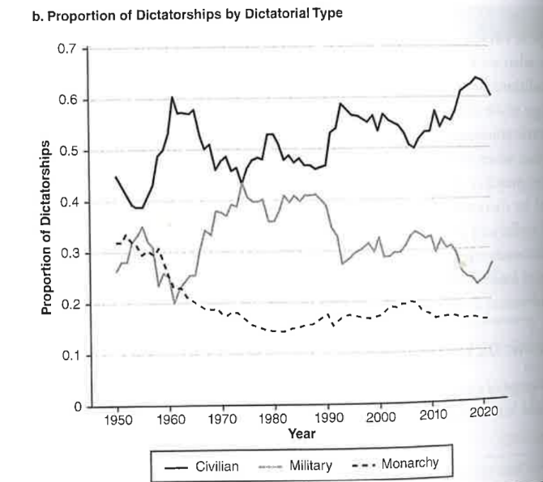
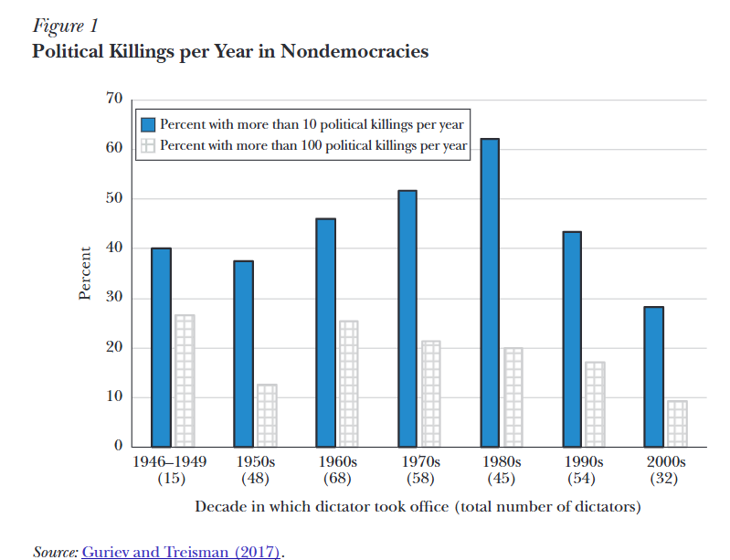
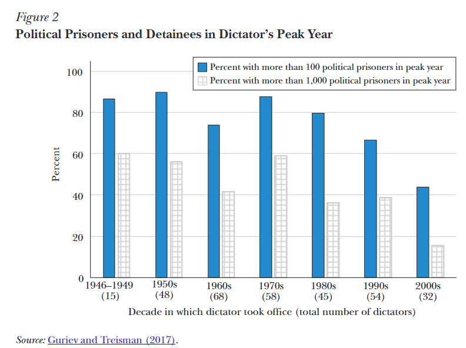
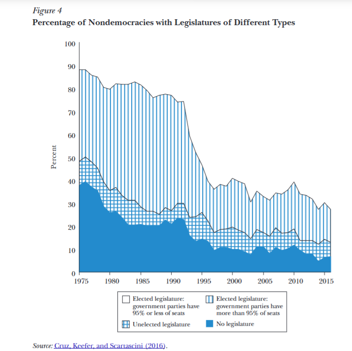
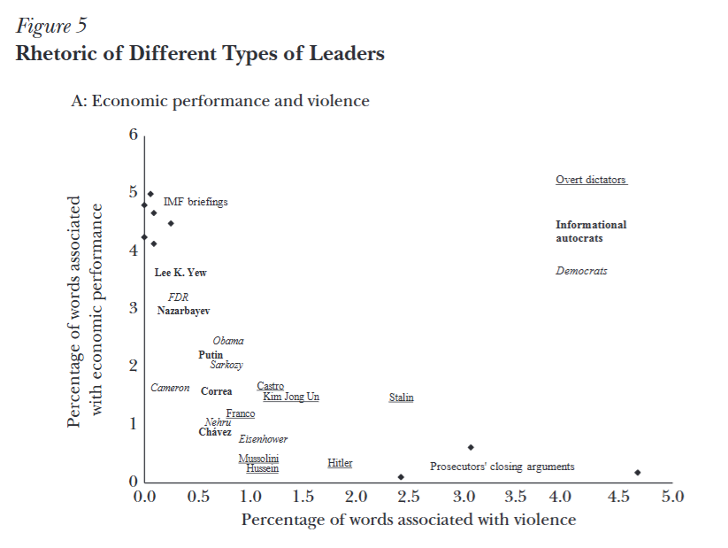

## Pictures

::::{.columns}
:::{.column width="25%"}

:::

:::{.column width="25%"}

:::

:::{.column width="25%"}

:::

:::{.column width="25%"}

:::
::::

- Who looks more like a dictator?
- What would your grandparents say if you asked them?


## Myths and Realities about Dictators

- Our imagination about dictators comes from history's most salient dictatorships

- We tend to imagine them as all-powerful individuals holding absolute power

- In reality, they govern complex systems and need complex institutions

- Their concerns are quite simple

- Need to satisfy allies without giving them too much power

- Don't have democratic competitors but care about citizens' opinion

- In a word, they are still fundamentally politicians

- Understanding their politics is our goal for today


## Our Plan for Today

Who dictators are

- Kings, generals, and their supporters

. . . 

How they rule

:::{.nonincremental}
- The surprising (?) prevalence of parties and elections
- From violence to media and information
:::

. . . 

Fundamental problems of authoritarian rule 

:::{.nonincremental}
- [Power-sharing]{.alert} $\rightarrow$ members of the support coalition
- [Control]{.alert} $\rightarrow$ broader society
:::

. . . 

Explaining dictators' economic performance


# Types of Dictatorship {.section}


## Monarchic Dictatorships

::::{.columns}

:::{.column width="60%"}
- The dictator is a [king]{.alert}
- Key power roles are held within the royal family
- [Succession]{.alert} happens within the royal family


::: {.fragment}
Tend to be relatively more stable. Why?
:::

:::

:::{.column width="40%"}

:::
::::


## Monarchic Dictatorships

Tend to be relatively more stable. Why?

:::: {.columns}

::: {.column width="48%"}

```{r}
#| echo: false
#| fig-align: center
#| fig-width: 5.5
#| fig-height: 5.2
#| out-width: "100%"

library(grid)

draw_monarchic_network <- function() {
  grid.newpage()
  pushViewport(viewport(width = 1, height = 1))
  
  # 7 Nodes (King is node 1: embedded in the network, not the sole center)
  nodes <- data.frame(
    id = 1:7,
    x = c(0.72, 0.36, 0.16, 0.28, 0.62, 0.85, 0.48),
    y = c(0.70, 0.80, 0.50, 0.24, 0.20, 0.45, 0.50),
    is_king = c(TRUE, FALSE, FALSE, FALSE, FALSE, FALSE, FALSE)
  )
  
  # Dense kinship and power-sharing ties
  edges <- matrix(c(
    1, 2,  1, 6,  1, 7,  1, 5,
    2, 3,  2, 7,  2, 4,
    3, 4,  3, 7,
    4, 5,  4, 7,
    5, 6,  5, 7,
    6, 7
  ), ncol = 2, byrow = TRUE)
  
  # 1. Background boundary indicating the "Ruling Family"
  hull_idx <- c(3, 2, 1, 6, 5, 4)
  hx <- nodes$x[hull_idx]
  hy <- nodes$y[hull_idx]
  cx <- mean(nodes$x)
  cy <- mean(nodes$y)
  hx_exp <- cx + (hx - cx) * 1.30
  hy_exp <- cy + (hy - cy) * 1.28
  
  grid.polygon(hx_exp, hy_exp, 
               gp = gpar(fill = "#F8FAFC", col = "#CBD5E1", lwd = 1.8, lty = "dashed"))
  
  # Title above network
  grid.text("Royal Family Network", x = 0.50, y = 0.94, 
            gp = gpar(fontsize = 14, fontface = "bold", col = "#0F172A"))
  
  # 2. Draw Edges
  for (e in 1:nrow(edges)) {
    n1 <- edges[e, 1]
    n2 <- edges[e, 2]
    grid.lines(x = c(nodes$x[n1], nodes$x[n2]), 
               y = c(nodes$y[n1], nodes$y[n2]), 
               gp = gpar(col = "#94A3B8", lwd = 2.0))
  }
  
  # Helper for Crown
  draw_crown <- function(x, y, w, h) {
    xs <- x + c(-w/2, -w/2, -w/4, 0, w/4, w/2, w/2)
    ys <- y + c(0, h*0.7, h*0.3, h, h*0.3, h*0.7, 0)
    grid.polygon(xs, ys, gp = gpar(fill = "#F59E0B", col = "#B45309", lwd = 1.4))
    
    # Jewels
    tip_xs <- x + c(-w/2, 0, w/2)
    tip_ys <- y + c(h*0.7, h, h*0.7)
    for (i in 1:3) {
      grid.circle(tip_xs[i], tip_ys[i] + h*0.09, r = h*0.12, 
                  gp = gpar(fill = "#EF4444", col = "#991B1B", lwd = 0.8))
    }
  }
  
  # 3. Draw Nodes
  r_node <- 0.056
  for (i in 1:nrow(nodes)) {
    nx <- nodes$x[i]
    ny <- nodes$y[i]
    is_k <- nodes$is_king[i]
    
    border_col <- if (is_k) "#D97706" else "#475569"
    fill_col   <- if (is_k) "#FEF3C7" else "#FFFFFF"
    lwd_val    <- if (is_k) 2.6 else 1.8
    
    grid.circle(nx, ny, r = r_node, 
                gp = gpar(fill = fill_col, col = border_col, lwd = lwd_val))
    
    head_r <- r_node * 0.35
    head_y <- ny + r_node * 0.16
    grid.circle(nx, head_y, r = head_r, 
                gp = gpar(fill = "#FDE68A", col = "#1F2937", lwd = 1.1))
    
    torso_col <- if (is_k) "#DC2626" else "#94A3B8"
    tx <- c(nx - r_node*0.54, nx + r_node*0.54, nx + r_node*0.40, nx - r_node*0.40)
    ty <- c(ny - r_node*0.82, ny - r_node*0.82, ny - r_node*0.06, ny - r_node*0.06)
    grid.polygon(tx, ty, gp = gpar(fill = torso_col, col = "#1F2937", lwd = 1.1))
    
    if (is_k) {
      draw_crown(nx, head_y + head_r * 0.82, w = head_r * 2.2, h = head_r * 1.5)
    }
  }
  
  popViewport()
}

draw_monarchic_network()
```

:::

::: {.column width="52%"}

- Durable access to power through intermarriage 

- Everyone has an interest in government stability $\implies$ Fewer incentives to overthrow the king

- Power sharing and succession encoded in family norms 

- Family members can monitor the king $\implies$ we will see that this solves [commitment]{.alert} and [collective action]{.alert} problems


:::

::::


## Military Dictatorships

::::{.columns}

:::{.column width="60%"}
- The dictator is/was a member of the [military]{.alert}
- Often come to power through military coups
- Motivated by threat of social unrest or economic interests

:::{.fragment}
Relatively less stable. Why?
:::
:::

:::{.column width="40%"}

:::
::::


## Military Dictatorships

Relatively less stable. Why?

:::: {.columns}

::: {.column width="48%"}

```{r}
#| echo: false
#| fig-align: center
#| fig-width: 5.5
#| fig-height: 5.2
#| out-width: "100%"

library(grid)

draw_military_networks <- function() {
  grid.newpage()
  pushViewport(viewport(width = 1, height = 1))
  
  # Title
  grid.text("Military Junta and Factions", x = 0.50, y = 0.94, 
            gp = gpar(fontsize = 14, fontface = "bold", col = "#0F172A"))
  
  # Helper to draw a military person node
  draw_military_node <- function(x, y, r = 0.052, torso_col = "#2D5A27", is_junta = FALSE) {
    fill_col <- if (is_junta) "#F0FDF4" else "#FFFFFF"
    b_col    <- if (is_junta) "#15803D" else "#475569"
    lwd_val  <- if (is_junta) 2.4 else 1.8
    
    grid.circle(x, y, r = r, 
                gp = gpar(fill = fill_col, col = b_col, lwd = lwd_val))
    
    head_r <- r * 0.35
    head_y <- y + r * 0.16
    grid.circle(x, head_y, r = head_r, 
                gp = gpar(fill = "#FDE68A", col = "#1F2937", lwd = 1.1))
    
    tx <- c(x - r*0.54, x + r*0.54, x + r*0.40, x - r*0.40)
    ty <- c(y - r*0.82, y - r*0.82, y - r*0.06, y - r*0.06)
    grid.polygon(tx, ty, gp = gpar(fill = torso_col, col = "#1F2937", lwd = 1.1))
    
    grid.circle(x, y - r*0.38, r = r*0.10, 
                gp = gpar(fill = "#F59E0B", col = "#B45309", lwd = 0.7))
  }
  
  # Helper for dashed boundary box
  draw_cluster_boundary <- function(x, y, w, h, label = NULL, col = "#CBD5E1", fill = "#F8FAFC") {
    grid.roundrect(x, y, width = w, height = h, r = unit(0.04, "npc"),
                   gp = gpar(fill = fill, col = col, lwd = 1.6, lty = "dashed"))
    if (!is.null(label)) {
      grid.text(label, x = x, y = y + h/2 - 0.042, 
                gp = gpar(fontsize = 11, fontface = "bold", col = "#1E293B"))
    }
  }
  
  # 1. CLUSTER BOUNDARIES
  # A. Military Junta (Top)
  draw_cluster_boundary(0.50, 0.67, w = 0.76, h = 0.43, 
                        label = "Military Junta", col = "#86EFAC", fill = "#F0FDF4")
  
  # B. Faction A (Bottom Left)
  draw_cluster_boundary(0.26, 0.22, w = 0.44, h = 0.36, 
                        label = "Faction A", col = "#CBD5E1", fill = "#F8FAFC")
  
  # C. Faction B (Bottom Right)
  draw_cluster_boundary(0.74, 0.22, w = 0.44, h = 0.36, 
                        label = "Faction B", col = "#CBD5E1", fill = "#F8FAFC")
  
  # 2. EDGES & NODES
  # Military Junta (4 nodes)
  j_nodes <- data.frame(
    x = c(0.34, 0.66, 0.50, 0.50),
    y = c(0.68, 0.68, 0.77, 0.53)
  )
  j_edges <- matrix(c(
    1, 2,  1, 3,  1, 4,
    2, 3,  2, 4,
    3, 4
  ), ncol = 2, byrow = TRUE)
  
  for (e in 1:nrow(j_edges)) {
    n1 <- j_edges[e, 1]
    n2 <- j_edges[e, 2]
    grid.lines(x = c(j_nodes$x[n1], j_nodes$x[n2]), 
               y = c(j_nodes$y[n1], j_nodes$y[n2]), 
               gp = gpar(col = "#94A3B8", lwd = 2.0))
  }
  for (i in 1:nrow(j_nodes)) {
    draw_military_node(j_nodes$x[i], j_nodes$y[i], r = 0.052, 
                       torso_col = "#1E4D2B", is_junta = TRUE)
  }
  
  # Faction A (3 nodes)
  f1_nodes <- data.frame(
    x = c(0.18, 0.34, 0.26),
    y = c(0.24, 0.24, 0.11)
  )
  f1_edges <- matrix(c(1, 2, 2, 3, 3, 1), ncol = 2, byrow = TRUE)
  
  for (e in 1:nrow(f1_edges)) {
    n1 <- f1_edges[e, 1]
    n2 <- f1_edges[e, 2]
    grid.lines(x = c(f1_nodes$x[n1], f1_nodes$x[n2]), 
               y = c(f1_nodes$y[n1], f1_nodes$y[n2]), 
               gp = gpar(col = "#94A3B8", lwd = 2.0))
  }
  for (i in 1:nrow(f1_nodes)) {
    draw_military_node(f1_nodes$x[i], f1_nodes$y[i], r = 0.046, 
                       torso_col = "#3B6E44", is_junta = FALSE)
  }
  
  # Faction B (2 nodes)
  f2_nodes <- data.frame(
    x = c(0.66, 0.82),
    y = c(0.18, 0.18)
  )
  grid.lines(x = c(f2_nodes$x[1], f2_nodes$x[2]), 
             y = c(f2_nodes$y[1], f2_nodes$y[2]), 
             gp = gpar(col = "#94A3B8", lwd = 2.0))
  
  for (i in 1:nrow(f2_nodes)) {
    draw_military_node(f2_nodes$x[i], f2_nodes$y[i], r = 0.046, 
                       torso_col = "#3B6E44", is_junta = FALSE)
  }
  
  popViewport()
}

draw_military_networks()
```

:::

::: {.column width="52%"}

- Armed forces easily split into [factions]{.alert}

- Disagreement over everyday politics leads to conflict

- Diffused military strength makes balance of power uncertain

- Military may prefer to "allow" democracy rather than maintain power

:::

::::


## Civilian Dictatorships

:::: {.columns}

::: {.column width="48%"}

```{r}
#| echo: false
#| fig-align: center
#| fig-width: 5.5
#| fig-height: 5.2
#| out-width: "100%"

library(grid)

draw_civilian_dictatorship <- function() {
  grid.newpage()
  pushViewport(viewport(width = 1, height = 1))
  
  # Title
  grid.text("Civilian Dictatorship", x = 0.50, y = 0.94, 
            gp = gpar(fontsize = 14, fontface = "bold", col = "#0F172A"))
  
  # Helper to draw a stylized civilian node
  draw_civilian_node <- function(x, y, r = 0.050, torso_col = "#64748B", is_dictator = FALSE) {
    fill_col <- if (is_dictator) "#EFF6FF" else "#FFFFFF"
    b_col    <- if (is_dictator) "#1E3A8A" else "#475569"
    lwd_val  <- if (is_dictator) 2.6 else 1.8
    
    # Outer circle
    grid.circle(x, y, r = r, 
                gp = gpar(fill = fill_col, col = b_col, lwd = lwd_val))
    
    # Head
    head_r <- r * 0.35
    head_y <- y + r * 0.16
    grid.circle(x, head_y, r = head_r, 
                gp = gpar(fill = "#FDE68A", col = "#1F2937", lwd = 1.1))
    
    # Torso (civilian clothing)
    tx <- c(x - r*0.54, x + r*0.54, x + r*0.40, x - r*0.40)
    ty <- c(y - r*0.82, y - r*0.82, y - r*0.06, y - r*0.06)
    grid.polygon(tx, ty, gp = gpar(fill = torso_col, col = "#1F2937", lwd = 1.1))
    
    # Dictator detail: dark suit with red necktie
    if (is_dictator) {
      grid.polygon(x = c(x, x - r*0.13, x, x + r*0.13),
                   y = c(y - r*0.06, y - r*0.45, y - r*0.68, y - r*0.45),
                   gp = gpar(fill = "#DC2626", col = "#991B1B", lwd = 0.8))
    }
  }
  
  # 1. Dictator at the top
  x_dict <- 0.50
  y_dict <- 0.78
  r_dict <- 0.058
  
  # 2. Nodes below
  # Group 1 (Organized network, e.g. party/institutions): 3 nodes
  g1_nodes <- data.frame(
    x = c(0.18, 0.36, 0.27),
    y = c(0.40, 0.40, 0.22)
  )
  g1_edges <- matrix(c(1, 2, 2, 3, 3, 1), ncol = 2, byrow = TRUE)
  
  # Group 2 (Organized network, e.g. elites/interest groups): 2 nodes
  g2_nodes <- data.frame(
    x = c(0.68, 0.84),
    y = c(0.38, 0.24)
  )
  
  # Standalone unconnected individuals
  ind_nodes <- data.frame(
    x = c(0.50, 0.88, 0.14),
    y = c(0.18, 0.48, 0.16)
  )
  
  # Internal network edges (grey)
  for (e in 1:nrow(g1_edges)) {
    n1 <- g1_edges[e, 1]
    n2 <- g1_edges[e, 2]
    grid.lines(x = c(g1_nodes$x[n1], g1_nodes$x[n2]), 
               y = c(g1_nodes$y[n1], g1_nodes$y[n2]), 
               gp = gpar(col = "#94A3B8", lwd = 2.0))
  }
  
  grid.lines(x = c(g2_nodes$x[1], g2_nodes$x[2]), 
             y = c(g2_nodes$y[1], g2_nodes$y[2]), 
             gp = gpar(col = "#94A3B8", lwd = 2.0))
  
  # 3. Two-sided arrows (Dictator <-> Groups & Citizens)
  # Arrow 1: Dictator <-> Group 1 (left)
  grid.lines(x = c(x_dict - 0.055, 0.31), 
             y = c(y_dict - 0.055, 0.46), 
             arrow = arrow(ends = "both", type = "closed", length = unit(0.024, "npc")),
             gp = gpar(col = "#2563EB", fill = "#2563EB", lwd = 2.2))
  
  # Arrow 2: Dictator <-> Group 2 (right)
  grid.lines(x = c(x_dict + 0.055, 0.70), 
             y = c(y_dict - 0.055, 0.45), 
             arrow = arrow(ends = "both", type = "closed", length = unit(0.024, "npc")),
             gp = gpar(col = "#2563EB", fill = "#2563EB", lwd = 2.2))
  
  # Arrow 3: Dictator <-> Unconnected citizens (center bottom)
  grid.lines(x = c(x_dict, 0.50), 
             y = c(y_dict - 0.075, 0.27), 
             arrow = arrow(ends = "both", type = "closed", length = unit(0.024, "npc")),
             gp = gpar(col = "#2563EB", fill = "#2563EB", lwd = 2.2))
  
  # 4. Draw Nodes
  for (i in 1:nrow(g1_nodes)) {
    draw_civilian_node(g1_nodes$x[i], g1_nodes$y[i], r = 0.048, torso_col = "#475569")
  }
  for (i in 1:nrow(g2_nodes)) {
    draw_civilian_node(g2_nodes$x[i], g2_nodes$y[i], r = 0.048, torso_col = "#475569")
  }
  for (i in 1:nrow(ind_nodes)) {
    draw_civilian_node(ind_nodes$x[i], ind_nodes$y[i], r = 0.045, torso_col = "#64748B")
  }
  
  # Dictator node
  draw_civilian_node(x_dict, y_dict, r = r_dict, torso_col = "#1E3A8A", is_dictator = TRUE)
  
  popViewport()
}

draw_civilian_dictatorship()
```

:::

::: {.column width="52%"}

- The dictator is a [civilian]{.alert} (not a member of the army)

- Needs to build a support base out of existing social groups and institutions

- [Party]{.alert}-centered regimes use party organizations to distribute resources, mobilize the masses, project power

- [Personality]{.alert}-centered regimes are organized around the dictator's figure creating personality cults

:::

::::


## Types of Dictatorships Over Time

{fig-align="center"}

## Classifying Dictatorships

```{r}
#| echo: false
#| fig-align: center
#| fig-width: 10
#| fig-height: 5.5
#| out-width: "950px"
#| out-height: "520px"

library(grid)

grid.newpage()
pushViewport(viewport(width = 1, height = 1))

col_line <- "#111827"
col_text <- "#111827"
col_source <- "#4B5563"
lwd_line <- 3.2

# Coordinates
y_q1 <- 0.94
y_q2 <- 0.79
y_b1 <- 0.67       # split 1
y_yesno1 <- 0.58   # Yes/No 1
y_monarchy <- 0.44 # MONARCHY

y_q3 <- 0.45       # Q3
y_b2 <- 0.31       # split 2
y_yesno2 <- 0.22   # Yes/No 2
y_mil_civ <- 0.09  # MILITARY / CIVILIAN

x_center <- 0.50
x_left1 <- 0.28    # Monarchy branch
x_right1 <- 0.72   # Q3 branch

x_left2 <- 0.56    # Military branch
x_right2 <- 0.88   # Civilian branch

# 1. Question 1
grid.text("1. Who is the effective head of government?", 
          x = x_center, y = y_q1, 
          gp = gpar(fontsize = 15, fontface = "bold", col = col_text))

# Line Q1 -> Q2
grid.lines(x = c(x_center, x_center), y = c(y_q1 - 0.032, y_q2 + 0.052), 
           gp = gpar(col = col_line, lwd = lwd_line, lineend = "square"))

# 2. Question 2
grid.text("2. Does the effective head of government bear the title of \"king\"", 
          x = x_center, y = y_q2 + 0.022, 
          gp = gpar(fontsize = 14, fontface = "bold", col = col_text))
grid.text("and have a hereditary successor or predecessor?", 
          x = x_center, y = y_q2 - 0.022, 
          gp = gpar(fontsize = 14, fontface = "bold", col = col_text))

# Split 1
grid.lines(x = c(x_center, x_center), y = c(y_q2 - 0.052, y_b1), 
           gp = gpar(col = col_line, lwd = lwd_line, lineend = "square"))
grid.lines(x = c(x_left1, x_right1), y = c(y_b1, y_b1), 
           gp = gpar(col = col_line, lwd = lwd_line, lineend = "square"))
grid.lines(x = c(x_left1, x_left1), y = c(y_b1, y_yesno1 + 0.03), 
           gp = gpar(col = col_line, lwd = lwd_line, lineend = "square"))
grid.lines(x = c(x_right1, x_right1), y = c(y_b1, y_yesno1 + 0.03), 
           gp = gpar(col = col_line, lwd = lwd_line, lineend = "square"))

# Labels (Split 1)
grid.text("Yes", x = x_left1, y = y_yesno1, 
          gp = gpar(fontsize = 14, fontface = "plain", col = col_text))
grid.text("No", x = x_right1, y = y_yesno1, 
          gp = gpar(fontsize = 14, fontface = "plain", col = col_text))

# Yes -> MONARCHY
grid.lines(x = c(x_left1, x_left1), y = c(y_yesno1 - 0.03, y_monarchy + 0.04), 
           gp = gpar(col = col_line, lwd = lwd_line, lineend = "square"))
grid.text("MONARCHY", x = x_left1, y = y_monarchy, 
          gp = gpar(fontsize = 15, fontface = "bold", col = col_text))

# No -> Q3
grid.lines(x = c(x_right1, x_right1), y = c(y_yesno1 - 0.03, y_q3 + 0.052), 
           gp = gpar(col = col_line, lwd = lwd_line, lineend = "square"))

# 3. Question 3
grid.text("3. Is the effective head of government a current or", 
          x = x_right1, y = y_q3 + 0.022, 
          gp = gpar(fontsize = 13.5, fontface = "bold", col = col_text))
grid.text("past member of the armed forces?", 
          x = x_right1, y = y_q3 - 0.022, 
          gp = gpar(fontsize = 13.5, fontface = "bold", col = col_text))

# Split 2
grid.lines(x = c(x_right1, x_right1), y = c(y_q3 - 0.052, y_b2), 
           gp = gpar(col = col_line, lwd = lwd_line, lineend = "square"))
grid.lines(x = c(x_left2, x_right2), y = c(y_b2, y_b2), 
           gp = gpar(col = col_line, lwd = lwd_line, lineend = "square"))
grid.lines(x = c(x_left2, x_left2), y = c(y_b2, y_yesno2 + 0.03), 
           gp = gpar(col = col_line, lwd = lwd_line, lineend = "square"))
grid.lines(x = c(x_right2, x_right2), y = c(y_b2, y_yesno2 + 0.03), 
           gp = gpar(col = col_line, lwd = lwd_line, lineend = "square"))

# Labels (Split 2)
grid.text("Yes", x = x_left2, y = y_yesno2, 
          gp = gpar(fontsize = 14, fontface = "plain", col = col_text))
grid.text("No", x = x_right2, y = y_yesno2, 
          gp = gpar(fontsize = 14, fontface = "plain", col = col_text))

# Lines to outcomes
grid.lines(x = c(x_left2, x_left2), y = c(y_yesno2 - 0.03, y_mil_civ + 0.04), 
           gp = gpar(col = col_line, lwd = lwd_line, lineend = "square"))
grid.lines(x = c(x_right2, x_right2), y = c(y_yesno2 - 0.03, y_mil_civ + 0.04), 
           gp = gpar(col = col_line, lwd = lwd_line, lineend = "square"))

grid.text("MILITARY", x = x_left2, y = y_mil_civ, 
          gp = gpar(fontsize = 15, fontface = "bold", col = col_text))
grid.text("CIVILIAN", x = x_right2, y = y_mil_civ, 
          gp = gpar(fontsize = 15, fontface = "bold", col = col_text))

# Footnote
grid.text("(Adapted from Cheibub, Gandhi, and Vreeland (2010) and from Clark, Golder, and Golder)", 
          x = 0.03, y = 0.015, just = "left", 
          gp = gpar(fontsize = 10, fontface = "italic", col = col_source))

popViewport()
```


# Changing Tools of Authoritarian Government {.section}


## A Decrease in Arbitrary Violence

Violence has been the chief tool of dictatorship to quell opposition. Yet it is in decline

::::{.columns}
::: {.column width="50%"}
{fig-align="center"}
:::
::: {.column width="50%"}

:::
::::


## Mimicking Democracy

Rulers increasingly adopt democratic institutions: elections, parliaments

{fig-align="center"}


## Why Elections?

Unlike in democracy, authoritarian elections are [non-competitive]{.alert} 

- The system is in fact rigged in favor of the incumbent
- Opposition parties are intimidated through "legal" means
  - Made-up accusations, selective arrests, restrictions to party activities
- Opposition runs but doesn't stand any chance

. . . 

What is the value of elections in such an environment?

- Controlled mobilization of society $\rightarrow$ signals strength
- [Co-opt]{.alert} opposition $\rightarrow$ has access to benefits and thus a stake in the system
- Learn about high/low support areas
- Signal dictator's popularity to the people


## From Ideology to Information Control

Rather than censoring, dictators manipulate ostensibly "reliable" information 

{fig-align="center"}

The goal is to convince educated citizens that they **govern well**


# Fundamental Problems of Authoritarian Rule {.section}

## The Problem of Authoritarian Power-Sharing

Problem of bargaining between the dictator and the support coalition

- The dictator is initially weak, needs a support coalition to rule 
- SC (elites) wants access to power and resources in exchange for support
- But the dictator will likely try to consolidate its power over the coalition
  - E.g., Stalin: grabbed absolute power through purges and the execution of faction leaders
- Fearing this, elites in the SC may stage early coups, making the regime unstable
  - Risky outcome for everybody, all parties want to avoid it

## The Problem of Authoritarian Power-Sharing

The bargain is plagued by familiar political problems:

- [Commitment]{.alert} problem of the dictator $\rightarrow$ a promise to share power today can be reneged on tomorrow
- [Monitoring]{.alert} problem $\rightarrow$ elites don't know what the dictator is doing/planning, making "judgement errors" likely
- [Collective action]{.alert} problem of the elites $\rightarrow$ if they can't act together against the dictator they are even weaker

. . . 

Solution: [institutions]{.alert} that transfer power to elites (e.g., parliaments, councils, politburos) 

- Allow constant monitoring of the dictator, elite coordination $\rightarrow$ Credibly threaten to punish future power grab attempts 
- However, they can still be weakened or strengthened


## The Problem of Authoritarian Control

Problem of managing the masses

. . . 

<div style="height: 0.3cm;"></div>

[Repression]{.alert} trade-offs 

- Large-scale repression makes the dictator too dependent on the army
- The dictator may want to keep the army weak and build up internal security services
- Ultimately risky if social unrest becomes too large to manage (e.g., Arab Spring)


## The Problem of Authoritarian Control

Problem of managing the masses

<div style="height: 0.3cm;"></div>

[Co-optation]{.alert} trade-offs 

- Co-optation $\rightarrow$ grant access to benefits and resources to organized social groups to make them invested in the regime
- What we called "liberalization without democratization" (managed by soft-liners)
- Another commitment problem: resource distribution can be stopped once the threat of revolt ends
- Giving formal say to opposition parties or organizations (e.g., unions) grants them some future influence
- As we know, the trade-off is that liberalizations can become democratizations

# Economic Performance {.section}

## Economic Performance 

- Why do dictatorships generally have worse economic performance than democracies?
- Why do we see differences in economic performances between dictatorships?
- Our scientific approach:
  - Start from variation in authoritarian institutions (power-sharing)
  - Study how rulers' incentives to provide economic goods vary with these institutions

- For this, we will use a stylized model of political regimes: [selectorate]{.alert} theory 

## Selectorate Theory

```{r}
#| echo: false
#| fig-align: center
#| fig-width: 9.5
#| fig-height: 5.5
#| out-width: "680px"
#| out-height: "395px"

library(grid)

draw_selectorate_figure <- function() {
  grid.newpage()
  pushViewport(viewport(width = 1, height = 1))
  
  # Banner at top: "FIGURE 8.4 ■ The Institutional Environment in Selectorate Theory"
  banner_y <- 0.93
  banner_h <- 0.075
  grid.rect(x = 0.50, y = banner_y, width = 0.94, height = banner_h,
            gp = gpar(fill = "#1E293B", col = "#1E293B"))
  
  grid.text("FIGURE 8.4", x = 0.055, y = banner_y, just = "left",
            gp = gpar(fontsize = 13.5, fontface = "bold", col = "white"))
  
  # Small white square separator
  grid.rect(x = 0.205, y = banner_y, width = 0.012, height = 0.012,
            gp = gpar(fill = "white", col = "white"))
  
  grid.text("The Institutional Environment in Selectorate Theory", 
            x = 0.23, y = banner_y, just = "left",
            gp = gpar(fontsize = 13.5, fontface = "bold", col = "white"))
  
  # Helper for drawing ellipse
  draw_ellipse <- function(xc, yc, rx, ry, fill = "white", col = "black", lwd = 2.2) {
    theta <- seq(0, 2 * pi, length.out = 500)
    x <- xc + rx * cos(theta)
    y <- yc + ry * sin(theta)
    grid.polygon(x, y, gp = gpar(fill = fill, col = col, lwd = lwd))
  }
  
  # 1. Outer: Residents (ellipse, light grey fill)
  draw_ellipse(xc = 0.50, yc = 0.46, rx = 0.43, ry = 0.36,
               fill = "#E5E7EB", col = "black", lwd = 2.4)
  
  # 2. Middle: Selectorate (circle, white fill)
  draw_ellipse(xc = 0.57, yc = 0.48, rx = 0.28, ry = 0.28,
               fill = "#FFFFFF", col = "black", lwd = 2.4)
  
  # 3. Inner: Winning Coalition (circle, medium grey fill)
  draw_ellipse(xc = 0.63, yc = 0.405, rx = 0.155, ry = 0.155,
               fill = "#CBD5E1", col = "black", lwd = 2.4)
  
  # LABELS
  # "Residents"
  grid.text("Residents", x = 0.23, y = 0.48, 
            gp = gpar(fontsize = 15, fontface = "plain", col = "black"))
  
  # "Selectorate"
  grid.text("Selectorate", x = 0.58, y = 0.67, 
            gp = gpar(fontsize = 15, fontface = "plain", col = "black"))
  
  # "Winning\ncoalition"
  grid.text("Winning\ncoalition", x = 0.63, y = 0.405, 
            gp = gpar(fontsize = 14, fontface = "plain", col = "black", lineheight = 1.15))
  
  popViewport()
}

draw_selectorate_figure()
```


:::{.nonincremental}
- **Selectorate** ($S$) $\rightarrow$ group who selects the leader
- **Winning Coalition** ($W$) $\rightarrow$ supporters needed to remain in power
:::

## Selectorate Theory: Different Regimes

```{r}
#| echo: false
#| fig-align: center
#| fig-width: 9.5
#| fig-height: 5.5
#| out-width: "680px"
#| out-height: "395px"

library(grid)

draw_selectorate_locations_figure <- function() {
  grid.newpage()
  pushViewport(viewport(width = 1, height = 1))
  
  # Banner at top: "FIGURE 8.5 ■ Selectorate Theory and Regime-Type Locations"
  banner_y <- 0.93
  banner_h <- 0.075
  grid.rect(x = 0.50, y = banner_y, width = 0.94, height = banner_h,
            gp = gpar(fill = "#1E293B", col = "#1E293B"))
  
  grid.text("FIGURE 8.5", x = 0.055, y = banner_y, just = "left",
            gp = gpar(fontsize = 13.5, fontface = "bold", col = "white"))
  
  # Small white square separator
  grid.rect(x = 0.19, y = banner_y, width = 0.012, height = 0.012,
            gp = gpar(fill = "white", col = "white"))
  
  grid.text("Selectorate Theory and Regime-Type Locations", 
            x = 0.215, y = banner_y, just = "left",
            gp = gpar(fontsize = 13.5, fontface = "bold", col = "white"))
  
  # Axis lines
  ax_x0 <- 0.15
  ax_x1 <- 0.95
  ax_y0 <- 0.12
  ax_y1 <- 0.85
  
  # Y axis & X axis lines
  grid.lines(x = c(ax_x0, ax_x0), y = c(ax_y0, ax_y1), gp = gpar(lwd = 2.4, col = "#111827"))
  grid.lines(x = c(ax_x0, ax_x1), y = c(ax_y0, ax_y0), gp = gpar(lwd = 2.4, col = "#111827"))
  
  # Y axis tick labels: Large & Small
  grid.text("Large", x = ax_x0 - 0.025, y = ax_y1 - 0.01, just = "right",
            gp = gpar(fontsize = 13.5, col = "#111827"))
  grid.text("Small", x = ax_x0 - 0.025, y = ax_y0 + 0.02, just = "right",
            gp = gpar(fontsize = 13.5, col = "#111827"))
  
  # Y axis title: Selectorate (S)
  grid.text(expression(bold("Selectorate (") * bolditalic("S") * bold(")")), 
            x = ax_x0 - 0.08, y = (ax_y0 + ax_y1) / 2, just = "center", rot = 90,
            gp = gpar(fontsize = 14, col = "#111827"))
  
  # X axis labels: Small, Winning Coalition (W), Large
  grid.text("Small", x = ax_x0 + 0.12, y = ax_y0 - 0.055, just = "center",
            gp = gpar(fontsize = 13.5, col = "#111827"))
  grid.text(expression(bold("Winning Coalition (") * bolditalic("W") * bold(")")), 
            x = (ax_x0 + ax_x1) / 2, y = ax_y0 - 0.055, just = "center",
            gp = gpar(fontsize = 14, col = "#111827"))
  grid.text("Large", x = ax_x1 - 0.03, y = ax_y0 - 0.055, just = "center",
            gp = gpar(fontsize = 13.5, col = "#111827"))
  
  # Text blocks inside quadrants
  # 1. Top-left (High S, Small W)
  grid.text("Other dictatorships\n(Example: Dominant-party and\npersonalist dictatorships)",
            x = ax_x0 + 0.06, y = ax_y1 - 0.035, just = c("left", "top"),
            gp = gpar(fontsize = 13.5, fontface = "plain", col = "#111827", lineheight = 1.25))
  
  # 2. Top-right (High S, Large W)
  grid.text("Most democracies",
            x = 0.62, y = ax_y1 - 0.035, just = c("left", "top"),
            gp = gpar(fontsize = 13.5, fontface = "plain", col = "#111827"))
  
  # 3. Bottom-left (Small S, Small W)
  grid.text("Most monarchies\nand military juntas",
            x = ax_x0 + 0.06, y = ax_y0 + 0.13, just = c("left", "bottom"),
            gp = gpar(fontsize = 13.5, fontface = "plain", col = "#111827", lineheight = 1.25))
  
  popViewport()
}

draw_selectorate_locations_figure()
```

:::{.nonincremental}
- Monarchies $\rightarrow$ low $S$, low $W$ (family members in both cases)
- Democracies $\rightarrow$ high $S$ (enfranchised), high $W$ (majority of voters)
:::


## The Loyalty Calculus

- The dictator needs to redistribute resources to $W$ to stay in power
  - Smaller $W$ $\implies$ individual goods (e.g., public companies' ownership)
  - Larger $W$ $\implies$ public goods (e.g., growth, infrastructure)
  - Economic performance becomes more important if $W$ is larger

- Members of $W$ choose whether to confirm or withdraw support
  - Low $W/S$ $\implies$ little chance to be in the next $W$
  - High $W/S$ $\implies$ high chance to be in the next $W$
  - $W$ members are more loyal if $W/S$ is lower


## Selectorate Theory: Government Performance

```{r}
#| echo: false
#| fig-align: center
#| fig-width: 9.5
#| fig-height: 5.5
#| out-width: "680px"
#| out-height: "395px"

library(grid)

draw_selectorate_performance_figure <- function() {
  grid.newpage()
  pushViewport(viewport(width = 1, height = 1))
  
  # Banner at top: "FIGURE 8.6 ■ Selectorate Theory and Government Performance"
  banner_y <- 0.93
  banner_h <- 0.075
  grid.rect(x = 0.50, y = banner_y, width = 0.94, height = banner_h,
            gp = gpar(fill = "#1E293B", col = "#1E293B"))
  
  grid.text("FIGURE 8.6", x = 0.055, y = banner_y, just = "left",
            gp = gpar(fontsize = 13.5, fontface = "bold", col = "white"))
  
  # Small white square separator
  grid.rect(x = 0.19, y = banner_y, width = 0.012, height = 0.012,
            gp = gpar(fill = "white", col = "white"))
  
  grid.text("Selectorate Theory and Government Performance", 
            x = 0.215, y = banner_y, just = "left",
            gp = gpar(fontsize = 13.5, fontface = "bold", col = "white"))
  
  # Axis lines
  ax_x0 <- 0.15
  ax_x1 <- 0.95
  ax_y0 <- 0.14
  ax_y1 <- 0.85
  
  # Y axis & X axis lines
  grid.lines(x = c(ax_x0, ax_x0), y = c(ax_y0, ax_y1), gp = gpar(lwd = 2.4, col = "#111827"))
  grid.lines(x = c(ax_x0, ax_x1), y = c(ax_y0, ax_y0), gp = gpar(lwd = 2.4, col = "#111827"))
  
  # Y axis tick labels: Large & Small
  grid.text("Large", x = ax_x0 - 0.025, y = ax_y1 - 0.01, just = "right",
            gp = gpar(fontsize = 13.5, col = "#111827"))
  grid.text("Small", x = ax_x0 - 0.025, y = ax_y0 + 0.02, just = "right",
            gp = gpar(fontsize = 13.5, col = "#111827"))
  
  # Y axis title: Selectorate (S)
  grid.text(expression(bold("Selectorate (") * bolditalic("S") * bold(")")), 
            x = ax_x0 - 0.08, y = (ax_y0 + ax_y1) / 2, just = "center", rot = 90,
            gp = gpar(fontsize = 14, col = "#111827"))
  
  # X axis labels: Small, Winning Coalition (W), Large
  grid.text("Small", x = ax_x0 + 0.12, y = ax_y0 - 0.05, just = "center",
            gp = gpar(fontsize = 13.5, col = "#111827"))
  grid.text(expression(bold("Winning Coalition (") * bolditalic("W") * bold(")")), 
            x = (ax_x0 + ax_x1) / 2, y = ax_y0 - 0.05, just = "center",
            gp = gpar(fontsize = 14, col = "#111827"))
  grid.text("Large", x = ax_x1 - 0.03, y = ax_y0 - 0.05, just = "center",
            gp = gpar(fontsize = 13.5, col = "#111827"))
  
  # Dashed line along W = S diagonal
  diag_x_end <- 0.84
  diag_y_end <- 0.88
  grid.lines(x = c(ax_x0, diag_x_end), y = c(ax_y0, diag_y_end), 
             gp = gpar(lwd = 2, lty = "dashed", col = "#475569"))
  
  # Text blocks inside quadrants
  # 1. Top-left: Dominant-party and personalist dictatorships
  grid.text("Dominant-party and personalist dictatorships\n(Poor policy performance:\nW and W/S are both small.)",
            x = ax_x0 + 0.06, y = ax_y1 - 0.03, just = c("left", "top"),
            gp = gpar(fontsize = 13, fontface = "plain", col = "#111827", lineheight = 1.25))
  
  # 2. Top-right: Democracies
  grid.text("Democracies\n(Good policy performance:\nW and W/S are both large.)",
            x = 0.63, y = ax_y1 - 0.03, just = c("left", "top"),
            gp = gpar(fontsize = 13, fontface = "plain", col = "#111827", lineheight = 1.25))
  
  # 3. Bottom-left: Monarchies and military juntas
  grid.text("Monarchies and military juntas\n(Middling policy performance:\nW is small but W/S is large.)",
            x = ax_x0 + 0.06, y = ax_y0 + 0.17, just = c("left", "bottom"),
            gp = gpar(fontsize = 13, fontface = "plain", col = "#111827", lineheight = 1.25))
  
  # Divider line above footnote
  grid.lines(x = c(0.03, 0.97), y = c(0.045, 0.045), gp = gpar(lwd = 0.8, col = "#94A3B8"))
  
  # Footnote at bottom: Note: W/S is large (and the loyalty norm is weak) along the dotted line.
  grid.text(expression(paste(italic("Note: "), italic("W/S"), " is large (and the loyalty norm is weak) along the dotted line.")),
            x = 0.03, y = 0.022, just = "left",
            gp = gpar(fontsize = 11, col = "#374151"))
  
  popViewport()
}

draw_selectorate_performance_figure()
```

:::{.nonincremental}
- Low $W$, low $W/S$ $\rightarrow$ Few elites but loyal, the dictator can extract for himself. Poor performance (Kleptocracy)
:::

## Selectorate Theory: Government Performance

```{r}
#| echo: false
#| fig-align: center
#| fig-width: 9.5
#| fig-height: 5.5
#| out-width: "680px"
#| out-height: "395px"

library(grid)

draw_selectorate_performance_figure <- function() {
  grid.newpage()
  pushViewport(viewport(width = 1, height = 1))
  
  # Banner at top: "FIGURE 8.6 ■ Selectorate Theory and Government Performance"
  banner_y <- 0.93
  banner_h <- 0.075
  grid.rect(x = 0.50, y = banner_y, width = 0.94, height = banner_h,
            gp = gpar(fill = "#1E293B", col = "#1E293B"))
  
  grid.text("FIGURE 8.6", x = 0.055, y = banner_y, just = "left",
            gp = gpar(fontsize = 13.5, fontface = "bold", col = "white"))
  
  # Small white square separator
  grid.rect(x = 0.19, y = banner_y, width = 0.012, height = 0.012,
            gp = gpar(fill = "white", col = "white"))
  
  grid.text("Selectorate Theory and Government Performance", 
            x = 0.215, y = banner_y, just = "left",
            gp = gpar(fontsize = 13.5, fontface = "bold", col = "white"))
  
  # Axis lines
  ax_x0 <- 0.15
  ax_x1 <- 0.95
  ax_y0 <- 0.14
  ax_y1 <- 0.85
  
  # Y axis & X axis lines
  grid.lines(x = c(ax_x0, ax_x0), y = c(ax_y0, ax_y1), gp = gpar(lwd = 2.4, col = "#111827"))
  grid.lines(x = c(ax_x0, ax_x1), y = c(ax_y0, ax_y0), gp = gpar(lwd = 2.4, col = "#111827"))
  
  # Y axis tick labels: Large & Small
  grid.text("Large", x = ax_x0 - 0.025, y = ax_y1 - 0.01, just = "right",
            gp = gpar(fontsize = 13.5, col = "#111827"))
  grid.text("Small", x = ax_x0 - 0.025, y = ax_y0 + 0.02, just = "right",
            gp = gpar(fontsize = 13.5, col = "#111827"))
  
  # Y axis title: Selectorate (S)
  grid.text(expression(bold("Selectorate (") * bolditalic("S") * bold(")")), 
            x = ax_x0 - 0.08, y = (ax_y0 + ax_y1) / 2, just = "center", rot = 90,
            gp = gpar(fontsize = 14, col = "#111827"))
  
  # X axis labels: Small, Winning Coalition (W), Large
  grid.text("Small", x = ax_x0 + 0.12, y = ax_y0 - 0.05, just = "center",
            gp = gpar(fontsize = 13.5, col = "#111827"))
  grid.text(expression(bold("Winning Coalition (") * bolditalic("W") * bold(")")), 
            x = (ax_x0 + ax_x1) / 2, y = ax_y0 - 0.05, just = "center",
            gp = gpar(fontsize = 14, col = "#111827"))
  grid.text("Large", x = ax_x1 - 0.03, y = ax_y0 - 0.05, just = "center",
            gp = gpar(fontsize = 13.5, col = "#111827"))
  
  # Dashed line along W = S diagonal
  diag_x_end <- 0.84
  diag_y_end <- 0.88
  grid.lines(x = c(ax_x0, diag_x_end), y = c(ax_y0, diag_y_end), 
             gp = gpar(lwd = 2, lty = "dashed", col = "#475569"))
  
  # Text blocks inside quadrants
  # 1. Top-left: Dominant-party and personalist dictatorships
  grid.text("Dominant-party and personalist dictatorships\n(Poor policy performance:\nW and W/S are both small.)",
            x = ax_x0 + 0.06, y = ax_y1 - 0.03, just = c("left", "top"),
            gp = gpar(fontsize = 13, fontface = "plain", col = "#111827", lineheight = 1.25))
  
  # 2. Top-right: Democracies
  grid.text("Democracies\n(Good policy performance:\nW and W/S are both large.)",
            x = 0.63, y = ax_y1 - 0.03, just = c("left", "top"),
            gp = gpar(fontsize = 13, fontface = "plain", col = "#111827", lineheight = 1.25))
  
  # 3. Bottom-left: Monarchies and military juntas
  grid.text("Monarchies and military juntas\n(Middling policy performance:\nW is small but W/S is large.)",
            x = ax_x0 + 0.06, y = ax_y0 + 0.17, just = c("left", "bottom"),
            gp = gpar(fontsize = 13, fontface = "plain", col = "#111827", lineheight = 1.25))
  
  # Divider line above footnote
  grid.lines(x = c(0.03, 0.97), y = c(0.045, 0.045), gp = gpar(lwd = 0.8, col = "#94A3B8"))
  
  # Footnote at bottom: Note: W/S is large (and the loyalty norm is weak) along the dotted line.
  grid.text(expression(paste(italic("Note: "), italic("W/S"), " is large (and the loyalty norm is weak) along the dotted line.")),
            x = 0.03, y = 0.022, just = "left",
            gp = gpar(fontsize = 11, col = "#374151"))
  
  popViewport()
}

draw_selectorate_performance_figure()
```

:::{.nonincremental}
- Low $W$, high $W/S$ $\rightarrow$ Few elites, but not loyal, they need to receive many resources. Middling performance
:::

## Selectorate Theory: Government Performance

```{r}
#| echo: false
#| fig-align: center
#| fig-width: 9.5
#| fig-height: 5.5
#| out-width: "680px"
#| out-height: "395px"

library(grid)

draw_selectorate_performance_figure <- function() {
  grid.newpage()
  pushViewport(viewport(width = 1, height = 1))
  
  # Banner at top: "FIGURE 8.6 ■ Selectorate Theory and Government Performance"
  banner_y <- 0.93
  banner_h <- 0.075
  grid.rect(x = 0.50, y = banner_y, width = 0.94, height = banner_h,
            gp = gpar(fill = "#1E293B", col = "#1E293B"))
  
  grid.text("FIGURE 8.6", x = 0.055, y = banner_y, just = "left",
            gp = gpar(fontsize = 13.5, fontface = "bold", col = "white"))
  
  # Small white square separator
  grid.rect(x = 0.19, y = banner_y, width = 0.012, height = 0.012,
            gp = gpar(fill = "white", col = "white"))
  
  grid.text("Selectorate Theory and Government Performance", 
            x = 0.215, y = banner_y, just = "left",
            gp = gpar(fontsize = 13.5, fontface = "bold", col = "white"))
  
  # Axis lines
  ax_x0 <- 0.15
  ax_x1 <- 0.95
  ax_y0 <- 0.14
  ax_y1 <- 0.85
  
  # Y axis & X axis lines
  grid.lines(x = c(ax_x0, ax_x0), y = c(ax_y0, ax_y1), gp = gpar(lwd = 2.4, col = "#111827"))
  grid.lines(x = c(ax_x0, ax_x1), y = c(ax_y0, ax_y0), gp = gpar(lwd = 2.4, col = "#111827"))
  
  # Y axis tick labels: Large & Small
  grid.text("Large", x = ax_x0 - 0.025, y = ax_y1 - 0.01, just = "right",
            gp = gpar(fontsize = 13.5, col = "#111827"))
  grid.text("Small", x = ax_x0 - 0.025, y = ax_y0 + 0.02, just = "right",
            gp = gpar(fontsize = 13.5, col = "#111827"))
  
  # Y axis title: Selectorate (S)
  grid.text(expression(bold("Selectorate (") * bolditalic("S") * bold(")")), 
            x = ax_x0 - 0.08, y = (ax_y0 + ax_y1) / 2, just = "center", rot = 90,
            gp = gpar(fontsize = 14, col = "#111827"))
  
  # X axis labels: Small, Winning Coalition (W), Large
  grid.text("Small", x = ax_x0 + 0.12, y = ax_y0 - 0.05, just = "center",
            gp = gpar(fontsize = 13.5, col = "#111827"))
  grid.text(expression(bold("Winning Coalition (") * bolditalic("W") * bold(")")), 
            x = (ax_x0 + ax_x1) / 2, y = ax_y0 - 0.05, just = "center",
            gp = gpar(fontsize = 14, col = "#111827"))
  grid.text("Large", x = ax_x1 - 0.03, y = ax_y0 - 0.05, just = "center",
            gp = gpar(fontsize = 13.5, col = "#111827"))
  
  # Dashed line along W = S diagonal
  diag_x_end <- 0.84
  diag_y_end <- 0.88
  grid.lines(x = c(ax_x0, diag_x_end), y = c(ax_y0, diag_y_end), 
             gp = gpar(lwd = 2, lty = "dashed", col = "#475569"))
  
  # Text blocks inside quadrants
  # 1. Top-left: Dominant-party and personalist dictatorships
  grid.text("Dominant-party and personalist dictatorships\n(Poor policy performance:\nW and W/S are both small.)",
            x = ax_x0 + 0.06, y = ax_y1 - 0.03, just = c("left", "top"),
            gp = gpar(fontsize = 13, fontface = "plain", col = "#111827", lineheight = 1.25))
  
  # 2. Top-right: Democracies
  grid.text("Democracies\n(Good policy performance:\nW and W/S are both large.)",
            x = 0.63, y = ax_y1 - 0.03, just = c("left", "top"),
            gp = gpar(fontsize = 13, fontface = "plain", col = "#111827", lineheight = 1.25))
  
  # 3. Bottom-left: Monarchies and military juntas
  grid.text("Monarchies and military juntas\n(Middling policy performance:\nW is small but W/S is large.)",
            x = ax_x0 + 0.06, y = ax_y0 + 0.17, just = c("left", "bottom"),
            gp = gpar(fontsize = 13, fontface = "plain", col = "#111827", lineheight = 1.25))
  
  # Divider line above footnote
  grid.lines(x = c(0.03, 0.97), y = c(0.045, 0.045), gp = gpar(lwd = 0.8, col = "#94A3B8"))
  
  # Footnote at bottom: Note: W/S is large (and the loyalty norm is weak) along the dotted line.
  grid.text(expression(paste(italic("Note: "), italic("W/S"), " is large (and the loyalty norm is weak) along the dotted line.")),
            x = 0.03, y = 0.022, just = "left",
            gp = gpar(fontsize = 11, col = "#374151"))
  
  popViewport()
}

draw_selectorate_performance_figure()
```

:::{.nonincremental}
- High $W$, high $W/S$ $\rightarrow$ Diffuse support and low loyalty require public goods. Good performance
:::

# Summing Up {.section}

## What We Learned

- Like elected politicians, dictators need a support coalition
- We classified dictatorships based on the support coalition
- Violence and information are both used to cement support
- Dictators have to manage [elites]{.alert} in their coalition and the [masses]{.alert}
- In doing so **familiar problems** emerge
  - Commitment, collective action, information
  - Power-sharing institutions attenuate (but do not solve) these problems
  - This is why "pseudo-democratic" institutions (parliaments, ministries, elections) are common in dictatorships
- The extent of power-sharing can explain economic performance


## 

::: {style="display: flex; justify-content: center; align-items: center; height: 70vh; font-size: 2.5em; font-weight: bold; color: Black;"}
Thank you!
:::