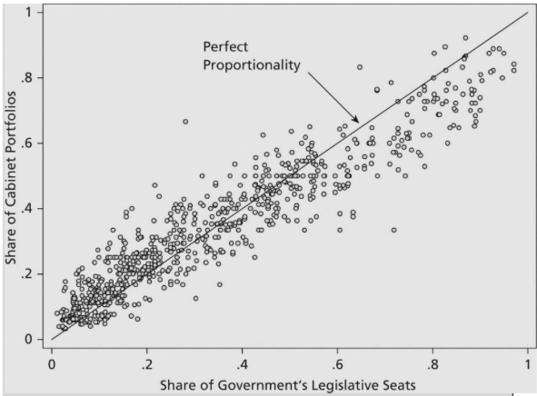
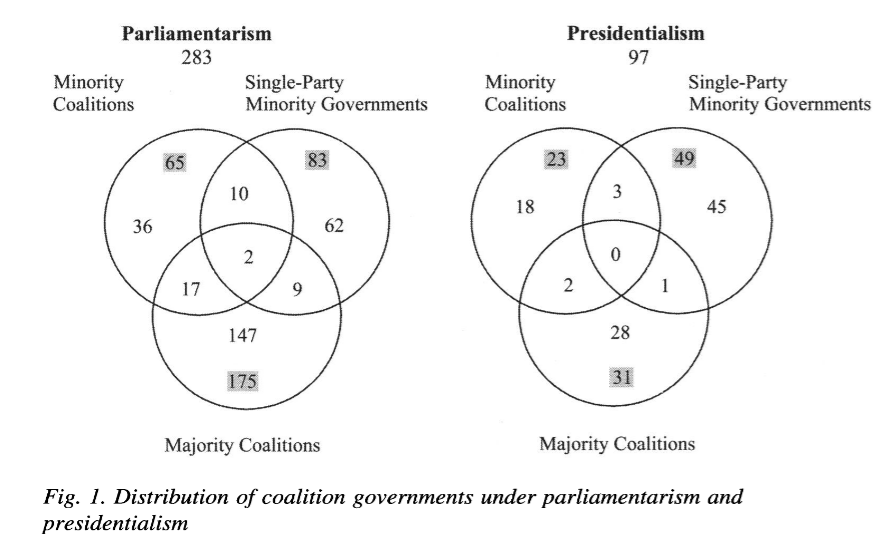

## Motivation

::::{.columns}
::: {.column width="25%"}

:::

::: {.column width="25%"}

:::

::: {.column width="25%"}

:::

::: {.column width="25%"}

:::
::::

- The first two only need to "worry" every 4 years
- The second two worry (or worried) pretty much all the time


## Our Plan for Today

We will talk about democratic governments (the [executive]{.alert} branch)

. . . 

Classification of democracies

- Based on who selects and "controls" the government
- [Parliamentary]{.alert} democracy $\rightarrow$ responsibility to legislature
- [Presidential]{.alert} democracy $\rightarrow$ autonomy from legislature
- [Semi-Presidential]{.alert} democracy $\rightarrow$ "mixed" form

. . . 

Government formation under each type

- Who forms the government
- How are powers distributed 
- How can the government be dismissed

## Classifying Democracies

```{r}
#| echo: false
#| fig-align: center
#| fig-width: 10
#| fig-height: 5.5
#| out-width: "950px"
#| out-height: "520px"

library(grid)

draw_democracies_tree <- function() {
  grid.newpage()
  pushViewport(viewport(width = 1, height = 1))

  col_line <- "#111827"
  col_text <- "#111827"
  col_source <- "#4B5563"
  lwd_line <- 2.6

  # Geometry
  # Root & Q1
  x_root <- 0.45
  y_root <- 0.94

  y_q1 <- 0.81
  y_split1 <- 0.70
  y_drop1 <- 0.64
  x_left1 <- 0.20
  x_right1 <- 0.69

  # Left branch (Presidential)
  y_no1 <- 0.59
  y_pres <- 0.52

  # Right branch (Q2)
  y_yes1 <- 0.59
  y_q2_line1 <- 0.52
  y_q2_line2 <- 0.46
  y_split2 <- 0.37
  y_drop2 <- 0.31
  x_left2 <- 0.52
  x_right2 <- 0.86

  # Sub-branches of Q2
  y_yes2 <- 0.26
  y_semi <- 0.19

  y_no2 <- 0.26
  y_parl <- 0.19

  # 1. Root: DEMOCRACIES
  grid.text("DEMOCRACIES", x = x_root, y = y_root,
            gp = gpar(fontsize = 15, fontface = "bold", col = col_text))

  # Stem from root to Q1
  grid.lines(x = c(x_root, x_root), y = c(y_root - 0.032, y_q1 + 0.035),
             gp = gpar(col = col_line, lwd = lwd_line, lineend = "square"))

  # 2. Question 1
  grid.text("1. Is the government responsible to the elected legislature?",
            x = x_root, y = y_q1,
            gp = gpar(fontsize = 14, fontface = "bold", col = col_text))

  # Stem from Q1 to Split 1
  grid.lines(x = c(x_root, x_root), y = c(y_q1 - 0.032, y_split1),
             gp = gpar(col = col_line, lwd = lwd_line, lineend = "square"))

  # Split 1: Horizontal bar and corner drops
  grid.lines(x = c(x_left1, x_right1), y = c(y_split1, y_split1),
             gp = gpar(col = col_line, lwd = lwd_line, lineend = "square"))
  grid.lines(x = c(x_left1, x_left1), y = c(y_split1, y_drop1),
             gp = gpar(col = col_line, lwd = lwd_line, lineend = "square"))
  grid.lines(x = c(x_right1, x_right1), y = c(y_split1, y_drop1),
             gp = gpar(col = col_line, lwd = lwd_line, lineend = "square"))

  # Left branch of Q1: No: PRESIDENTIAL DEMOCRACIES
  grid.text("No:", x = x_left1, y = y_no1,
            gp = gpar(fontsize = 13.5, fontface = "plain", col = col_text))
  grid.text("PRESIDENTIAL DEMOCRACIES", x = x_left1, y = y_pres,
            gp = gpar(fontsize = 14, fontface = "bold", col = col_text))

  # Right branch of Q1: Yes: Question 2
  grid.text("Yes:", x = x_right1, y = y_yes1,
            gp = gpar(fontsize = 13.5, fontface = "plain", col = col_text))
  grid.text("2. Is the head of state popularly", x = x_right1, y = y_q2_line1,
            gp = gpar(fontsize = 13.5, fontface = "bold", col = col_text))
  grid.text("elected for a fixed term in office?", x = x_right1, y = y_q2_line2,
            gp = gpar(fontsize = 13.5, fontface = "bold", col = col_text))

  # Stem from Q2 to Split 2
  grid.lines(x = c(x_right1, x_right1), y = c(y_q2_line2 - 0.032, y_split2),
             gp = gpar(col = col_line, lwd = lwd_line, lineend = "square"))

  # Split 2: Horizontal bar and corner drops
  grid.lines(x = c(x_left2, x_right2), y = c(y_split2, y_split2),
             gp = gpar(col = col_line, lwd = lwd_line, lineend = "square"))
  grid.lines(x = c(x_left2, x_left2), y = c(y_split2, y_drop2),
             gp = gpar(col = col_line, lwd = lwd_line, lineend = "square"))
  grid.lines(x = c(x_right2, x_right2), y = c(y_split2, y_drop2),
             gp = gpar(col = col_line, lwd = lwd_line, lineend = "square"))

  # Left branch of Q2: Yes: SEMI-PRESIDENTIAL
  grid.text("Yes:", x = x_left2, y = y_yes2,
            gp = gpar(fontsize = 13.5, fontface = "plain", col = col_text))
  grid.text("SEMI-PRESIDENTIAL", x = x_left2, y = y_semi,
            gp = gpar(fontsize = 14, fontface = "bold", col = col_text))

  # Right branch of Q2: No: PARLIAMENTARY
  grid.text("No:", x = x_right2, y = y_no2,
            gp = gpar(fontsize = 13.5, fontface = "plain", col = col_text))
  grid.text("PARLIAMENTARY", x = x_right2, y = y_parl,
            gp = gpar(fontsize = 14, fontface = "bold", col = col_text))

  # Bottom divider line
  grid.lines(x = c(0.04, 0.96), y = c(0.10, 0.10),
             gp = gpar(col = "#94A3B8", lwd = 1.0))

  # Footnote
  grid.text(expression(paste(italic("Source: "), "Cheibub, Gandhi, and Vreeland (2010)")),
            x = 0.04, y = 0.05, just = "left",
            gp = gpar(fontsize = 11, col = col_source))

  popViewport()
}

draw_democracies_tree()
```


## Gamson's Law

{fig-align="center"}

## Cheibub et al

{fig-align="center"}

## 

::: {style="display: flex; justify-content: center; align-items: center; height: 70vh; font-size: 2.5em; font-weight: bold; color: Black;"}
Thank you!
:::