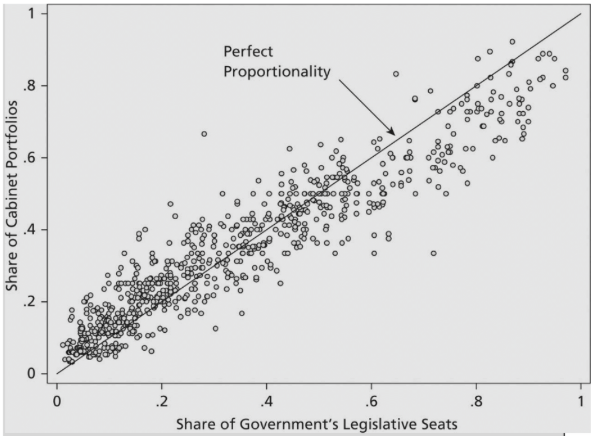
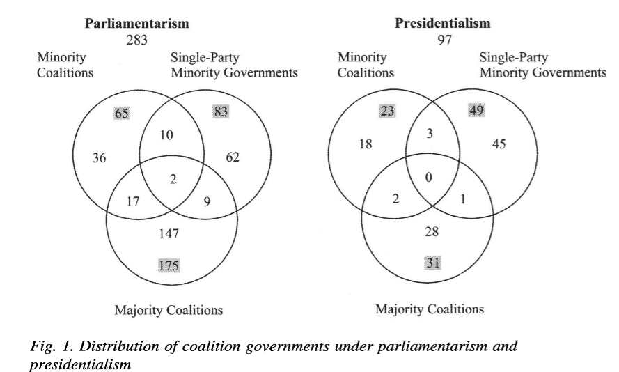

## Motivation

::::{.columns}
::: {.column width="25%"}

:::

::: {.column width="25%"}

:::

::: {.column width="25%"}

:::

::: {.column width="25%"}

:::
::::

- The first two only need to worry every 4 years
- The second two have to worry pretty much all the time


## Our Plan for Today

Democratic governments (the [executive]{.alert} branch)

. . . 

Classification of democracies

- Based on who selects and "controls" the government
- [Parliamentary]{.alert} democracy $\rightarrow$ responsibility to legislature
- [Presidential]{.alert} democracy $\rightarrow$ autonomy from legislature
- [Semi-Presidential]{.alert} democracy $\rightarrow$ "mixed" form

. . . 

Government formation and survival under each type

- Who forms the government
- How are powers distributed 
- How can the government be dismissed

## Actors

```{r}
#| echo: false
#| fig-align: center
#| fig-width: 10
#| fig-height: 5
#| out-width: "950px"
#| out-height: "475px"

library(grid)

# Helper: Draw stylized person
draw_person <- function(x, y, s = 0.05, 
                        torso_col = "#334155", 
                        head_col = "#FDE68A", 
                        collar_col = "#FFFFFF",
                        tie_col = NULL,
                        sash_col = NULL) {
  head_r <- s * 0.38
  head_y <- y + s * 0.42
  
  # Torso / Shoulders
  tx <- c(x - s * 0.62, x + s * 0.62, x + s * 0.40, x - s * 0.40)
  ty <- c(y - s * 0.50, y - s * 0.50, y + s * 0.15, y + s * 0.15)
  grid.polygon(tx, ty, gp = gpar(fill = torso_col, col = "#0F172A", lwd = 1.3))
  
  # Shirt collar (white V at neck)
  if (!is.null(collar_col)) {
    cx <- c(x - s * 0.20, x, x + s * 0.20)
    cy <- c(y + s * 0.15, y - s * 0.10, y + s * 0.15)
    grid.polygon(cx, cy, gp = gpar(fill = collar_col, col = NA))
  }
  
  # Necktie
  if (!is.null(tie_col)) {
    tie_x <- c(x, x + s * 0.08, x, x - s * 0.08)
    tie_y <- c(y + s * 0.10, y - s * 0.15, y - s * 0.42, y - s * 0.15)
    grid.polygon(tie_x, tie_y, gp = gpar(fill = tie_col, col = "#7F1D1D", lwd = 0.8))
  }
  
  # Presidential Sash
  if (!is.null(sash_col)) {
    sx <- c(x - s * 0.45, x - s * 0.28, x + s * 0.45, x + s * 0.28)
    sy <- c(y + s * 0.10, y + s * 0.14, y - s * 0.45, y - s * 0.49)
    grid.polygon(sx, sy, gp = gpar(fill = sash_col, col = "#B45309", lwd = 0.8))
  }
  
  # Head
  grid.circle(x, head_y, r = head_r, 
              gp = gpar(fill = head_col, col = "#0F172A", lwd = 1.3))
}

# Helper: Draw 5-pointed star
draw_star <- function(x, y, r, fill = "#F59E0B", col = "#B45309") {
  angles <- seq(pi/2, pi/2 + 2*pi, length.out = 11)[1:10]
  radii <- rep(c(r, r * 0.45), 5)
  grid.polygon(x + radii * cos(angles), y + radii * sin(angles),
               gp = gpar(fill = fill, col = col, lwd = 1))
}

# 1. Legislature Panel
draw_actor_legislature <- function() {
  grid.roundrect(x = 0.5, y = 0.5, width = 0.95, height = 0.95, r = unit(0.04, "snpc"),
                 gp = gpar(fill = "#FFFFFF", col = "#E2E8F0", lwd = 1.5))
  
  # Captions on top
  grid.text("Legislature", x = 0.5, y = 0.91,
            gp = gpar(fontsize = 15, fontface = "bold", col = "#0F172A"))
  grid.text("Parliament / Assembly", x = 0.5, y = 0.84,
            gp = gpar(fontsize = 10.5, col = "#64748B", fontface = "italic"))
  
  center_x <- 0.50
  center_y <- 0.22
  
  # Chamber arc background
  arc_theta <- seq(pi * 0.06, pi * 0.94, length.out = 60)
  outer_r <- 0.47
  inner_r <- 0.13
  ch_x <- c(center_x + outer_r * cos(arc_theta), 
            center_x + inner_r * cos(rev(arc_theta)))
  ch_y <- c(center_y + outer_r * sin(arc_theta) * 0.88, 
            center_y + inner_r * sin(rev(arc_theta)) * 0.88)
  grid.polygon(ch_x, ch_y, gp = gpar(fill = "#F8FAFC", col = "#E2E8F0", lwd = 1.2))
  
  # Seating rows
  radii <- c(0.18, 0.26, 0.34, 0.42)
  counts <- c(7, 11, 15, 19)
  
  for (r in radii) {
    theta <- seq(pi * 0.08, pi * 0.92, length.out = 40)
    grid.lines(center_x + r * cos(theta), center_y + r * sin(theta) * 0.88,
               gp = gpar(col = "#CBD5E1", lwd = 1, lty = "dotted"))
  }
  
  for (row in seq_along(radii)) {
    r <- radii[row]
    n <- counts[row]
    thetas <- seq(pi * 0.10, pi * 0.90, length.out = n)
    for (i in 1:n) {
      th <- thetas[i]
      col_idx <- if (th > pi * 0.65) "#EF4444" else if (th > pi * 0.45) "#F59E0B" else if (th > pi * 0.25) "#3B82F6" else "#10B981"
      sx <- center_x + r * cos(th)
      sy <- center_y + r * sin(th) * 0.88
      grid.circle(sx, sy, r = 0.017, 
                  gp = gpar(fill = col_idx, col = "#1E293B", lwd = 0.8))
    }
  }
  
  # Podium / Rostrum
  grid.roundrect(center_x, center_y - 0.04, width = 0.26, height = 0.05, r = unit(0.01, "snpc"),
                 gp = gpar(fill = "#475569", col = "#1E293B", lwd = 1.2))
  grid.polygon(c(center_x - 0.07, center_x + 0.07, center_x + 0.05, center_x - 0.05),
               c(center_y - 0.02, center_y - 0.02, center_y + 0.07, center_y + 0.07),
               gp = gpar(fill = "#334155", col = "#0F172A", lwd = 1.2))
  grid.rect(center_x, center_y + 0.025, width = 0.04, height = 0.015,
            gp = gpar(fill = "#F59E0B", col = "#B45309", lwd = 0.8))
  
  grid.text("Assembly of Representatives", 0.50, 0.07, 
            gp = gpar(fontsize = 9, col = "#475569", fontface = "bold"))
}

# 2. Government Panel
draw_actor_government <- function() {
  grid.roundrect(x = 0.5, y = 0.5, width = 0.95, height = 0.95, r = unit(0.04, "snpc"),
                 gp = gpar(fill = "#FFFFFF", col = "#E2E8F0", lwd = 1.5))
  
  # Captions on top
  grid.text("Government", x = 0.5, y = 0.91,
            gp = gpar(fontsize = 15, fontface = "bold", col = "#0F172A"))
  grid.text("Prime Minister + Cabinet", x = 0.5, y = 0.84,
            gp = gpar(fontsize = 10.5, col = "#64748B", fontface = "italic"))
  
  tab_cx <- 0.50
  tab_cy <- 0.40
  tab_rx <- 0.33
  tab_ry <- 0.16
  
  # Background ministers (behind table)
  draw_person(x = 0.28, y = 0.48, s = 0.072, torso_col = "#475569", tie_col = "#2563EB")
  draw_person(x = 0.72, y = 0.48, s = 0.072, torso_col = "#475569", tie_col = "#D97706")
  
  # Prime Minister at head of table
  draw_person(x = tab_cx, y = 0.58, s = 0.10, 
              torso_col = "#1E3A8A", head_col = "#FDE68A", tie_col = "#DC2626")
  grid.text("Prime Minister", tab_cx, 0.70, 
            gp = gpar(fontsize = 9.5, fontface = "bold", col = "#1E3A8A"))
  
  # Cabinet Meeting Table
  ell_t <- seq(0, 2 * pi, length.out = 100)
  grid.polygon(x = tab_cx + tab_rx * cos(ell_t), 
               y = tab_cy + tab_ry * sin(ell_t),
               gp = gpar(fill = "#E2E8F0", col = "#94A3B8", lwd = 2.0))
  grid.polygon(x = tab_cx + (tab_rx - 0.04) * cos(ell_t), 
               y = tab_cy + (tab_ry - 0.03) * sin(ell_t),
               gp = gpar(fill = "#F1F5F9", col = "#CBD5E1", lwd = 1.0))
  
  # Foreground ministers (in front of table)
  draw_person(x = 0.19, y = 0.36, s = 0.072, torso_col = "#475569", tie_col = "#16A34A")
  draw_person(x = 0.81, y = 0.36, s = 0.072, torso_col = "#475569", tie_col = "#9333EA")
  draw_person(x = 0.36, y = 0.22, s = 0.072, torso_col = "#475569", tie_col = "#EA580C")
  draw_person(x = 0.64, y = 0.22, s = 0.072, torso_col = "#475569", tie_col = "#0D9488")
  
  grid.text("Ministers (Executive Portfolios)", 0.50, 0.07, 
            gp = gpar(fontsize = 9, col = "#475569", fontface = "bold"))
}

# 3. President Panel
draw_actor_president <- function() {
  grid.roundrect(x = 0.5, y = 0.5, width = 0.95, height = 0.95, r = unit(0.04, "snpc"),
                 gp = gpar(fill = "#FFFFFF", col = "#E2E8F0", lwd = 1.5))
  
  # Captions on top
  grid.text("President", x = 0.5, y = 0.91,
            gp = gpar(fontsize = 15, fontface = "bold", col = "#0F172A"))
  grid.text("Head of State / Chief Executive", x = 0.5, y = 0.84,
            gp = gpar(fontsize = 10.5, col = "#64748B", fontface = "italic"))
  
  seal_x <- 0.50
  seal_y <- 0.50
  grid.circle(seal_x, seal_y, r = 0.25,
              gp = gpar(fill = "#F8FAFC", col = "#E2E8F0", lwd = 1.2))
  
  # Ceremonial flags
  grid.lines(c(0.24, 0.24), c(0.20, 0.68), gp = gpar(col = "#D97706", lwd = 2.2))
  grid.circle(0.24, 0.69, r = 0.013, gp = gpar(fill = "#F59E0B", col = "#B45309"))
  grid.polygon(c(0.24, 0.13, 0.15, 0.24), c(0.67, 0.56, 0.38, 0.43),
               gp = gpar(fill = "#3B82F6", col = "#1D4ED8", lwd = 1))
  
  grid.lines(c(0.76, 0.76), c(0.20, 0.68), gp = gpar(col = "#D97706", lwd = 2.2))
  grid.circle(0.76, 0.69, r = 0.013, gp = gpar(fill = "#F59E0B", col = "#B45309"))
  grid.polygon(c(0.76, 0.87, 0.85, 0.76), c(0.67, 0.56, 0.38, 0.43),
               gp = gpar(fill = "#EF4444", col = "#B91C1C", lwd = 1))
  
  # President figure
  draw_person(x = 0.50, y = 0.52, s = 0.125, 
              torso_col = "#0F172A", head_col = "#FDE68A", 
              tie_col = "#DC2626", sash_col = "#F59E0B")
  
  # Presidential Podium
  pod_x <- c(0.34, 0.66, 0.62, 0.38)
  pod_y <- c(0.17, 0.17, 0.39, 0.39)
  grid.polygon(pod_x, pod_y, gp = gpar(fill = "#334155", col = "#1E293B", lwd = 1.5))
  
  grid.roundrect(0.50, 0.395, width = 0.27, height = 0.024, r = unit(0.008, "snpc"),
                 gp = gpar(fill = "#1E293B", col = "#0F172A", lwd = 1.2))
  grid.rect(x = 0.50, y = 0.155, width = 0.35, height = 0.035, 
            gp = gpar(fill = "#1E293B", col = "#0F172A"))
  
  grid.circle(0.50, 0.28, r = 0.048, 
              gp = gpar(fill = "#1E3A8A", col = "#F59E0B", lwd = 1.8))
  draw_star(0.50, 0.28, r = 0.030, fill = "#F59E0B", col = "#B45309")
  
  # Microphones
  grid.lines(c(0.44, 0.46, 0.47), c(0.40, 0.44, 0.46), gp = gpar(col = "#0F172A", lwd = 1.8))
  grid.circle(0.47, 0.465, r = 0.010, gp = gpar(fill = "#64748B", col = "#0F172A"))
  grid.lines(c(0.56, 0.54, 0.53), c(0.40, 0.44, 0.46), gp = gpar(col = "#0F172A", lwd = 1.8))
  grid.circle(0.53, 0.465, r = 0.010, gp = gpar(fill = "#64748B", col = "#0F172A"))
  
  grid.text("Popularly Elected Executive", 0.50, 0.07, 
            gp = gpar(fontsize = 9, col = "#475569", fontface = "bold"))
}

# 3-Column Drawing
grid.newpage()

# Viewport 1: Legislature
pushViewport(viewport(x = 0.17, y = 0.5, width = 0.31, height = 0.96))
draw_actor_legislature()
popViewport()

# Viewport 2: Government
pushViewport(viewport(x = 0.50, y = 0.5, width = 0.31, height = 0.96))
draw_actor_government()
popViewport()

# Viewport 3: President
pushViewport(viewport(x = 0.83, y = 0.5, width = 0.31, height = 0.96))
draw_actor_president()
popViewport()
```


# Classifying Democracies {.section}


## Criteria for Classification

Is a democracy presidential, parliamentary, or semi-presidential? It depends on

1. [Responsibility]{.alert} of the government to the legislature
  - Parl/Semi-Pres: legislature has constitutional power to remove the government without cause
  - Removed if [no confidence]{.alert} vote won by a majority
  - Pres: legislature cannot remove the government without cause

2. A [popularly elected]{.alert} head of state serves a [fixed term]{.alert} in office
  - Either "direct" or "indirect" vote, e.g., Electoral College
  - Parl: HoS not popularly elected, mostly ceremonial role (including Kings)


## Classifying Democracies

```{r}
#| echo: false
#| fig-align: center
#| fig-width: 10
#| fig-height: 5.5
#| out-width: "950px"
#| out-height: "520px"

library(grid)

draw_democracies_tree <- function() {
  grid.newpage()
  pushViewport(viewport(width = 1, height = 1))

  col_line <- "#111827"
  col_text <- "#111827"
  col_source <- "#4B5563"
  lwd_line <- 2.6

  # Geometry
  # Root & Q1
  x_root <- 0.45
  y_root <- 0.94

  y_q1 <- 0.81
  y_split1 <- 0.70
  y_drop1 <- 0.64
  x_left1 <- 0.20
  x_right1 <- 0.69

  # Left branch (Presidential)
  y_no1 <- 0.59
  y_pres <- 0.52

  # Right branch (Q2)
  y_yes1 <- 0.59
  y_q2_line1 <- 0.52
  y_q2_line2 <- 0.46
  y_split2 <- 0.37
  y_drop2 <- 0.31
  x_left2 <- 0.52
  x_right2 <- 0.86

  # Sub-branches of Q2
  y_yes2 <- 0.26
  y_semi <- 0.19

  y_no2 <- 0.26
  y_parl <- 0.19

  # 1. Root: DEMOCRACIES
  grid.text("DEMOCRACIES", x = x_root, y = y_root,
            gp = gpar(fontsize = 15, fontface = "bold", col = col_text))

  # Stem from root to Q1
  grid.lines(x = c(x_root, x_root), y = c(y_root - 0.032, y_q1 + 0.035),
             gp = gpar(col = col_line, lwd = lwd_line, lineend = "square"))

  # 2. Question 1
  grid.text("1. Is the government responsible to the elected legislature?",
            x = x_root, y = y_q1,
            gp = gpar(fontsize = 14, fontface = "bold", col = col_text))

  # Stem from Q1 to Split 1
  grid.lines(x = c(x_root, x_root), y = c(y_q1 - 0.032, y_split1),
             gp = gpar(col = col_line, lwd = lwd_line, lineend = "square"))

  # Split 1: Horizontal bar and corner drops
  grid.lines(x = c(x_left1, x_right1), y = c(y_split1, y_split1),
             gp = gpar(col = col_line, lwd = lwd_line, lineend = "square"))
  grid.lines(x = c(x_left1, x_left1), y = c(y_split1, y_drop1),
             gp = gpar(col = col_line, lwd = lwd_line, lineend = "square"))
  grid.lines(x = c(x_right1, x_right1), y = c(y_split1, y_drop1),
             gp = gpar(col = col_line, lwd = lwd_line, lineend = "square"))

  # Left branch of Q1: No: PRESIDENTIAL DEMOCRACIES
  grid.text("No:", x = x_left1, y = y_no1,
            gp = gpar(fontsize = 13.5, fontface = "plain", col = col_text))
  grid.text("PRESIDENTIAL DEMOCRACIES", x = x_left1, y = y_pres,
            gp = gpar(fontsize = 14, fontface = "bold", col = col_text))

  # Right branch of Q1: Yes: Question 2
  grid.text("Yes:", x = x_right1, y = y_yes1,
            gp = gpar(fontsize = 13.5, fontface = "plain", col = col_text))
  grid.text("2. Is the head of state popularly", x = x_right1, y = y_q2_line1,
            gp = gpar(fontsize = 13.5, fontface = "bold", col = col_text))
  grid.text("elected for a fixed term in office?", x = x_right1, y = y_q2_line2,
            gp = gpar(fontsize = 13.5, fontface = "bold", col = col_text))

  # Stem from Q2 to Split 2
  grid.lines(x = c(x_right1, x_right1), y = c(y_q2_line2 - 0.032, y_split2),
             gp = gpar(col = col_line, lwd = lwd_line, lineend = "square"))

  # Split 2: Horizontal bar and corner drops
  grid.lines(x = c(x_left2, x_right2), y = c(y_split2, y_split2),
             gp = gpar(col = col_line, lwd = lwd_line, lineend = "square"))
  grid.lines(x = c(x_left2, x_left2), y = c(y_split2, y_drop2),
             gp = gpar(col = col_line, lwd = lwd_line, lineend = "square"))
  grid.lines(x = c(x_right2, x_right2), y = c(y_split2, y_drop2),
             gp = gpar(col = col_line, lwd = lwd_line, lineend = "square"))

  # Left branch of Q2: Yes: SEMI-PRESIDENTIAL
  grid.text("Yes:", x = x_left2, y = y_yes2,
            gp = gpar(fontsize = 13.5, fontface = "plain", col = col_text))
  grid.text("SEMI-PRESIDENTIAL", x = x_left2, y = y_semi,
            gp = gpar(fontsize = 14, fontface = "bold", col = col_text))

  # Right branch of Q2: No: PARLIAMENTARY
  grid.text("No:", x = x_right2, y = y_no2,
            gp = gpar(fontsize = 13.5, fontface = "plain", col = col_text))
  grid.text("PARLIAMENTARY", x = x_right2, y = y_parl,
            gp = gpar(fontsize = 14, fontface = "bold", col = col_text))

  # Bottom divider line
  grid.lines(x = c(0.04, 0.96), y = c(0.10, 0.10),
             gp = gpar(col = "#94A3B8", lwd = 1.0))

  # Footnote
  grid.text(expression(paste(italic("Source: "), "Cheibub, Gandhi, and Vreeland (2010)")),
            x = 0.04, y = 0.05, just = "left",
            gp = gpar(fontsize = 11, col = col_source))

  popViewport()
}

draw_democracies_tree()
```


# Governments in Parliamentary Democracies {.section}

## The Government

```{r}
#| echo: false
#| fig-align: center
#| fig-width: 10
#| fig-height: 3.5
#| out-width: "950px"
#| out-height: "260px"

library(grid)

# 1. Voters Card
draw_chain_voters <- function() {
  grid.roundrect(x = 0.5, y = 0.5, width = 0.96, height = 0.96, r = unit(0.04, "snpc"),
                 gp = gpar(fill = "#FFFFFF", col = "#CBD5E1", lwd = 1.5))
  
  grid.text("Voters", x = 0.5, y = 0.90,
            gp = gpar(fontsize = 13.5, fontface = "bold", col = "#0F172A"))
  grid.text("(Citizens / Electorate)", x = 0.5, y = 0.81,
            gp = gpar(fontsize = 9.5, col = "#64748B", fontface = "italic"))
  
  # Group of voters
  draw_person(0.31, 0.59, s = 0.075, torso_col = "#64748B")
  draw_person(0.50, 0.63, s = 0.075, torso_col = "#0284C7")
  draw_person(0.69, 0.59, s = 0.075, torso_col = "#D97706")
  
  draw_person(0.23, 0.42, s = 0.08, torso_col = "#2563EB")
  draw_person(0.41, 0.44, s = 0.08, torso_col = "#DC2626")
  draw_person(0.59, 0.44, s = 0.08, torso_col = "#16A34A")
  draw_person(0.77, 0.42, s = 0.08, torso_col = "#9333EA")
  
  # Ballot box
  bx <- 0.50
  by <- 0.20
  grid.roundrect(bx, by, width = 0.32, height = 0.16, r = unit(0.02, "snpc"),
                 gp = gpar(fill = "#1E293B", col = "#0F172A", lwd = 1.2))
  grid.roundrect(bx, by + 0.04, width = 0.18, height = 0.025, r = unit(0.01, "snpc"),
                 gp = gpar(fill = "#0F172A", col = "#475569"))
  grid.polygon(c(bx - 0.06, bx + 0.06, bx + 0.06, bx - 0.06),
               c(by + 0.03, by + 0.03, by + 0.10, by + 0.10),
               gp = gpar(fill = "#FFFFFF", col = "#CBD5E1", lwd = 1))
  grid.lines(c(bx - 0.03, bx, bx + 0.04), c(by + 0.065, by + 0.05, by + 0.085),
             gp = gpar(col = "#16A34A", lwd = 1.6))
}

# 2. Legislature Card
draw_chain_legislature <- function() {
  grid.roundrect(x = 0.5, y = 0.5, width = 0.96, height = 0.96, r = unit(0.04, "snpc"),
                 gp = gpar(fill = "#FFFFFF", col = "#CBD5E1", lwd = 1.5))
  
  grid.text("Legislature", x = 0.5, y = 0.90,
            gp = gpar(fontsize = 13.5, fontface = "bold", col = "#0F172A"))
  grid.text("(Parliament / Assembly)", x = 0.5, y = 0.81,
            gp = gpar(fontsize = 9.5, col = "#64748B", fontface = "italic"))
  
  center_x <- 0.50
  center_y <- 0.20
  
  arc_theta <- seq(pi * 0.06, pi * 0.94, length.out = 40)
  outer_r <- 0.44
  inner_r <- 0.13
  ch_x <- c(center_x + outer_r * cos(arc_theta), 
            center_x + inner_r * cos(rev(arc_theta)))
  ch_y <- c(center_y + outer_r * sin(arc_theta) * 0.88, 
            center_y + inner_r * sin(rev(arc_theta))) * 0.88
  grid.polygon(ch_x, ch_y, gp = gpar(fill = "#F8FAFC", col = "#E2E8F0", lwd = 1.1))
  
  radii <- c(0.18, 0.26, 0.34, 0.41)
  counts <- c(6, 10, 14, 17)
  
  for (r in radii) {
    theta <- seq(pi * 0.08, pi * 0.92, length.out = 30)
    grid.lines(center_x + r * cos(theta), center_y + r * sin(theta) * 0.88,
               gp = gpar(col = "#CBD5E1", lwd = 0.9, lty = "dotted"))
  }
  
  for (row in seq_along(radii)) {
    r <- radii[row]
    n <- counts[row]
    thetas <- seq(pi * 0.10, pi * 0.90, length.out = n)
    for (i in 1:n) {
      th <- thetas[i]
      col_idx <- if (th > pi * 0.65) "#EF4444" else if (th > pi * 0.45) "#F59E0B" else if (th > pi * 0.25) "#3B82F6" else "#10B981"
      sx <- center_x + r * cos(th)
      sy <- center_y + r * sin(th) * 0.88
      grid.circle(sx, sy, r = 0.016, 
                  gp = gpar(fill = col_idx, col = "#1E293B", lwd = 0.7))
    }
  }
  
  grid.roundrect(center_x, center_y - 0.04, width = 0.24, height = 0.045, r = unit(0.01, "snpc"),
                 gp = gpar(fill = "#475569", col = "#1E293B", lwd = 1.1))
  grid.polygon(c(center_x - 0.06, center_x + 0.06, center_x + 0.04, center_x - 0.04),
               c(center_y - 0.02, center_y - 0.02, center_y + 0.06, center_y + 0.06),
               gp = gpar(fill = "#334155", col = "#0F172A", lwd = 1.1))
  grid.rect(center_x, center_y + 0.02, width = 0.035, height = 0.012,
            gp = gpar(fill = "#F59E0B", col = "#B45309", lwd = 0.7))
}

# 3. Government Card
draw_chain_government <- function() {
  grid.roundrect(x = 0.5, y = 0.5, width = 0.96, height = 0.96, r = unit(0.04, "snpc"),
                 gp = gpar(fill = "#FFFFFF", col = "#CBD5E1", lwd = 1.5))
  
  grid.text("Government", x = 0.5, y = 0.90,
            gp = gpar(fontsize = 13.5, fontface = "bold", col = "#0F172A"))
  grid.text("(Prime Minister + Cabinet)", x = 0.5, y = 0.81,
            gp = gpar(fontsize = 9.5, col = "#64748B", fontface = "italic"))
  
  tab_cx <- 0.50
  tab_cy <- 0.38
  tab_rx <- 0.32
  tab_ry <- 0.15
  
  draw_person(x = 0.28, y = 0.48, s = 0.07, torso_col = "#475569", tie_col = "#2563EB")
  draw_person(x = 0.72, y = 0.48, s = 0.07, torso_col = "#475569", tie_col = "#D97706")
  
  draw_person(x = tab_cx, y = 0.58, s = 0.095, 
              torso_col = "#1E3A8A", head_col = "#FDE68A", tie_col = "#DC2626")
  grid.text("Prime Minister", tab_cx, 0.69, 
            gp = gpar(fontsize = 9, fontface = "bold", col = "#1E3A8A"))
  
  ell_t <- seq(0, 2 * pi, length.out = 80)
  grid.polygon(x = tab_cx + tab_rx * cos(ell_t), 
               y = tab_cy + tab_ry * sin(ell_t),
               gp = gpar(fill = "#E2E8F0", col = "#94A3B8", lwd = 1.8))
  grid.polygon(x = tab_cx + (tab_rx - 0.04) * cos(ell_t), 
               y = tab_cy + (tab_ry - 0.03) * sin(ell_t),
               gp = gpar(fill = "#F1F5F9", col = "#CBD5E1", lwd = 0.9))
  
  draw_person(x = 0.19, y = 0.34, s = 0.07, torso_col = "#475569", tie_col = "#16A34A")
  draw_person(x = 0.81, y = 0.34, s = 0.07, torso_col = "#475569", tie_col = "#9333EA")
  draw_person(x = 0.36, y = 0.20, s = 0.07, torso_col = "#475569", tie_col = "#EA580C")
  draw_person(x = 0.64, y = 0.20, s = 0.07, torso_col = "#475569", tie_col = "#0D9488")
}

# Unidirectional Flow Arrow
draw_flow_arrow <- function(x1, y1, x2, y2, main_label, sub_label = NULL) {
  arrow_spec <- arrow(angle = 24, length = unit(0.16, "inches"), ends = "last", type = "closed")
  grid.lines(x = c(x1, x2), y = c(y1, y2),
             arrow = arrow_spec,
             gp = gpar(col = "#2563EB", fill = "#2563EB", lwd = 3.8))
  
  mid_x <- (x1 + x2) / 2
  grid.text(main_label, x = mid_x, y = y1 + 0.11,
            gp = gpar(fontsize = 11, fontface = "bold", col = "#1E3A8A"))
  
  if (!is.null(sub_label)) {
    grid.text(sub_label, x = mid_x, y = y1 - 0.11,
              gp = gpar(fontsize = 8.5, fontface = "italic", col = "#64748B"))
  }
}

grid.newpage()

# Card 1: Voters
pushViewport(viewport(x = 0.145, y = 0.50, width = 0.25, height = 0.94))
draw_chain_voters()
popViewport()

# Arrow 1: Voters -> Legislature
draw_flow_arrow(x1 = 0.28, y1 = 0.50, x2 = 0.365, y2 = 0.50, 
                main_label = "Elects", sub_label = "(Legislative\nelection)")

# Card 2: Legislature
pushViewport(viewport(x = 0.50, y = 0.50, width = 0.25, height = 0.94))
draw_chain_legislature()
popViewport()

# Arrow 2: Legislature -> Government
draw_flow_arrow(x1 = 0.635, y1 = 0.50, x2 = 0.72, y2 = 0.50, 
                main_label = "Selects", sub_label = "(Confidence /\ninvestiture)")

# Card 3: Government
pushViewport(viewport(x = 0.855, y = 0.50, width = 0.25, height = 0.94))
draw_chain_government()
popViewport()
```

**Government**: Prime Minister (chief executive) + Cabinet

- Cabinet: Ministers in charge of policy areas
- Bear collective responsibility for the government's decisions

## Government Formation: The Need for Coalitions

```{r}
#| echo: false
#| fig-align: center
#| fig-width: 7.2
#| fig-height: 2.8
#| out-width: "620px"
#| out-height: "240px"

library(grid)

grid.newpage()

cx <- 0.50
cy <- 0.17

outer_r <- 0.46
inner_r <- 0.14

# Outer background chamber glow/fill
arc_theta <- seq(pi * 0.05, pi * 0.95, length.out = 100)
ch_x <- c(cx + outer_r * cos(arc_theta), cx + inner_r * cos(rev(arc_theta)))
ch_y <- c(cy + outer_r * sin(arc_theta), cy + inner_r * sin(rev(arc_theta)))
grid.polygon(ch_x, ch_y, gp = gpar(fill = "#F8FAFC", col = "#E2E8F0", lwd = 1.3))

# Central 50% majority threshold dashed line
grid.lines(x = c(cx, cx), y = c(cy + inner_r, cy + outer_r + 0.04),
           gp = gpar(col = "#94A3B8", lwd = 2.0, lty = "dashed"))

# Concentric seating rows
radii <- c(0.19, 0.25, 0.31, 0.37, 0.43)
counts <- c(11, 15, 19, 23, 27) # Total = 95 seats (majority = 48)

# Party distribution:
# Blue (plurality): 40 seats (42.1%, < 50%)
# Red: 28 seats (29.5%)
# Green: 15 seats (15.8%)
# Yellow: 12 seats (12.6%, crossing the 50% threshold)
party_colors <- c(
  rep("#DC2626", 28), # Red
  rep("#16A34A", 15), # Green
  rep("#F59E0B", 12), # Yellow
  rep("#2563EB", 40)  # Blue (plurality)
)

# Guide arc lines
for (r in radii) {
  theta <- seq(pi * 0.07, pi * 0.93, length.out = 60)
  grid.lines(cx + r * cos(theta), cy + r * sin(theta),
             gp = gpar(col = "#CBD5E1", lwd = 0.9, lty = "dotted"))
}

# Compute seat coordinates
seat_coords <- data.frame()
for (row in seq_along(radii)) {
  r <- radii[row]
  n <- counts[row]
  thetas <- seq(pi * 0.93, pi * 0.07, length.out = n)
  for (i in 1:n) {
    th <- thetas[i]
    seat_coords <- rbind(seat_coords, data.frame(r = r, theta = th,
                                                 x = cx + r * cos(th),
                                                 y = cy + r * sin(th)))
  }
}

# Order from left to right (high theta to low theta)
seat_coords <- seat_coords[order(-seat_coords$theta), ]
seat_coords$col <- party_colors

# Draw seat circles
for (i in 1:nrow(seat_coords)) {
  grid.circle(seat_coords$x[i], seat_coords$y[i], r = 0.015,
              gp = gpar(fill = seat_coords$col[i], col = "#0F172A", lwd = 0.8))
}

# Speaker's Podium / Dais at center bottom
grid.roundrect(cx, cy - 0.05, width = 0.22, height = 0.06, r = unit(0.01, "snpc"),
               gp = gpar(fill = "#475569", col = "#1E293B", lwd = 1.2))
grid.polygon(c(cx - 0.065, cx + 0.065, cx + 0.048, cx - 0.048),
             c(cy - 0.02, cy - 0.02, cy + 0.07, cy + 0.07),
             gp = gpar(fill = "#334155", col = "#0F172A", lwd = 1.2))
grid.rect(cx, cy + 0.028, width = 0.038, height = 0.013,
          gp = gpar(fill = "#F59E0B", col = "#B45309", lwd = 0.8))
```

- The government must enjoy support from a majority in the legislature 
- Threat of no confidence vote 
- A party has a majority of seats $\rightarrow$ can govern alone
- No party has a majority of seats $\rightarrow$ a [coalition]{.alert} must be formed

## Government Formation and Dissolution Process

Government [Formation]{.alert} Process 

- Party leaders bargain over possible coalitions (next slides)
- "Supervision" role of the HoS (effective influence varies by country)
- Bargaining led by a "formateur", typically the largest party's leader (likely PM)
- PM appoints cabinet members $\rightarrow$ cabinet posts at the center of the bargaining process

. . . 

Government [Dissolution]{.alert} Process

- Once formed, the govt stays until the next election or a no confidence vote
- If it loses confidence, it remains in power until a new one is formed (early election or new coalition)


## Theory of Government Formation

What explains government formation?

$\implies$ We want to isolate the key forces that drive the bargaining process 

1. [Office-seeking]{.alert} incentives $\rightarrow$ office concessions
  - MPs care about office (cabinet portfolios), that's their condition for support
  - Larger parties want more portfolios
  - Pull towards a [Minimal Winning Coalition]{.alert}: smallest possible majority

2. [Policy-seeking]{.alert} incentives $\rightarrow$ policy concessions
  - MPs have ideological motivations, want their policies implemented
  - Larger parties want more leverage in government policy
  - Pull towards a [connected coalition]{.alert}: parties ideologically close

## Office vs Policy

- Both incentives are present
- Democratic competition forces politicians to pursue both
  - They need office to deliver what they promised to voters
  - They need to deliver what they promised if they want to stay in office
- Office has both intrinsic and instrumental value to politicians
- Even if purely office-seeking, they are forced to behave *as if* they were policy-seeking
- Even if purely policy-seeking, they are forced to behave *as if* they were office-seeking
- This entails trade-offs, e.g., what govt coalition to enter

## Gamson's Law

Larger parties in the legislature get larger quotas in the government

{fig-align="center"}


## Types of Government

Majority governments

- Single Party Majority: one party has majority of seats
- Minimal Winning Coalition: smallest possible majority
- Surplus majority: larger majority than strictly necessary
  - "National unity" governments to implement important policies
  - Avoid "veto threat" by small parties in MWC or "commitment problem" of coalition partners

. . . 

Minority governments

- Single Party Minority or Minority Coalition
- Opposition "tolerates" the government, which is under constant threat
- Influence policy with less accountability or avoid "uneasy" coalitions

# Governments in Presidential Democracies {.section}

## The Government
```{r}
#| echo: false
#| fig-align: center
#| fig-width: 10
#| fig-height: 4.2
#| out-width: "950px"
#| out-height: "320px"

library(grid)

# 1. Voters Card (Left)
draw_pres_voters <- function() {
  grid.roundrect(0.5, 0.5, 0.96, 0.96, r = unit(0.04, "snpc"),
                 gp = gpar(fill = "#FFFFFF", col = "#CBD5E1", lwd = 1.5))
  grid.text("Voters", 0.5, 0.91, gp = gpar(fontsize = 13.5, fontface = "bold", col = "#0F172A"))
  grid.text("(Electorate)", 0.5, 0.83, gp = gpar(fontsize = 9.5, col = "#64748B", fontface = "italic"))
  
  draw_person(0.31, 0.60, s = 0.075, torso_col = "#64748B")
  draw_person(0.50, 0.64, s = 0.075, torso_col = "#0284C7")
  draw_person(0.69, 0.60, s = 0.075, torso_col = "#D97706")
  
  draw_person(0.23, 0.43, s = 0.08, torso_col = "#2563EB")
  draw_person(0.41, 0.45, s = 0.08, torso_col = "#DC2626")
  draw_person(0.59, 0.45, s = 0.08, torso_col = "#16A34A")
  draw_person(0.77, 0.43, s = 0.08, torso_col = "#9333EA")
  
  bx <- 0.50; by <- 0.20
  grid.roundrect(bx, by, width = 0.32, height = 0.16, r = unit(0.02, "snpc"),
                 gp = gpar(fill = "#1E293B", col = "#0F172A", lwd = 1.2))
  grid.roundrect(bx, by + 0.04, width = 0.18, height = 0.025, r = unit(0.01, "snpc"),
                 gp = gpar(fill = "#0F172A", col = "#475569"))
  grid.polygon(c(bx - 0.06, bx + 0.06, bx + 0.06, bx - 0.06),
               c(by + 0.03, by + 0.03, by + 0.10, by + 0.10),
               gp = gpar(fill = "#FFFFFF", col = "#CBD5E1", lwd = 1))
  grid.lines(c(bx - 0.03, bx, bx + 0.04), c(by + 0.065, by + 0.05, by + 0.085),
             gp = gpar(col = "#16A34A", lwd = 1.6))
}

# 2. Legislature Card (Top)
draw_pres_legislature <- function() {
  grid.roundrect(0.5, 0.5, 0.96, 0.96, r = unit(0.04, "snpc"),
                 gp = gpar(fill = "#FFFFFF", col = "#CBD5E1", lwd = 1.5))
  grid.text("Legislature", 0.5, 0.88, gp = gpar(fontsize = 13, fontface = "bold", col = "#0F172A"))
  grid.text("(Congress / Assembly)", 0.5, 0.77, gp = gpar(fontsize = 9, col = "#64748B", fontface = "italic"))
  
  center_x <- 0.50; center_y <- 0.18
  arc_theta <- seq(pi * 0.08, pi * 0.92, length.out = 35)
  ch_x <- c(center_x + 0.42 * cos(arc_theta), center_x + 0.13 * cos(rev(arc_theta)))
  ch_y <- c(center_y + 0.42 * sin(arc_theta) * 0.85, center_y + 0.13 * sin(rev(arc_theta))) * 0.85
  grid.polygon(ch_x, ch_y, gp = gpar(fill = "#F8FAFC", col = "#E2E8F0", lwd = 1))
  
  radii <- c(0.18, 0.27, 0.36)
  counts <- c(7, 11, 15)
  for (row in seq_along(radii)) {
    r <- radii[row]; n <- counts[row]
    thetas <- seq(pi * 0.12, pi * 0.88, length.out = n)
    for (i in 1:n) {
      th <- thetas[i]
      col_idx <- if (th > pi * 0.55) "#EF4444" else if (th > pi * 0.40) "#F59E0B" else "#3B82F6"
      grid.circle(center_x + r * cos(th), center_y + r * sin(th) * 0.85, r = 0.016, 
                  gp = gpar(fill = col_idx, col = "#1E293B", lwd = 0.7))
    }
  }
  grid.roundrect(center_x, center_y - 0.03, width = 0.22, height = 0.04, r = unit(0.01, "snpc"),
                 gp = gpar(fill = "#475569", col = "#1E293B", lwd = 1))
  grid.rect(center_x, center_y + 0.02, width = 0.035, height = 0.012, gp = gpar(fill = "#F59E0B", col = "#B45309"))
}

# 3. President Card
draw_pres_president <- function() {
  grid.roundrect(0.5, 0.5, 0.96, 0.96, r = unit(0.04, "snpc"),
                 gp = gpar(fill = "#FFFFFF", col = "#CBD5E1", lwd = 1.5))
  grid.text("President", 0.5, 0.88, gp = gpar(fontsize = 13, fontface = "bold", col = "#0F172A"))
  grid.text("Chief Executive & Head of State", 0.5, 0.77, gp = gpar(fontsize = 8.5, col = "#64748B", fontface = "italic"))
  
  grid.lines(c(0.24, 0.24), c(0.18, 0.65), gp = gpar(col = "#D97706", lwd = 2))
  grid.circle(0.24, 0.66, r = 0.012, gp = gpar(fill = "#F59E0B", col = "#B45309"))
  grid.polygon(c(0.24, 0.14, 0.16, 0.24), c(0.64, 0.54, 0.38, 0.42), gp = gpar(fill = "#3B82F6", col = "#1D4ED8", lwd = 0.8))
  
  grid.lines(c(0.76, 0.76), c(0.18, 0.65), gp = gpar(col = "#D97706", lwd = 2))
  grid.circle(0.76, 0.66, r = 0.012, gp = gpar(fill = "#F59E0B", col = "#B45309"))
  grid.polygon(c(0.76, 0.86, 0.84, 0.76), c(0.64, 0.54, 0.38, 0.42), gp = gpar(fill = "#EF4444", col = "#B91C1C", lwd = 0.8))
  
  draw_person(0.50, 0.46, s = 0.115, torso_col = "#0F172A", tie_col = "#DC2626", sash_col = "#F59E0B")
  
  grid.polygon(c(0.35, 0.65, 0.61, 0.39), c(0.15, 0.15, 0.34, 0.34), gp = gpar(fill = "#334155", col = "#1E293B", lwd = 1.2))
  grid.circle(0.50, 0.245, r = 0.042, gp = gpar(fill = "#1E3A8A", col = "#F59E0B", lwd = 1.5))
  draw_star(0.50, 0.245, r = 0.026, fill = "#F59E0B", col = "#B45309")
}

# 4. Cabinet Card
draw_pres_cabinet <- function() {
  grid.roundrect(0.5, 0.5, 0.96, 0.96, r = unit(0.04, "snpc"),
                 gp = gpar(fill = "#FFFFFF", col = "#CBD5E1", lwd = 1.5))
  grid.text("Cabinet", 0.5, 0.88, gp = gpar(fontsize = 13, fontface = "bold", col = "#0F172A"))
  grid.text("Secretaries / Ministers", 0.5, 0.77, gp = gpar(fontsize = 8.5, col = "#64748B", fontface = "italic"))
  
  tab_cx <- 0.50; tab_cy <- 0.36; tab_rx <- 0.33; tab_ry <- 0.15
  draw_person(0.30, 0.48, s = 0.07, torso_col = "#475569", tie_col = "#2563EB")
  draw_person(0.70, 0.48, s = 0.07, torso_col = "#475569", tie_col = "#D97706")
  
  ell_t <- seq(0, 2 * pi, length.out = 60)
  grid.polygon(tab_cx + tab_rx * cos(ell_t), tab_cy + tab_ry * sin(ell_t),
               gp = gpar(fill = "#E2E8F0", col = "#94A3B8", lwd = 1.5))
  
  draw_person(0.20, 0.32, s = 0.07, torso_col = "#475569", tie_col = "#16A34A")
  draw_person(0.80, 0.32, s = 0.07, torso_col = "#475569", tie_col = "#9333EA")
  draw_person(0.38, 0.18, s = 0.07, torso_col = "#475569", tie_col = "#EA580C")
  draw_person(0.62, 0.18, s = 0.07, torso_col = "#475569", tie_col = "#0D9488")
}

# Flow Arrow function
draw_pres_arrow <- function(x1, y1, x2, y2, label, col = "#2563EB") {
  arrow_spec <- arrow(angle = 24, length = unit(0.15, "inches"), ends = "last", type = "closed")
  grid.lines(c(x1, x2), c(y1, y2), arrow = arrow_spec, gp = gpar(col = col, fill = col, lwd = 3.6))
  
  mid_x <- (x1 + x2) / 2
  mid_y <- (y1 + y2) / 2
  
  theta <- atan2(y2 - y1, x2 - x1)
  off_x <- -0.038 * sin(theta)
  off_y <-  0.038 * cos(theta)
  
  grid.text(label, mid_x + off_x, mid_y + off_y,
            gp = gpar(fontsize = 10.5, fontface = "bold", col = col))
}

grid.newpage()

# 1. Government Container (President + Cabinet) - centered nicely
gov_cx <- 0.69; gov_cy <- 0.25; gov_w <- 0.58; gov_h <- 0.46
grid.roundrect(x = gov_cx, y = gov_cy, width = gov_w, height = gov_h, r = unit(0.03, "snpc"),
               gp = gpar(fill = "#F8FAFC", col = "#94A3B8", lwd = 1.3, lty = "dashed"))
# Title: just "Government"
grid.text("Government", x = gov_cx, y = gov_cy + gov_h/2 - 0.035, 
          gp = gpar(fontsize = 11, fontface = "bold", col = "#1E3A8A"))

# 2. Voters Card (Left, vertically centered)
pushViewport(viewport(x = 0.14, y = 0.50, width = 0.23, height = 0.90))
draw_pres_voters()
popViewport()

# 3. Legislature Card (Top, centered at x = 0.69, y = 0.77)
pushViewport(viewport(x = 0.69, y = 0.77, width = 0.32, height = 0.38))
draw_pres_legislature()
popViewport()

# 4. President Card (shifted right to x = 0.53, centered within Gov container)
pushViewport(viewport(x = 0.53, y = 0.22, width = 0.23, height = 0.36))
draw_pres_president()
popViewport()

# 5. Cabinet Card (shifted right to x = 0.85, centered within Gov container)
pushViewport(viewport(x = 0.85, y = 0.22, width = 0.23, height = 0.36))
draw_pres_cabinet()
popViewport()

# Separation of Powers label between Legislature and Government
grid.text("[ Separation of Powers: No Legislative Confidence Vote ]", 
          x = 0.69, y = 0.53,
          gp = gpar(fontsize = 9, fontface = "italic", col = "#64748B"))

# Arrow 1: Voters -> Legislature
draw_pres_arrow(x1 = 0.26, y1 = 0.65, x2 = 0.52, y2 = 0.77, label = "Elects", col = "#2563EB")

# Arrow 2: Voters -> President
draw_pres_arrow(x1 = 0.26, y1 = 0.35, x2 = 0.405, y2 = 0.22, label = "Elects", col = "#2563EB")

# Arrow 3: President -> Cabinet
draw_pres_arrow(x1 = 0.655, y1 = 0.22, x2 = 0.725, y2 = 0.22, label = "Appoints", col = "#D97706")
```

**Government**: President (Chief Executive and Head of State) + Cabinet

- The President is always the "formateur", and their party is automatically included in the cabinet
- No responsibility to the legislature $\rightarrow$ Govt is replaced at fixed intervals

## Types of Government

In a Pres. system the logic of coalition formation bargaining breaks down

::::{.columns}
::: {.column width="60%"}
- The President can appoint co-party members even if the party has a minority of seats
- $\Uparrow$ Minority cabinets, $\Downarrow$ coalition cabinets
- However, coalition cabinets remain common
:::
::: {.column width="40%"}
{fig-align="center"}
:::
::::

:::{.fragment}
A President still needs a legislative majority to pass laws $\implies$ coalition government may be needed to get things done

More limited legislative powers of the Pres., $\implies$ cabinet proportionality
:::


# Governments in Semi-Presidential Democracies {.section}


## The Government
```{r}
#| echo: false
#| fig-align: center
#| fig-width: 10
#| fig-height: 4.2
#| out-width: "950px"
#| out-height: "320px"

library(grid)

# 1. Voters Card (Left)
draw_semi_voters <- function() {
  grid.roundrect(0.5, 0.5, 0.96, 0.96, r = unit(0.04, "snpc"),
                 gp = gpar(fill = "#FFFFFF", col = "#CBD5E1", lwd = 1.5))
  grid.text("Voters", 0.5, 0.91, gp = gpar(fontsize = 13, fontface = "bold", col = "#0F172A"))
  grid.text("(Electorate)", 0.5, 0.83, gp = gpar(fontsize = 9, col = "#64748B", fontface = "italic"))
  
  draw_person(0.31, 0.60, s = 0.075, torso_col = "#64748B")
  draw_person(0.50, 0.64, s = 0.075, torso_col = "#0284C7")
  draw_person(0.69, 0.60, s = 0.075, torso_col = "#D97706")
  
  draw_person(0.23, 0.43, s = 0.08, torso_col = "#2563EB")
  draw_person(0.41, 0.45, s = 0.08, torso_col = "#DC2626")
  draw_person(0.59, 0.45, s = 0.08, torso_col = "#16A34A")
  draw_person(0.77, 0.43, s = 0.08, torso_col = "#9333EA")
  
  bx <- 0.50; by <- 0.20
  grid.roundrect(bx, by, width = 0.32, height = 0.16, r = unit(0.02, "snpc"),
                 gp = gpar(fill = "#1E293B", col = "#0F172A", lwd = 1.2))
  grid.roundrect(bx, by + 0.04, width = 0.18, height = 0.025, r = unit(0.01, "snpc"),
                 gp = gpar(fill = "#0F172A", col = "#475569"))
  grid.polygon(c(bx - 0.06, bx + 0.06, bx + 0.06, bx - 0.06),
               c(by + 0.03, by + 0.03, by + 0.10, by + 0.10),
               gp = gpar(fill = "#FFFFFF", col = "#CBD5E1", lwd = 1))
  grid.lines(c(bx - 0.03, bx, bx + 0.04), c(by + 0.065, by + 0.05, by + 0.085),
             gp = gpar(col = "#16A34A", lwd = 1.6))
}

# 2. President Card (Top Middle)
draw_semi_president <- function() {
  grid.roundrect(0.5, 0.5, 0.96, 0.96, r = unit(0.04, "snpc"),
                 gp = gpar(fill = "#FFFFFF", col = "#CBD5E1", lwd = 1.5))
  grid.text("President", 0.5, 0.88, gp = gpar(fontsize = 12.5, fontface = "bold", col = "#0F172A"))
  grid.text("(Head of State)", 0.5, 0.77, gp = gpar(fontsize = 8.5, col = "#64748B", fontface = "italic"))
  
  grid.lines(c(0.24, 0.24), c(0.18, 0.65), gp = gpar(col = "#D97706", lwd = 2))
  grid.circle(0.24, 0.66, r = 0.012, gp = gpar(fill = "#F59E0B", col = "#B45309"))
  grid.polygon(c(0.24, 0.14, 0.16, 0.24), c(0.64, 0.54, 0.38, 0.42), gp = gpar(fill = "#3B82F6", col = "#1D4ED8", lwd = 0.8))
  
  grid.lines(c(0.76, 0.76), c(0.18, 0.65), gp = gpar(col = "#D97706", lwd = 2))
  grid.circle(0.76, 0.66, r = 0.012, gp = gpar(fill = "#F59E0B", col = "#B45309"))
  grid.polygon(c(0.76, 0.86, 0.84, 0.76), c(0.64, 0.54, 0.38, 0.42), gp = gpar(fill = "#EF4444", col = "#B91C1C", lwd = 0.8))
  
  draw_person(0.50, 0.46, s = 0.11, torso_col = "#0F172A", tie_col = "#DC2626", sash_col = "#F59E0B")
  
  grid.polygon(c(0.35, 0.65, 0.61, 0.39), c(0.15, 0.15, 0.34, 0.34), gp = gpar(fill = "#334155", col = "#1E293B", lwd = 1.2))
  grid.circle(0.50, 0.245, r = 0.040, gp = gpar(fill = "#1E3A8A", col = "#F59E0B", lwd = 1.5))
  draw_star(0.50, 0.245, r = 0.024, fill = "#F59E0B", col = "#B45309")
}

# 3. Legislature Card (Bottom Middle)
draw_semi_legislature <- function() {
  grid.roundrect(0.5, 0.5, 0.96, 0.96, r = unit(0.04, "snpc"),
                 gp = gpar(fill = "#FFFFFF", col = "#CBD5E1", lwd = 1.5))
  grid.text("Legislature", 0.5, 0.88, gp = gpar(fontsize = 12.5, fontface = "bold", col = "#0F172A"))
  grid.text("(Parliament / Assembly)", 0.5, 0.77, gp = gpar(fontsize = 8.5, col = "#64748B", fontface = "italic"))
  
  center_x <- 0.50; center_y <- 0.18
  arc_theta <- seq(pi * 0.08, pi * 0.92, length.out = 35)
  ch_x <- c(center_x + 0.42 * cos(arc_theta), center_x + 0.13 * cos(rev(arc_theta)))
  ch_y <- c(center_y + 0.42 * sin(arc_theta) * 0.85, center_y + 0.13 * sin(rev(arc_theta))) * 0.85
  grid.polygon(ch_x, ch_y, gp = gpar(fill = "#F8FAFC", col = "#E2E8F0", lwd = 1))
  
  radii <- c(0.18, 0.27, 0.36)
  counts <- c(7, 11, 15)
  for (row in seq_along(radii)) {
    r <- radii[row]; n <- counts[row]
    thetas <- seq(pi * 0.12, pi * 0.88, length.out = n)
    for (i in 1:n) {
      th <- thetas[i]
      col_idx <- if (th > pi * 0.55) "#EF4444" else if (th > pi * 0.40) "#F59E0B" else "#3B82F6"
      grid.circle(center_x + r * cos(th), center_y + r * sin(th) * 0.85, r = 0.016, 
                  gp = gpar(fill = col_idx, col = "#1E293B", lwd = 0.7))
    }
  }
  grid.roundrect(center_x, center_y - 0.03, width = 0.22, height = 0.04, r = unit(0.01, "snpc"),
                 gp = gpar(fill = "#475569", col = "#1E293B", lwd = 1))
  grid.rect(center_x, center_y + 0.02, width = 0.035, height = 0.012, gp = gpar(fill = "#F59E0B", col = "#B45309"))
}

# 4. Government Card (Right)
draw_semi_government <- function() {
  grid.roundrect(0.5, 0.5, 0.96, 0.96, r = unit(0.04, "snpc"),
                 gp = gpar(fill = "#FFFFFF", col = "#CBD5E1", lwd = 1.5))
  grid.text("Government", 0.5, 0.90, gp = gpar(fontsize = 13, fontface = "bold", col = "#0F172A"))
  grid.text("(Prime Minister + Cabinet)", 0.5, 0.82, gp = gpar(fontsize = 9, col = "#64748B", fontface = "italic"))
  
  tab_cx <- 0.50; tab_cy <- 0.38; tab_rx <- 0.32; tab_ry <- 0.15
  draw_person(0.28, 0.48, s = 0.07, torso_col = "#475569", tie_col = "#2563EB")
  draw_person(0.72, 0.48, s = 0.07, torso_col = "#475569", tie_col = "#D97706")
  
  draw_person(tab_cx, 0.58, s = 0.095, torso_col = "#1E3A8A", head_col = "#FDE68A", tie_col = "#DC2626")
  grid.text("Prime Minister", tab_cx, 0.69, gp = gpar(fontsize = 9, fontface = "bold", col = "#1E3A8A"))
  
  ell_t <- seq(0, 2 * pi, length.out = 80)
  grid.polygon(tab_cx + tab_rx * cos(ell_t), tab_cy + tab_ry * sin(ell_t),
               gp = gpar(fill = "#E2E8F0", col = "#94A3B8", lwd = 1.8))
  grid.polygon(tab_cx + (tab_rx - 0.04) * cos(ell_t), 
               y = tab_cy + (tab_ry - 0.03) * sin(ell_t),
               gp = gpar(fill = "#F1F5F9", col = "#CBD5E1", lwd = 0.9))
  
  draw_person(0.19, 0.34, s = 0.07, torso_col = "#475569", tie_col = "#16A34A")
  draw_person(0.81, 0.34, s = 0.07, torso_col = "#475569", tie_col = "#9333EA")
  draw_person(0.36, 0.20, s = 0.07, torso_col = "#475569", tie_col = "#EA580C")
  draw_person(0.64, 0.20, s = 0.07, torso_col = "#475569", tie_col = "#0D9488")
}

# Flow Arrow function
draw_semi_arrow <- function(x1, y1, x2, y2, label, col = "#2563EB") {
  arrow_spec <- arrow(angle = 24, length = unit(0.15, "inches"), ends = "last", type = "closed")
  grid.lines(c(x1, x2), c(y1, y2), arrow = arrow_spec, gp = gpar(col = col, fill = col, lwd = 3.6))
  
  mid_x <- (x1 + x2) / 2
  mid_y <- (y1 + y2) / 2
  
  theta <- atan2(y2 - y1, x2 - x1)
  off_x <- -0.040 * sin(theta)
  off_y <-  0.040 * cos(theta)
  
  grid.text(label, mid_x + off_x, mid_y + off_y,
            gp = gpar(fontsize = 10.5, fontface = "bold", col = col))
}

grid.newpage()

# Card 1: Voters (Left)
pushViewport(viewport(x = 0.13, y = 0.50, width = 0.22, height = 0.90))
draw_semi_voters()
popViewport()

# Card 2: President (Top Middle)
pushViewport(viewport(x = 0.49, y = 0.76, width = 0.26, height = 0.40))
draw_semi_president()
popViewport()

# Card 3: Legislature (Bottom Middle)
pushViewport(viewport(x = 0.49, y = 0.24, width = 0.26, height = 0.40))
draw_semi_legislature()
popViewport()

# Card 4: Government (Right)
pushViewport(viewport(x = 0.86, y = 0.50, width = 0.25, height = 0.90))
draw_semi_government()
popViewport()

# Arrow 1: Voters -> President
draw_semi_arrow(x1 = 0.245, y1 = 0.62, x2 = 0.355, y2 = 0.76, label = "Elects", col = "#2563EB")

# Arrow 2: Voters -> Legislature
draw_semi_arrow(x1 = 0.245, y1 = 0.38, x2 = 0.355, y2 = 0.24, label = "Elects", col = "#2563EB")

# Arrow 3: President -> Government
draw_semi_arrow(x1 = 0.625, y1 = 0.76, x2 = 0.730, y2 = 0.62, label = "Appoints", col = "#D97706")

# Arrow 4: Legislature -> Government (just "Selects")
draw_semi_arrow(x1 = 0.625, y1 = 0.24, x2 = 0.730, y2 = 0.38, label = "Selects", col = "#2563EB")
```

**Government**: Prime Minister + Cabinet (+ President)

- The government can be responsible to the legislature *and* the President
- Large variation in *effective* powers of the President

## Cohabitation of Prime Minister and President

::::{.columns}
::: {.column width="50%"}

:::
::: {.column width="50%"}

:::
::::
- The President and the PM can be from different parties $\rightarrow$ [cohabitation]{.alert}
- During cohabitation, the President is in a legislative minority
- Unlike Pres. systems, cohabitation in the executive may be unavoidable

## Balance of Powers


```{r}
#| echo: false
#| fig-align: center
#| fig-width: 9.5
#| fig-height: 3.4
#| out-width: "820px"
#| out-height: "230px"

library(grid)

grid.newpage()

# Canvas container
grid.roundrect(0.5, 0.5, width = 0.98, height = 0.94, r = unit(0.02, "snpc"),
               gp = gpar(fill = "#FAFAFA", col = "#E2E8F0", lwd = 1.2))

# 1. Middle connection line behind cards and arrows
grid.lines(c(0.16, 0.84), c(0.55, 0.55),
           gp = gpar(col = "#E2E8F0", lwd = 6, lineend = "round"))
grid.lines(c(0.16, 0.84), c(0.55, 0.55),
           gp = gpar(col = "#CBD5E1", lwd = 1.5, lty = "dotted"))

# 2. Left Pole: Parliamentary System Box
pl_x <- 0.095; pl_y <- 0.55; pl_w <- 0.145; pl_h <- 0.48
grid.roundrect(pl_x, pl_y, width = pl_w, height = pl_h, r = unit(0.03, "snpc"),
               gp = gpar(fill = "#EFF6FF", col = "#2563EB", lwd = 2.4))
grid.roundrect(pl_x, pl_y + 0.11, width = pl_w - 0.02, height = 0.18, r = unit(0.02, "snpc"),
               gp = gpar(fill = "#DBEAFE", col = NA))
grid.text("PARLIAMENTARY", pl_x, pl_y + 0.15,
          gp = gpar(fontsize = 9, fontface = "bold", col = "#1E40AF"))
grid.text("SYSTEM", pl_x, pl_y + 0.07,
          gp = gpar(fontsize = 9, fontface = "bold", col = "#1E40AF"))
grid.text("Legislative\nsupremacy", pl_x, pl_y - 0.10,
          gp = gpar(fontsize = 9, fontface = "italic", col = "#3B82F6"))

# 3. Right Pole: Presidential System Box
pr_x <- 0.905; pr_y <- 0.55; pr_w <- 0.145; pr_h <- 0.48
grid.roundrect(pr_x, pr_y, width = pr_w, height = pr_h, r = unit(0.03, "snpc"),
               gp = gpar(fill = "#FEF2F2", col = "#DC2626", lwd = 2.4))
grid.roundrect(pr_x, pr_y + 0.11, width = pl_w - 0.02, height = 0.18, r = unit(0.02, "snpc"),
               gp = gpar(fill = "#FEE2E2", col = NA))
grid.text("PRESIDENTIAL", pr_x, pr_y + 0.15,
          gp = gpar(fontsize = 9, fontface = "bold", col = "#991B1B"))
grid.text("SYSTEM", pr_x, pr_y + 0.07,
          gp = gpar(fontsize = 9, fontface = "bold", col = "#991B1B"))
grid.text("Presidential\nsupremacy", pr_x, pr_y - 0.10,
          gp = gpar(fontsize = 9, fontface = "italic", col = "#EF4444"))

# 4. Middle Card: Cabinet features
mc_x <- 0.50; mc_y <- 0.55; mc_w <- 0.27; mc_h <- 0.58
# Shadow
grid.roundrect(mc_x + 0.005, mc_y - 0.012, width = mc_w, height = mc_h, r = unit(0.03, "snpc"),
               gp = gpar(fill = "#CBD5E1", col = NA))
# Card container
grid.roundrect(mc_x, mc_y, width = mc_w, height = mc_h, r = unit(0.03, "snpc"),
                 gp = gpar(fill = "#FFFFFF", col = "#1E293B", lwd = 2.4))

# Card Header: Cabinet features
grid.roundrect(mc_x, mc_y + 0.20, width = mc_w - 0.02, height = 0.13, r = unit(0.02, "snpc"),
               gp = gpar(fill = "#F8FAFC", col = "#E2E8F0", lwd = 1))
grid.text("Cabinet features", mc_x, mc_y + 0.20,
          gp = gpar(fontsize = 11, fontface = "bold", col = "#0F172A"))

# Feature 1 Box: Proportionality of cabinet appointments
f1_y <- mc_y + 0.04
grid.roundrect(mc_x, f1_y, width = mc_w - 0.03, height = 0.15, r = unit(0.02, "snpc"),
               gp = gpar(fill = "#F1F5F9", col = "#CBD5E1", lwd = 1))
grid.circle(mc_x - 0.10, f1_y, r = 0.012, gp = gpar(fill = "#2563EB", col = "#1D4ED8"))
grid.text("Proportionality of", mc_x + 0.012, f1_y + 0.028,
          gp = gpar(fontsize = 9, fontface = "bold", col = "#1E293B"))
grid.text("cabinet appointments", mc_x + 0.012, f1_y - 0.028,
          gp = gpar(fontsize = 9, fontface = "bold", col = "#1E293B"))

# Feature 2 Box: Partisan ministers
f2_y <- mc_y - 0.14
grid.roundrect(mc_x, f2_y, width = mc_w - 0.03, height = 0.15, r = unit(0.02, "snpc"),
               gp = gpar(fill = "#F1F5F9", col = "#CBD5E1", lwd = 1))
grid.circle(mc_x - 0.10, f2_y, r = 0.012, gp = gpar(fill = "#DC2626", col = "#B91C1C"))
grid.text("Partisan ministers", mc_x + 0.012, f2_y,
          gp = gpar(fontsize = 9, fontface = "bold", col = "#1E293B"))

# 5. Pulling Arrows (Clean, no bottom captions)
# Left Arrow: PM powers
arrow_l <- arrow(angle = 24, length = unit(0.20, "inches"), ends = "first", type = "closed")
grid.lines(c(0.175, 0.36), c(0.55, 0.55), arrow = arrow_l,
           gp = gpar(col = "#2563EB", fill = "#2563EB", lwd = 5.5))
grid.text("PM powers", 0.267, 0.65,
          gp = gpar(fontsize = 11, fontface = "bold", col = "#1E40AF"))

# Right Arrow: President powers
arrow_r <- arrow(angle = 24, length = unit(0.20, "inches"), ends = "last", type = "closed")
grid.lines(c(0.64, 0.825), c(0.55, 0.55), arrow = arrow_r,
           gp = gpar(col = "#DC2626", fill = "#DC2626", lwd = 5.5))
grid.text("President powers", 0.733, 0.65,
          gp = gpar(fontsize = 11, fontface = "bold", col = "#991B1B"))

# 6. Bottom Spectrum Visual Line
spec_y <- 0.14
# Double-headed continuous spectrum arrow spanning between the two poles
arrow_spec <- arrow(angle = 20, length = unit(0.14, "inches"), ends = "both", type = "closed")
grid.lines(c(0.095, 0.905), c(spec_y, spec_y), arrow = arrow_spec,
           gp = gpar(col = "#334155", fill = "#334155", lwd = 3.5))

# Tick marks along the bottom spectrum
ticks <- seq(0.15, 0.85, by = 0.05)
for (tx in ticks) {
  grid.lines(c(tx, tx), c(spec_y - 0.022, spec_y + 0.022),
             gp = gpar(col = "#94A3B8", lwd = 1.3))
}
# Center midpoint tick
grid.lines(c(0.50, 0.50), c(spec_y - 0.04, spec_y + 0.04),
           gp = gpar(col = "#0F172A", lwd = 2.5))
```


- Semi-Presidentialism has both Pres. and Parl. features
- The [balance of powers]{.alert} between PM and President pulls towards one pole
- The President is less strong than in Pres. democracy
  - The government is responsible to the legislature; the Pres. needs a majority to get their preferred policies
- The PM is also less strong than in Parl. democracy


# Summing Up {.section}

## What We Learned

The types of democracy reflect different ways to structure the relationship between legislative and executive branches

- Presidential systems $\rightarrow$ absence of legislative responsibility
  - "Mutual independence" between executive and legislative
  - Fixed govt duration
- Parliamentary systems $\rightarrow$ legislature controls govt composition
  - "Mutual dependence" between executive and legislative
  - Coalition formation bargaining $\rightarrow$ office and policy incentives
  - Govt survival determined in parliament
- Semi-Presidential systems $\rightarrow$ "mixed" features
  - The President can form the govt, but the govt requires a parliamentary majority


## 

::: {style="display: flex; justify-content: center; align-items: center; height: 70vh; font-size: 2.5em; font-weight: bold; color: Black;"}
Thank you!
:::